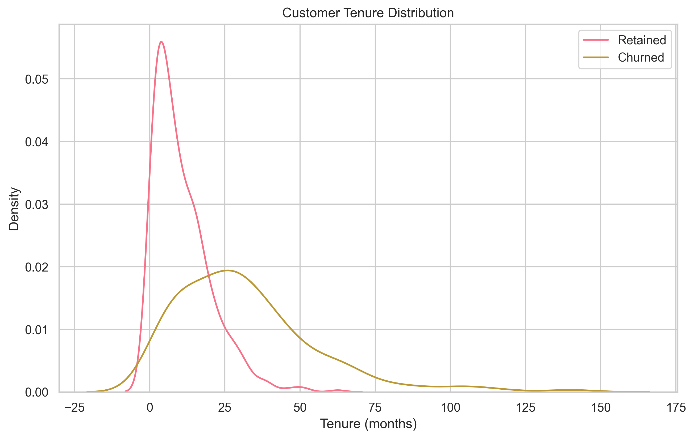

# Implementing Gradient Boosting

**After this lesson:** you can explain Implementing Gradient Boosting and try the examples in your own notebook.

## Overview

Libraries and APIs (e.g. **hist** gradient boosting in sklearn, XGBoost/LightGBM/CatBoost at overview level): key parameters and fit patterns.

## Getting Started: Basic Implementation with XGBoost

### Classification Example: Spam Detection

Build a spam detector as our first project. This is like creating a filter that can tell if an email is spam or not.

Before we dive into the code, get clear on what we're trying to achieve:

1. We want to classify emails as spam or not spam
2. We'll use features like word counts and sender information
3. We'll train a model to learn patterns from these features

Here's how we'll do it step by step:

#### XGBoost: `DMatrix`, `train`, early stopping

Informative vs redundant features

`make_classification` creates 15 features that genuinely predict the label and 5 redundant noise features, mimics real data where not all columns are useful. Gradient boosting handles this well via feature selection inside each tree.

DMatrix: XGBoost's data format

`xgb.DMatrix` wraps numpy arrays in XGBoost's optimized internal format, attaching labels alongside features. Required before calling `xgb.train`, unlike sklearn's `.fit(X, y)`, XGBoost separates data preparation from training.

Boosting parameters

`eta` (learning rate) shrinks each new tree's contribution, lower values need more rounds but generalize better. `objective: binary:logistic` produces probabilities for a two-class problem. `eval_metric: logloss` measures calibration of those probabilities.

Train with eval tracking

`evals` logs loss on both train and test each round. `early_stopping_rounds=10` halts boosting when test loss stops improving for 10 rounds, XGBoost automatically uses the best round's weights, avoiding over-boosting.

Probability → class label

`model.predict` returns a float probability per sample. `(y_pred > 0.5)` applies the default decision threshold, lower it (e.g. 0.3) to catch more positives at the cost of more false alarms.

Great job! You've just built your first spam detector. break down what we did:

1. We prepared our data (emails and their features)
2. We split the data for training and testing
3. We set up our model with appropriate parameters
4. We trained the model and evaluated its performance

Now that you understand the basics, try something a bit more complex: predicting house prices!

## LightGBM Implementation: House Price Prediction

Predicting house prices is like helping a real estate agent estimate property values. We'll use LightGBM, which is particularly good at handling large datasets efficiently.

Before coding, think through what you need:

1. Features like square footage, number of bedrooms, location, etc.
2. A way to measure how accurate our predictions are
3. A model that can learn from these features

Implement this step by step:

#### LightGBM regression: `Dataset`, RMSE, \\(R^2\\)

Data and LightGBM Datasets

1000 synthetic regression samples with 20 features are split 80/20; `lgb.Dataset` wraps the train and test arrays, the `reference=train_data` argument aligns the test set's feature histogram with the training set.

Params and Train

A parameter dict sets the regression objective and RMSE metric; `feature_fraction=0.9` adds column subsampling for regularisation; `early_stopping(10)` halts training if validation RMSE has not improved for 10 rounds.

Evaluate

RMSE measures the average prediction error in the original units; R² shows the fraction of variance explained, together they give a balanced picture of regression performance.

Excellent! You've now built a house price predictor. Notice how this implementation is similar to our spam detector but with some key differences:

1. We're predicting continuous values (prices) instead of categories
2. We're using different evaluation metrics
3. The data preparation is slightly different

Now, try something even more interesting: customer segmentation with CatBoost!

## CatBoost Implementation: Customer Segmentation

Customer segmentation is like grouping customers for targeted marketing. CatBoost is particularly good at handling categorical data, which is perfect for this task.

Before we start coding, get clear on what we're working with:

1. Customer data like age, income, education, and occupation
2. Categorical features that need special handling
3. A way to identify high-value customers

Implement this step by step:

#### CatBoost: `Pool` + categorical feature indices

Data with Categoricals

Two numeric and two categorical columns are generated; the binary target labels high-value customers using an age/income/education rule that mimics a real segmentation heuristic.

CatBoost Pool and Train

`Pool` bundles features, labels, and the categorical column indices so CatBoost can apply ordered target encoding natively; `eval_set` enables validation loss logging during training without a separate API call.

Great work! You've now built a customer segmentation model. Notice how CatBoost makes it easy to handle categorical data:

1. We specified which features are categorical
2. CatBoost automatically handles the encoding
3. The rest of the process is similar to our previous examples

Now, put everything together in a real-world example: predicting customer churn!

## Real-World Example: Customer Churn Prediction

Customer churn prediction is like having a crystal ball for customer retention. We'll use everything we've learned to build a practical system.

Before we start coding, get clear on what we're building:

1. A system that predicts which customers might leave
2. Features that help identify at-risk customers
3. A way to categorize customers by risk level

Implement this step by step:

#### Churn model: `fit` with `cat_features`, importance, risk bins

Data Generation

Three numeric and three categorical columns simulate a telecom dataset; the churn label combines short tenure, high charges, and month-to-month contract, a realistic proxy for real churn signals.

Train CatBoost

Categorical columns are passed directly via `cat_features` without manual encoding; CatBoost uses ordered target statistics internally, avoiding target leakage.

Importance and Risk Bins

Feature importances are ranked to surface the top churn drivers; `pd.cut` buckets predicted probabilities into Low/Medium/High tiers, enabling prioritised retention outreach.

You've now built a complete customer churn prediction system. Notice how we've combined everything we've learned:

1. We used CatBoost for handling categorical data
2. We analyzed feature importance to understand what drives churn
3. We created risk categories to help prioritize retention efforts

## Best Practices and Common Mistakes

Now that you've seen several implementations, review some best practices and common mistakes to avoid:

### 1. Data Preparation

* Always check for missing values
* Scale numerical features
* Handle categorical variables properly
* Remove irrelevant features

### 2. Model Tuning

* Start with default parameters
* Use cross-validation
* Tune one parameter at a time
* Keep track of changes

### 3. Evaluation

* Use appropriate metrics
* Check for overfitting
* Analyze feature importance
* Monitor training progress

## Common Mistakes to Avoid

1. **Using Too Many Trees**
   * Like studying the same material over and over
   * Can lead to overfitting
   * Solution: Use early stopping
2. **Ignoring Categorical Features**
   * Like not considering important customer segments
   * Can miss valuable patterns
   * Solution: Use proper encoding or CatBoost
3. **Skipping Feature Importance**
   * Like not learning from your mistakes
   * Miss insights about your data
   * Solution: Always analyze feature importance

## Next Steps

Ready to try these implementations? Start with the spam detection example and gradually move to more complex projects. Remember, practice makes perfect!

## Gotchas

* **Using the sklearn API vs the native XGBoost API interchangeably**: `xgb.train` (native) takes a `DMatrix` and a params dict; `XGBClassifier` (sklearn API) takes numpy arrays and uses `fit`. Mixing them (e.g., passing a `DMatrix` to `XGBClassifier.fit`) raises confusing type errors. Pick one API per project and stick with it.
* **`early_stopping_rounds` in the native XGBoost API uses the last entry in `evals`**: XGBoost monitors the _last_ evaluation set passed to `evals` for early stopping. If you list `[(dtrain, 'train'), (dtest, 'test')]`, it correctly watches the test set. Reversing the order means early stopping fires on training loss and almost never stops.
* **LightGBM's `reference=train_data` in `Dataset` is not optional**: Passing `reference=train_data` when building the test `Dataset` ensures the two datasets share the same feature binning histogram. Omitting it can cause silent prediction drift, especially on categorical features.
* **CatBoost's `Pool` with `cat_features` expects column&#x20;**_**names**_**, not integer indices, for DataFrames**, When your input is a pandas DataFrame, pass string column names to `cat_features`. Passing integer positions works for numpy arrays but silently misidentifies columns when a DataFrame has a non-default index.
* **`predict_proba` column ordering differs between sklearn and CatBoost**: In sklearn, `predict_proba(X)[:, 1]` gives P(positive class). In CatBoost, the column order depends on class ordering in the training labels. Always check `model.classes_` before slicing a specific column to avoid swapping the positive and negative class probabilities.
* **`scale_pos_weight` in XGBClassifier is not the same as SMOTE or resampling**: `scale_pos_weight` adjusts the gradient contribution of minority-class samples; it does not create new samples. For severe imbalance (>100:1), it helps but may still underperform proper resampling or threshold tuning on `predict_proba` output.

## Additional Resources

For more learning:

* [XGBoost Documentation](https://xgboost.readthedocs.io/)
* [LightGBM Documentation](https://lightgbm.readthedocs.io/)
* [CatBoost Documentation](https://catboost.ai/docs/)
* [Kaggle Gradient Boosting Tutorials](https://www.kaggle.com/learn/intro-to-deep-learning)
