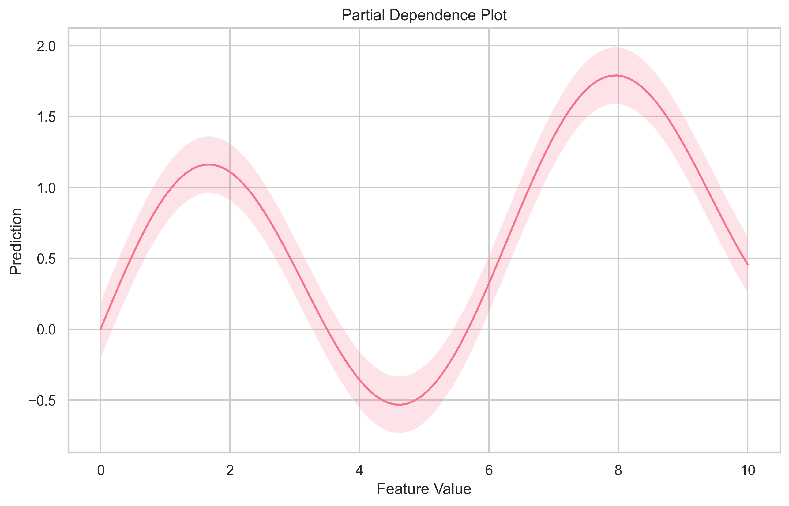
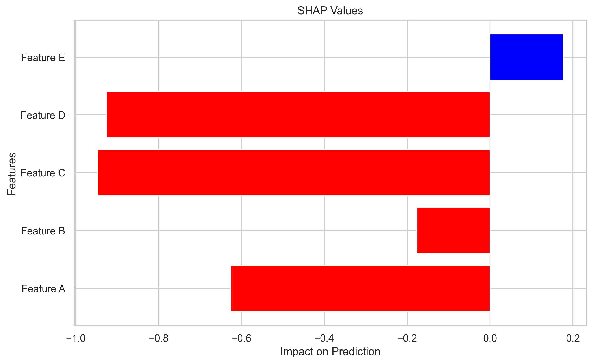

# Advanced Gradient Boosting Techniques

**After this lesson:** you can explain the core ideas in “Advanced Gradient Boosting Techniques” and reproduce the examples here in your own notebook or environment.

## Overview

Regularization, early stopping, monotone constraints, and other levers on modern GBDT systems.

## Advanced Model Architectures

### 1. Multi-Output Gradient Boosting: Predicting Multiple Things at Once

Imagine you're a weather forecaster trying to predict both temperature and humidity. Multi-output Gradient Boosting lets you predict multiple related outcomes simultaneously.


import numpy as np
from sklearn.multioutput import MultiOutputRegressor
from xgboost import XGBRegressor

def train_multi_output_model(X, y_multiple):
    """Train a model that predicts multiple outputs at once

    Parameters:
    X: Features (like weather conditions)
    y_multiple: Multiple targets (like temperature and humidity)
    """
    # Create a model that can predict multiple outputs
    model = MultiOutputRegressor(
        XGBRegressor(
            n_estimators=100,    # Number of trees
            learning_rate=0.1,   # How fast to learn
            max_depth=5          # How deep each tree can grow
        )
    )
    # Train the model
    model.fit(X, y_multiple)
    return model

# Example usage:
# weather_data = load_weather_data()
# predictions = model.predict(new_weather_data)
# temperature_pred = predictions[:, 0]
# humidity_pred = predictions[:, 1]


<aside class="code-explainer__callouts" aria-label="Code walkthrough">
  

    

      
      Multi-output Setup
    

    

      
<code>MultiOutputRegressor</code> wraps any single-output estimator — here <code>XGBRegressor</code> — training one separate model per target column so each target's tree structure is independent.

    

  

  

    

      
      Fit and Example Usage
    

    

      
Pass the 2D target matrix <code>y_multiple</code> directly; <code>model.predict</code> returns a 2D array where each column corresponds to one target — commented usage shows slicing temperature vs humidity predictions.

    

  

</aside>

**Why This Matters**: Instead of training separate models for each prediction, you can train one model that understands the relationships between different outputs.

### 2. Hierarchical Gradient Boosting: Learning in Layers

Think of this like learning a language - you start with basic words, then phrases, then sentences. Hierarchical Gradient Boosting learns complex patterns in layers.


class HierarchicalGBM:
    """Hierarchical Gradient Boosting for nested categories

    Like learning a language in layers:
    1. Basic vocabulary
    2. Simple phrases
    3. Complex sentences
    """
    def __init__(self, levels):
        self.levels = levels  # Number of learning layers
        self.models = {}      # Store models for each level

    def fit(self, X, y_hierarchy):
        """Train models at each level of the hierarchy"""
        for level in self.levels:
            # Train model for current level
            self.models[level] = XGBClassifier()
            self.models[level].fit(
                X,
                y_hierarchy[level],
                sample_weight=self._get_weights(level, y_hierarchy)
            )

    def _get_weights(self, level, y_hierarchy):
        """Give more importance to samples that were correct at previous level"""
        weights = np.ones(len(y_hierarchy))
        if level > 0:
            # Increase weights for samples that were correct
            # at previous level (like building on what you know)
            prev_correct = (
                self.models[level-1].predict(X) ==
                y_hierarchy[level-1]
            )
            weights[prev_correct] *= 2
        return weights


<aside class="code-explainer__callouts" aria-label="Code walkthrough">
  

    

      
      Class Init
    

    

      
Stores the list of hierarchy levels and a dict to hold one <code>XGBClassifier</code> per level; the docstring uses language-learning layers as an analogy for coarse-to-fine classification.

    

  

  

    

      
      Fit and Weight
    

    

      
<code>fit</code> trains a fresh tree per level with adaptive <code>sample_weight</code>; <code>_get_weights</code> doubles the weight of samples the previous level got right — focusing subsequent levels on harder examples.

    

  

</aside>

## Advanced Loss Functions: Customizing How We Learn

### 1. Custom Loss Function: Teaching the Model What Matters

Sometimes the standard ways of measuring error don't fit your needs. Custom loss functions let you define what "good" means for your specific problem.


def custom_objective(y_true, y_pred):
    """Custom objective function for XGBoost

    Think of this as creating your own grading system:
    - How much to penalize different types of mistakes
    - How to guide the model's learning
    """
    # Calculate gradients (how to adjust predictions)
    grad = 2 * (y_pred - y_true)

    # Calculate hessians (how confident we are in adjustments)
    hess = 2 * np.ones_like(y_pred)

    return grad, hess

# Use custom objective
params = {
    'objective': custom_objective,
    'max_depth': 3
}


<aside class="code-explainer__callouts" aria-label="Code walkthrough">
  

    

      
      Gradient and Hessian
    

    

      
XGBoost custom objectives must return both the first derivative (gradient) and second derivative (hessian) of the loss; here they implement MSE: <code>grad = 2(pred - true)</code>, <code>hess = 2</code> (constant).

    

  

  

    

      
      Pass to XGBoost
    

    

      
Pass the function via <code>params['objective']</code>; XGBoost will call it each boosting round with the current predictions to compute the update direction.

    

  

</aside>

### 2. Weighted Loss: Paying Attention to Important Examples

Like a teacher giving more attention to certain students, weighted loss lets you focus on important examples in your data.


def weighted_log_loss(y_true, y_pred, weights):
    """Weighted logarithmic loss

    Parameters:
    y_true: Actual values
    y_pred: Predicted values
    weights: Importance of each example
    """
    return -np.mean(
        weights * (
            y_true * np.log(y_pred) +
            (1 - y_true) * np.log(1 - y_pred)
        )
    )


<aside class="code-explainer__callouts" aria-label="Code walkthrough">
  

    

      
      Docstring
    

    

      
Three parameters: true labels, predicted probabilities, and a per-sample weight vector — higher weights on minority or high-value samples steer the model to minimize their errors more aggressively.

    

  

  

    

      
      Weighted BCE
    

    

      
Multiplies standard binary cross-entropy by the <code>weights</code> vector before averaging; samples with higher weight contribute more to the final loss scalar, guiding gradient descent toward those examples.

    

  

</aside>

## Advanced Feature Engineering: Creating Better Inputs

### 1. Automated Feature Interactions: Finding Hidden Relationships

Sometimes the relationship between features is more important than the features themselves. This is like discovering that certain ingredients work better together.


def create_interactions(X, degree=2):
    """Create feature interactions up to specified degree

    Example:
    If you have features A and B, this creates:
    - A*B (interaction between A and B)
    - A*A (squared term for A)
    - B*B (squared term for B)
    """
    from itertools import combinations

    X = X.copy()
    features = list(X.columns)

    for d in range(2, degree + 1):
        for combo in combinations(features, d):
            name = '*'.join(combo)
            X[name] = 1
            for feature in combo:
                X[name] *= X[feature]

    return X


<aside class="code-explainer__callouts" aria-label="Code walkthrough">
  

    

      
      Signature and Docstring
    

    

      
Takes a DataFrame and maximum interaction degree; the docstring shows the concrete new columns produced from features A and B at degree 2 — products and squares.

    

  

  

    

      
      Combinatorial Products
    

    

      
<code>combinations(features, d)</code> generates all d-feature subsets; each new column starts at 1 and is multiplied by each feature in the combo — creating polynomial interaction terms without external libraries.

    

  

</aside>

### 2. Time-Based Features: Understanding Patterns Over Time

Time-based features help capture patterns that change over time, like how sales vary by hour, day, or season.


def create_time_features(df, date_column):
    """Create features from datetime information

    Parameters:
    df: DataFrame with datetime column
    date_column: Name of the datetime column
    """
    df = df.copy()

    # Extract basic time components
    df['hour'] = df[date_column].dt.hour
    df['day'] = df[date_column].dt.day
    df['month'] = df[date_column].dt.month
    df['year'] = df[date_column].dt.year
    df['dayofweek'] = df[date_column].dt.dayofweek

    # Create cyclical features (helps model understand time cycles)
    df['hour_sin'] = np.sin(2 * np.pi * df['hour']/24)
    df['hour_cos'] = np.cos(2 * np.pi * df['hour']/24)

    return df


<aside class="code-explainer__callouts" aria-label="Code walkthrough">
  

    

      
      Calendar Components
    

    

      
Extract hour, day, month, year, and day-of-week from a datetime column using pandas <code>.dt</code> accessor — these linear features give the model basic time awareness.

    

  

  

    

      
      Cyclical Encoding
    

    

      
Sin/cos encoding of hour maps 23→0 continuity: the model sees that hour 23 and hour 0 are adjacent — raw integer hour would treat them as far apart.

    

  

</aside>

## Advanced Training Techniques: Smarter Learning

### 1. Learning Rate Scheduling: Adjusting Your Learning Speed

Like a student starting with broad concepts and then focusing on details, learning rate scheduling helps the model learn more effectively.


class LearningRateScheduler:
    """Dynamic learning rate scheduler

    Think of this as adjusting study intensity:
    - Start strong (high learning rate)
    - Gradually focus on details (lower learning rate)
    """
    def __init__(self, initial_lr=0.1, decay=0.995):
        self.initial_lr = initial_lr
        self.decay = decay
        self.iteration = 0

    def __call__(self):
        """Calculate current learning rate"""
        lr = self.initial_lr * (self.decay ** self.iteration)
        self.iteration += 1
        return lr

# Use with XGBoost
scheduler = LearningRateScheduler()
model = xgb.train(
    params,
    dtrain,
    num_boost_round=1000,
    callbacks=[
        xgb.callback.reset_learning_rate(scheduler)
    ]
)


<aside class="code-explainer__callouts" aria-label="Code walkthrough">
  

    

      
      Exponential Decay
    

    

      
Each call multiplies <code>initial_lr</code> by <code>decay^iteration</code>; with <code>decay=0.995</code> the rate decays ~40% after 200 rounds — early rounds take large steps, later rounds fine-tune.

    

  

  

    

      
      XGBoost Callback
    

    

      
Pass the scheduler instance to <code>xgb.callback.reset_learning_rate</code>; XGBoost calls it each boosting round to get the scheduled rate, updating the <code>eta</code> parameter automatically.

    

  

</aside>

## Advanced Model Analysis: Understanding Your Model

### 1. Partial Dependence Analysis: Understanding Feature Effects

This helps you understand how each feature affects your predictions, like seeing how changing one ingredient affects a recipe.


def calculate_partial_dependence(model, X, feature, grid_points=50):
    """Calculate how a feature affects predictions

    Parameters:
    model: Trained model
    X: Input data
    feature: Feature to analyze
    grid_points: Number of points to evaluate
    """
    # Create range of values to test
    feature_values = np.linspace(
        X[feature].min(),
        X[feature].max(),
        grid_points
    )

    # Calculate predictions for each value
    predictions = []
    for value in feature_values:
        X_modified = X.copy()
        X_modified[feature] = value
        pred = model.predict(X_modified)
        predictions.append(pred.mean())

    return feature_values, predictions


<aside class="code-explainer__callouts" aria-label="Code walkthrough">
  

    

      
      Feature Grid
    

    

      
<code>np.linspace</code> creates 50 evenly-spaced values from the feature's min to max — this grid will be swept while all other features remain at their real values.

    

  

  

    

      
      Marginal Effect
    

    

      
For each grid value, set the target feature to that value across all rows, predict, and average — the mean prediction at each grid point is the partial dependence, revealing the feature's marginal effect on output.

    

  

</aside>

### 2. SHAP Value Analysis: Understanding Feature Importance

SHAP values help you understand how each feature contributes to predictions, like knowing which ingredients are most important in a recipe.


import shap

def analyze_shap_interactions(model, X):
    """Analyze how features work together to make predictions

    Parameters:
    model: Trained model
    X: Input data
    """
    # Calculate SHAP values
    explainer = shap.TreeExplainer(model)
    shap_values = explainer.shap_values(X)

    # Calculate interaction values
    interaction_values = explainer.shap_interaction_values(X)

    return shap_values, interaction_values


<aside class="code-explainer__callouts" aria-label="Code walkthrough">
  

    

      
      TreeExplainer Setup
    

    

      
<code>shap.TreeExplainer</code> is optimized for tree-based models (XGBoost, LightGBM, Random Forest) and computes exact SHAP values in polynomial time rather than the exponential brute-force approach.

    

  

  

    

      
      SHAP and Interactions
    

    

      
<code>shap_values</code> gives each feature's contribution to each prediction; <code>shap_interaction_values</code> returns a 3D array showing pairwise feature interaction contributions — expensive but informative.

    

  

</aside>

## Common Mistakes to Avoid

1. **Overcomplicating Models**
   - Like using too many ingredients in a recipe
   - Can lead to overfitting
   - Solution: Start simple, add complexity gradually

2. **Ignoring Feature Interactions**
   - Like not considering how ingredients work together
   - Miss important patterns
   - Solution: Use interaction features

3. **Poor Learning Rate Choices**
   - Like studying too fast or too slow
   - Can lead to poor performance
   - Solution: Use learning rate scheduling

## Next Steps

Ready to try these advanced techniques? Start with one concept at a time and gradually combine them. Remember, even advanced techniques should be used thoughtfully!

## Gotchas

- **`MultiOutputRegressor` trains independent models, not a joint model** — Wrapping `XGBRegressor` in `MultiOutputRegressor` trains one separate tree ensemble per target column. Correlations between targets are ignored. If your targets are tightly correlated, a native multi-output model (e.g., XGBoost's built-in multi-output support) or a shared representation layer will perform better.
- **Custom objectives must return *per-sample* gradients and hessians, not scalars** — The `custom_objective` function must return arrays of shape `(n_samples,)` for both `grad` and `hess`. Returning a scalar (e.g., the mean loss) instead of per-sample values causes XGBoost to silently compute wrong tree splits.
- **`create_interactions` grows exponentially with feature count** — For $p$ features at degree 2, you get $\binom{p}{2} + p$ new columns. With 100 features this adds ~5,000 columns; with 500 it adds ~125,000. Running this without filtering first can exhaust memory silently before fitting begins.
- **`shap_interaction_values` is $O(n \cdot p^2)$ in memory** — The interaction matrix returned by `explainer.shap_interaction_values(X)` has shape `(n_samples, n_features, n_features)`. For a dataset with 10,000 rows and 200 features, this is 10,000 × 200 × 200 floats ≈ 3.2 GB. Call it on a small representative sample, not the full dataset.
- **Learning rate scheduling via `xgb.callback.reset_learning_rate` is version-dependent** — The callback API changed between XGBoost 1.x and 2.x. Code written for one version may fail silently (using the original learning rate throughout) on the other. Always verify the learning rate is actually changing by checking `model.get_params()` after training.
- **Partial dependence averages out interaction effects** — The `calculate_partial_dependence` function marginalizes over all other features by holding them at their real values and averaging predictions. When two features interact strongly, the partial dependence of either feature individually can look flat even though the joint effect is large. Use ICE plots or SHAP interaction values to detect this.

## Additional Resources

For deeper understanding:

- [XGBoost Advanced Features](https://xgboost.readthedocs.io/en/latest/tutorials/index.html)
- [SHAP Documentation](https://shap.readthedocs.io/)
- [Feature Engineering for Machine Learning](https://www.oreilly.com/library/view/feature-engineering-for/9781491953235/)
