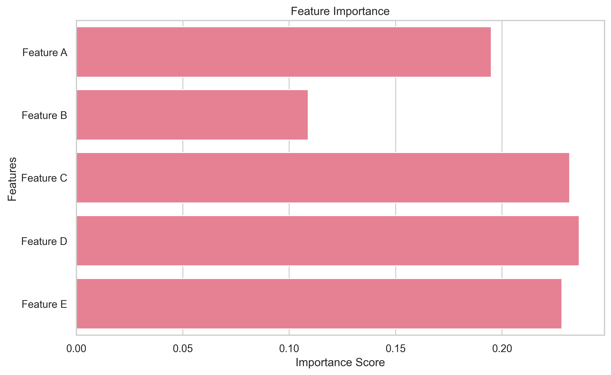

# Advanced Gradient Boosting Techniques

**After this lesson:** you can explain Advanced Gradient Boosting Techniques and try the examples in your own notebook.

## Overview

Regularization, early stopping, monotone constraints, and other levers on modern GBDT systems.

## Advanced Model Architectures

### 1. Multi-Output Gradient Boosting: Predicting Multiple Things at Once

Imagine you're a weather forecaster trying to predict both temperature and humidity. Multi-output Gradient Boosting lets you predict multiple related outcomes simultaneously.

Multi-output Setup

`MultiOutputRegressor` wraps any single-output estimator, here `XGBRegressor`, training one separate model per target column so each target's tree structure is independent.

Fit and Example Usage

Pass the 2D target matrix `y_multiple` directly; `model.predict` returns a 2D array where each column corresponds to one target, commented usage shows slicing temperature vs humidity predictions.

**Why This Matters**: Instead of training separate models for each prediction, you can train one model that understands the relationships between different outputs.

### 2. Hierarchical Gradient Boosting: Learning in Layers

Think of this like learning a language - you start with basic words, then phrases, then sentences. Hierarchical Gradient Boosting learns complex patterns in layers.

Class Init

Stores the list of hierarchy levels and a dict to hold one `XGBClassifier` per level; the docstring uses language-learning layers as an analogy for coarse-to-fine classification.

Fit and Weight

`fit` trains a fresh tree per level with adaptive `sample_weight`; `_get_weights` doubles the weight of samples the previous level got right, focusing subsequent levels on harder examples.

## Advanced Loss Functions: Customizing How We Learn

### 1. Custom Loss Function: Teaching the Model What Matters

Sometimes the standard ways of measuring error don't fit your needs. Custom loss functions let you define what "good" means for your specific problem.

Gradient and Hessian

XGBoost custom objectives must return both the first derivative (gradient) and second derivative (hessian) of the loss; here they implement MSE: `grad = 2(pred - true)`, `hess = 2` (constant).

Pass to XGBoost

Pass the function via `params['objective']`; XGBoost will call it each boosting round with the current predictions to compute the update direction.

### 2. Weighted Loss: Paying Attention to Important Examples

Like a teacher giving more attention to certain students, weighted loss lets you focus on important examples in your data.

Docstring

Three parameters: true labels, predicted probabilities, and a per-sample weight vector, higher weights on minority or high-value samples steer the model to minimize their errors more aggressively.

Weighted BCE

Multiplies standard binary cross-entropy by the `weights` vector before averaging; samples with higher weight contribute more to the final loss scalar, guiding gradient descent toward those examples.

## Advanced Feature Engineering: Creating Better Inputs

### 1. Automated Feature Interactions: Finding Hidden Relationships

Sometimes the relationship between features is more important than the features themselves. This is like discovering that certain ingredients work better together.

Signature and Docstring

Takes a DataFrame and maximum interaction degree; the docstring shows the concrete new columns produced from features A and B at degree 2, products and squares.

Combinatorial Products

`combinations(features, d)` generates all d-feature subsets; each new column starts at 1 and is multiplied by each feature in the combo, creating polynomial interaction terms without external libraries.

### 2. Time-Based Features: Understanding Patterns Over Time

Time-based features help capture patterns that change over time, like how sales vary by hour, day, or season.

Calendar Components

Extract hour, day, month, year, and day-of-week from a datetime column using pandas `.dt` accessor, these linear features give the model basic time awareness.

Cyclical Encoding

Sin/cos encoding of hour maps 23→0 continuity: the model sees that hour 23 and hour 0 are adjacent, raw integer hour would treat them as far apart.

## Advanced Training Techniques: Smarter Learning

### 1. Learning Rate Scheduling: Adjusting Your Learning Speed

Like a student starting with broad concepts and then focusing on details, learning rate scheduling helps the model learn more effectively.

Exponential Decay

Each call multiplies `initial_lr` by `decay^iteration`; with `decay=0.995` the rate decays \~40% after 200 rounds, early rounds take large steps, later rounds fine-tune.

XGBoost Callback

Pass the scheduler instance to `xgb.callback.reset_learning_rate`; XGBoost calls it each boosting round to get the scheduled rate, updating the `eta` parameter automatically.

## Advanced Model Analysis: Understanding Your Model

### 1. Partial Dependence Analysis: Understanding Feature Effects

This helps you understand how each feature affects your predictions, like seeing how changing one ingredient affects a recipe.

Feature Grid

`np.linspace` creates 50 evenly-spaced values from the feature's min to max, this grid will be swept while all other features remain at their real values.

Marginal Effect

For each grid value, set the target feature to that value across all rows, predict, and average, the mean prediction at each grid point is the partial dependence, revealing the feature's marginal effect on output.

### 2. SHAP Value Analysis: Understanding Feature Importance

SHAP values help you understand how each feature contributes to predictions, like knowing which ingredients are most important in a recipe.

TreeExplainer Setup

`shap.TreeExplainer` is optimized for tree-based models (XGBoost, LightGBM, Random Forest) and computes exact SHAP values in polynomial time rather than the exponential brute-force approach.

SHAP and Interactions

`shap_values` gives each feature's contribution to each prediction; `shap_interaction_values` returns a 3D array showing pairwise feature interaction contributions, expensive but informative.

## Common Mistakes to Avoid

1. **Overcomplicating Models**
   * Like using too many ingredients in a recipe
   * Can lead to overfitting
   * Solution: Start simple, add complexity gradually
2. **Ignoring Feature Interactions**
   * Like not considering how ingredients work together
   * Miss important patterns
   * Solution: Use interaction features
3. **Poor Learning Rate Choices**
   * Like studying too fast or too slow
   * Can lead to poor performance
   * Solution: Use learning rate scheduling

## Next Steps

Ready to try these advanced techniques? Start with one concept at a time and gradually combine them. Remember, even advanced techniques should be used thoughtfully!

## Gotchas

* **`MultiOutputRegressor` trains independent models, not a joint model**: Wrapping `XGBRegressor` in `MultiOutputRegressor` trains one separate tree ensemble per target column. Correlations between targets are ignored. If your targets are tightly correlated, a native multi-output model (e.g., XGBoost's built-in multi-output support) or a shared representation layer will perform better.
* **Custom objectives must return&#x20;**_**per-sample**_**&#x20;gradients and hessians, not scalars**, The `custom_objective` function must return arrays of shape `(n_samples,)` for both `grad` and `hess`. Returning a scalar (e.g., the mean loss) instead of per-sample values causes XGBoost to silently compute wrong tree splits.
* **`create_interactions` grows exponentially with feature count**: For \\(p\\) features at degree 2, you get \\(\binom{p}{2} + p\\) new columns. With 100 features this adds \~5,000 columns; with 500 it adds \~125,000. Running this without filtering first can exhaust memory silently before fitting begins.
* **`shap_interaction_values` is \\(O(n \cdot p^2)\\) in memory**: The interaction matrix returned by `explainer.shap_interaction_values(X)` has shape `(n_samples, n_features, n_features)`. For a dataset with 10,000 rows and 200 features, this is 10,000 × 200 × 200 floats ≈ 3.2 GB. Call it on a small representative sample, not the full dataset.
* **Learning rate scheduling via `xgb.callback.reset_learning_rate` is version-dependent**: The callback API changed between XGBoost 1.x and 2.x. Code written for one version may fail silently (using the original learning rate throughout) on the other. Always verify the learning rate is actually changing by checking `model.get_params()` after training.
* **Partial dependence averages out interaction effects**: The `calculate_partial_dependence` function marginalizes over all other features by holding them at their real values and averaging predictions. When two features interact strongly, the partial dependence of either feature individually can look flat even though the joint effect is large. Use ICE plots or SHAP interaction values to detect this.

## Additional Resources

For deeper understanding:

* [XGBoost Advanced Features](https://xgboost.readthedocs.io/en/latest/tutorials/index.html)
* [SHAP Documentation](https://shap.readthedocs.io/)
* [Feature Engineering for Machine Learning](https://www.oreilly.com/library/view/feature-engineering-for/9781491953235/)
