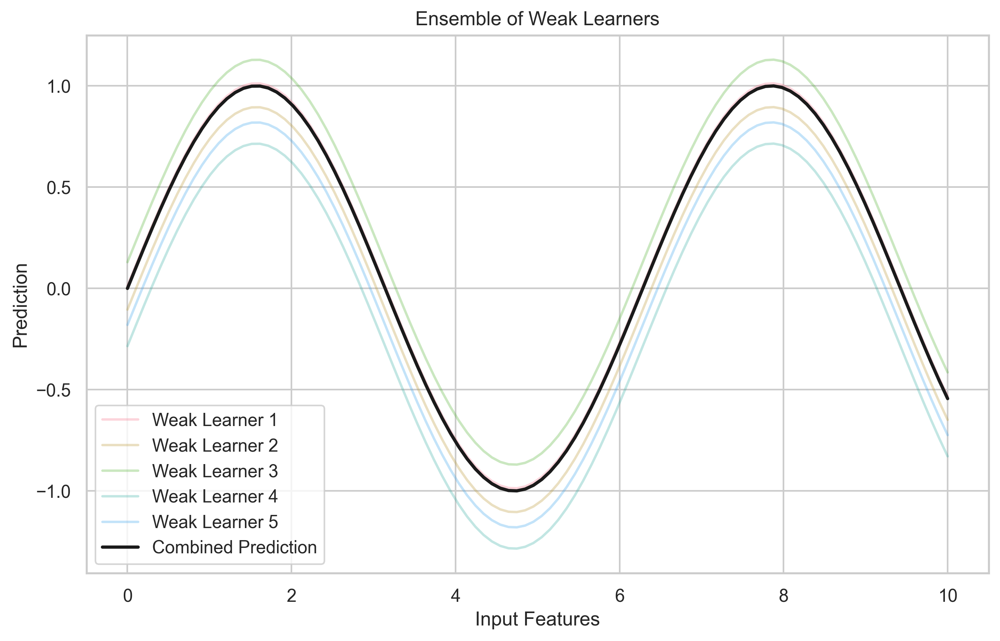
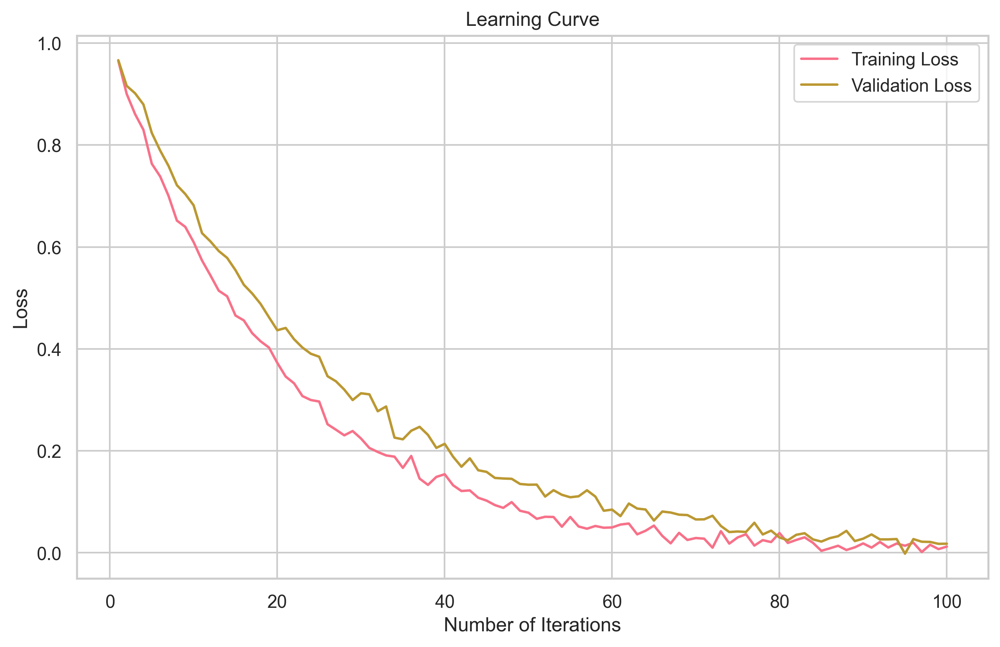

# Advanced Gradient Boosting Techniques

Welcome to the advanced section! Think of this as moving from basic cooking to gourmet recipes. We'll explore sophisticated techniques that can make your models even more powerful.

## Advanced Model Architectures

### 1. Multi-Output Gradient Boosting: Predicting Multiple Things at Once

Imagine you're a weather forecaster trying to predict both temperature and humidity. Multi-output Gradient Boosting lets you predict multiple related outcomes simultaneously.


```python
import numpy as np
from sklearn.multioutput import MultiOutputRegressor
from xgboost import XGBRegressor

def train_multi_output_model(X, y_multiple):
    """Train a model that predicts multiple outputs at once
    
    Parameters:
    X: Features (like weather conditions)
    y_multiple: Multiple targets (like temperature and humidity)
    """
    # Create a model that can predict multiple outputs
    model = MultiOutputRegressor(
        XGBRegressor(
            n_estimators=100,    # Number of trees
            learning_rate=0.1,   # How fast to learn
            max_depth=5          # How deep each tree can grow
        )
    )
    # Train the model
    model.fit(X, y_multiple)
    return model

# Example usage:
# weather_data = load_weather_data()
# predictions = model.predict(new_weather_data)
# temperature_pred = predictions[:, 0]
# humidity_pred = predictions[:, 1]
```

**Why This Matters**: Instead of training separate models for each prediction, you can train one model that understands the relationships between different outputs.

### 2. Hierarchical Gradient Boosting: Learning in Layers

Think of this like learning a language - you start with basic words, then phrases, then sentences. Hierarchical Gradient Boosting learns complex patterns in layers.



```python
class HierarchicalGBM:
    """Hierarchical Gradient Boosting for nested categories
    
    Like learning a language in layers:
    1. Basic vocabulary
    2. Simple phrases
    3. Complex sentences
    """
    def __init__(self, levels):
        self.levels = levels  # Number of learning layers
        self.models = {}      # Store models for each level
        
    def fit(self, X, y_hierarchy):
        """Train models at each level of the hierarchy"""
        for level in self.levels:
            # Train model for current level
            self.models[level] = XGBClassifier()
            self.models[level].fit(
                X, 
                y_hierarchy[level],
                sample_weight=self._get_weights(level, y_hierarchy)
            )
    
    def _get_weights(self, level, y_hierarchy):
        """Give more importance to samples that were correct at previous level"""
        weights = np.ones(len(y_hierarchy))
        if level > 0:
            # Increase weights for samples that were correct
            # at previous level (like building on what you know)
            prev_correct = (
                self.models[level-1].predict(X) == 
                y_hierarchy[level-1]
            )
            weights[prev_correct] *= 2
        return weights
```

## Advanced Loss Functions: Customizing How We Learn

### 1. Custom Loss Function: Teaching the Model What Matters

Sometimes the standard ways of measuring error don't fit your needs. Custom loss functions let you define what "good" means for your specific problem.



```python
def custom_objective(y_true, y_pred):
    """Custom objective function for XGBoost
    
    Think of this as creating your own grading system:
    - How much to penalize different types of mistakes
    - How to guide the model's learning
    """
    # Calculate gradients (how to adjust predictions)
    grad = 2 * (y_pred - y_true)
    
    # Calculate hessians (how confident we are in adjustments)
    hess = 2 * np.ones_like(y_pred)
    
    return grad, hess

# Use custom objective
params = {
    'objective': custom_objective,
    'max_depth': 3
}
```

### 2. Weighted Loss: Paying Attention to Important Examples

Like a teacher giving more attention to certain students, weighted loss lets you focus on important examples in your data.

```python
def weighted_log_loss(y_true, y_pred, weights):
    """Weighted logarithmic loss
    
    Parameters:
    y_true: Actual values
    y_pred: Predicted values
    weights: Importance of each example
    """
    return -np.mean(
        weights * (
            y_true * np.log(y_pred) + 
            (1 - y_true) * np.log(1 - y_pred)
        )
    )
```

## Advanced Feature Engineering: Creating Better Inputs

### 1. Automated Feature Interactions: Finding Hidden Relationships

Sometimes the relationship between features is more important than the features themselves. This is like discovering that certain ingredients work better together.


```python
def create_interactions(X, degree=2):
    """Create feature interactions up to specified degree
    
    Example:
    If you have features A and B, this creates:
    - A*B (interaction between A and B)
    - A*A (squared term for A)
    - B*B (squared term for B)
    """
    from itertools import combinations
    
    X = X.copy()
    features = list(X.columns)
    
    for d in range(2, degree + 1):
        for combo in combinations(features, d):
            name = '*'.join(combo)
            X[name] = 1
            for feature in combo:
                X[name] *= X[feature]
    
    return X
```

### 2. Time-Based Features: Understanding Patterns Over Time

Time-based features help capture patterns that change over time, like how sales vary by hour, day, or season.

```python
def create_time_features(df, date_column):
    """Create features from datetime information
    
    Parameters:
    df: DataFrame with datetime column
    date_column: Name of the datetime column
    """
    df = df.copy()
    
    # Extract basic time components
    df['hour'] = df[date_column].dt.hour
    df['day'] = df[date_column].dt.day
    df['month'] = df[date_column].dt.month
    df['year'] = df[date_column].dt.year
    df['dayofweek'] = df[date_column].dt.dayofweek
    
    # Create cyclical features (helps model understand time cycles)
    df['hour_sin'] = np.sin(2 * np.pi * df['hour']/24)
    df['hour_cos'] = np.cos(2 * np.pi * df['hour']/24)
    
    return df
```

## Advanced Training Techniques: Smarter Learning

### 1. Learning Rate Scheduling: Adjusting Your Learning Speed

Like a student starting with broad concepts and then focusing on details, learning rate scheduling helps the model learn more effectively.

```python
class LearningRateScheduler:
    """Dynamic learning rate scheduler
    
    Think of this as adjusting study intensity:
    - Start strong (high learning rate)
    - Gradually focus on details (lower learning rate)
    """
    def __init__(self, initial_lr=0.1, decay=0.995):
        self.initial_lr = initial_lr
        self.decay = decay
        self.iteration = 0
    
    def __call__(self):
        """Calculate current learning rate"""
        lr = self.initial_lr * (self.decay ** self.iteration)
        self.iteration += 1
        return lr

# Use with XGBoost
scheduler = LearningRateScheduler()
model = xgb.train(
    params,
    dtrain,
    num_boost_round=1000,
    callbacks=[
        xgb.callback.reset_learning_rate(scheduler)
    ]
)
```

## Advanced Model Analysis: Understanding Your Model

### 1. Partial Dependence Analysis: Understanding Feature Effects

This helps you understand how each feature affects your predictions, like seeing how changing one ingredient affects a recipe.


```python
def calculate_partial_dependence(model, X, feature, grid_points=50):
    """Calculate how a feature affects predictions
    
    Parameters:
    model: Trained model
    X: Input data
    feature: Feature to analyze
    grid_points: Number of points to evaluate
    """
    # Create range of values to test
    feature_values = np.linspace(
        X[feature].min(),
        X[feature].max(),
        grid_points
    )
    
    # Calculate predictions for each value
    predictions = []
    for value in feature_values:
        X_modified = X.copy()
        X_modified[feature] = value
        pred = model.predict(X_modified)
        predictions.append(pred.mean())
    
    return feature_values, predictions
```

### 2. SHAP Value Analysis: Understanding Feature Importance

SHAP values help you understand how each feature contributes to predictions, like knowing which ingredients are most important in a recipe.


```python
import shap

def analyze_shap_interactions(model, X):
    """Analyze how features work together to make predictions
    
    Parameters:
    model: Trained model
    X: Input data
    """
    # Calculate SHAP values
    explainer = shap.TreeExplainer(model)
    shap_values = explainer.shap_values(X)
    
    # Calculate interaction values
    interaction_values = explainer.shap_interaction_values(X)
    
    return shap_values, interaction_values
```

## Common Mistakes to Avoid

1. **Overcomplicating Models**
   - Like using too many ingredients in a recipe
   - Can lead to overfitting
   - Solution: Start simple, add complexity gradually

2. **Ignoring Feature Interactions**
   - Like not considering how ingredients work together
   - Miss important patterns
   - Solution: Use interaction features

3. **Poor Learning Rate Choices**
   - Like studying too fast or too slow
   - Can lead to poor performance
   - Solution: Use learning rate scheduling

## Next Steps

Ready to try these advanced techniques? Start with one concept at a time and gradually combine them. Remember, even advanced techniques should be used thoughtfully!

## Additional Resources

For deeper understanding:

- [XGBoost Advanced Features](https://xgboost.readthedocs.io/en/latest/tutorials/index.html)
- [SHAP Documentation](https://shap.readthedocs.io/)
- [Feature Engineering for Machine Learning](https://www.oreilly.com/library/view/feature-engineering-for/9781491953235/)
