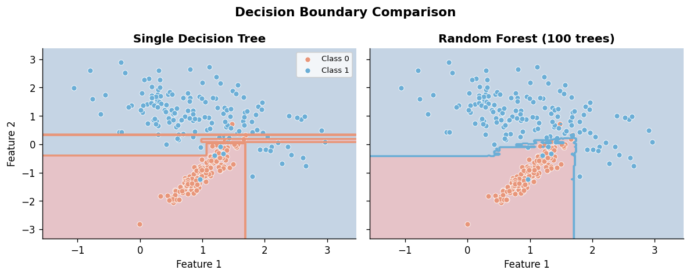
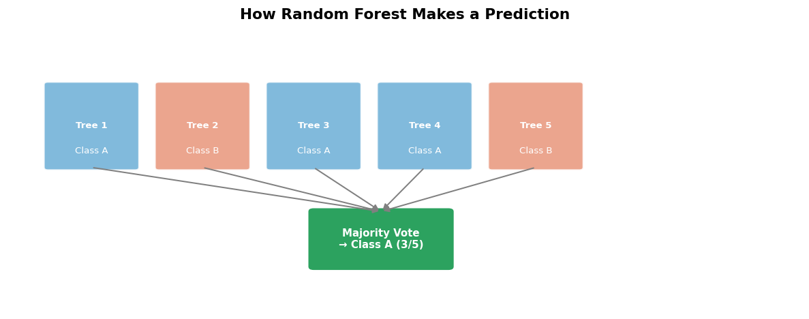

# Introduction to Random Forest

**After this lesson:** you can explain Introduction to Random Forest and try the examples in your own notebook.

## Overview

**Random forests** combine many decision trees trained on **bootstrap** samples and **random feature subsets** at each split, then aggregate predictions (vote or average). **Prerequisites:** [Decision trees](../../5.2-supervised-learning-1/decision-trees/1-introduction.md); [5.3 README](../).

Imagine you're trying to make an important decision, like choosing a new car. Instead of relying on just one person's opinion, you might ask multiple friends with different perspectives. Each friend brings their own experience and knowledge to the table. Random Forest works exactly like this - it's a team of decision-makers (trees) that work together to make better predictions than any single tree could make alone.

 _Figure 1: A single decision tree (left) makes simple, piecewise linear decisions, while a Random Forest (right) combines multiple trees to create more complex decision boundaries._

## What is Random Forest?

Random Forest is like having a committee of experts making decisions together. Each expert (tree) in the committee:

1. Looks at a different set of data points
2. Considers different features (characteristics) of the problem
3. Makes their own decision
4. The final decision is made by combining all the experts' votes

### Why This Matters

* **Better Accuracy**: Just like how a group of people often makes better decisions than a single person, Random Forest typically performs better than individual decision trees
* **More Reliable**: By combining multiple trees, the model becomes more stable and less likely to make mistakes
* **Handles Complexity**: Can capture complex patterns in data that simpler models might miss

## Key Concepts Explained

### 1. Bootstrap Aggregating (Bagging)

Think of this like creating multiple study groups for an exam:

* Each group gets a different set of practice questions
* Some questions might appear in multiple groups
* This helps each group learn different aspects of the material

**Why This Matters**: This approach helps prevent overfitting, which is like memorizing answers instead of understanding the concepts.

### 2. Random Feature Selection

Imagine each expert in our committee only looks at certain aspects of a car:

* One expert might focus on safety features
* Another might look at fuel efficiency
* A third might consider price and maintenance costs

**Why This Matters**: This diversity in perspective helps the model consider different aspects of the problem, leading to more reliable predictions.

.png>) _Figure 2: Feature importance shows which characteristics matter most in making predictions._

### 3. Ensemble Prediction

This is like taking a vote among all the experts:

* For classification problems: The most common prediction wins
* For regression problems: The average of all predictions is used

**Why This Matters**: This democratic approach helps balance out individual biases and errors.

 _Figure 3: How individual tree predictions combine to form the final ensemble prediction._

## When to Use Random Forest?

### Perfect For

* **High-dimensional data**: When you have many features (like predicting house prices using 20+ characteristics)
* **Complex relationships**: When the patterns in your data aren't simple straight lines
* **Feature importance**: When you want to understand which factors matter most
* **Missing values**: When your data has gaps or missing information
* **Both classification and regression**: Whether you're predicting categories or numbers

### Less Suitable For

* **Real-time predictions**: When you need instant results (like in high-frequency trading)
* **Simple relationships**: When your data follows clear, linear patterns
* **Interpretability**: When you need to explain exactly how the model makes decisions
* **Very large datasets**: When you're working with massive amounts of data (consider alternatives like LightGBM)

## Advantages and Limitations

### Advantages

1. **Excellent Performance**: Often achieves high accuracy without much tuning
2. **Feature Importance**: Helps you understand which factors matter most
3. **Handles Non-linear Relationships**: Can capture complex patterns in your data
4. **Resistant to Overfitting**: Less likely to memorize training data
5. **Few Hyperparameters**: Easier to tune than many other models

### Limitations

1. **Black-box Model**: Harder to explain how it makes decisions
2. **Computational Cost**: Can be slower than simpler models
3. **Memory Usage**: Requires more memory to store multiple trees
4. **Noisy Data**: May overfit on very noisy datasets
5. **Linear Problems**: Not the best choice for simple linear relationships

.png>) _Figure 4: The bias-variance tradeoff in Random Forests - how model complexity affects predictions._

## Prerequisites

Before diving deeper, make sure you understand:

1. **Decision Trees**: The building blocks of Random Forest
2. **Basic Probability**: Understanding how randomness helps in model building
3. **Cross-validation**: How to properly evaluate model performance
4. **Model Evaluation Metrics**: How to measure how well your model is doing

## Gotchas

* **"More trees always helps"**: beyond a few hundred trees, adding more estimators yields diminishing accuracy returns while training time and memory grow linearly; always plot OOB error vs `n_estimators` to find where improvement flattens.
* **Random Forest is not immune to overfitting**: on very noisy datasets, fully-grown trees (the default `max_depth=None`) can still memorise noise; setting `min_samples_leaf` or `max_depth` is often needed even though bagging reduces variance.
* **Feature importances are biased toward high-cardinality features**: a feature with many unique values (e.g., a numeric ID or timestamp) gets more split opportunities, inflating its Gini importance; prefer permutation importance for reliable rankings.
* **Bootstrap sampling changes the effective training set size**: each tree only sees \~63.2% unique samples, so a 1 000-row dataset effectively trains each tree on \~632 rows; this matters when your dataset is already small.
* **"Random Forest handles missing values" is misleading**: sklearn's implementation does not accept `NaN` by default; the common claim applies to specialised libraries (e.g., `MissForest`, H2O RF); you must impute before passing data to scikit-learn.
* **Not setting `random_state` makes results non-reproducible**: both the bootstrap sampling and feature subsampling depend on random state; omitting it means every re-run may give a slightly different model and feature importance ranking.

## Next Steps

Ready to understand the math behind Random Forests? Continue to [Mathematical Foundation](2-math-foundation.md) to learn how these concepts work in practice!
