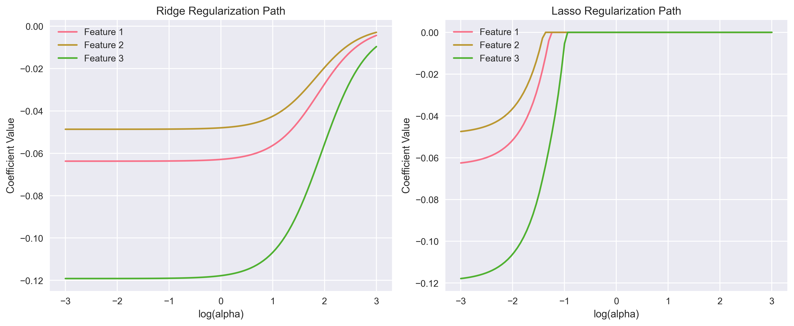
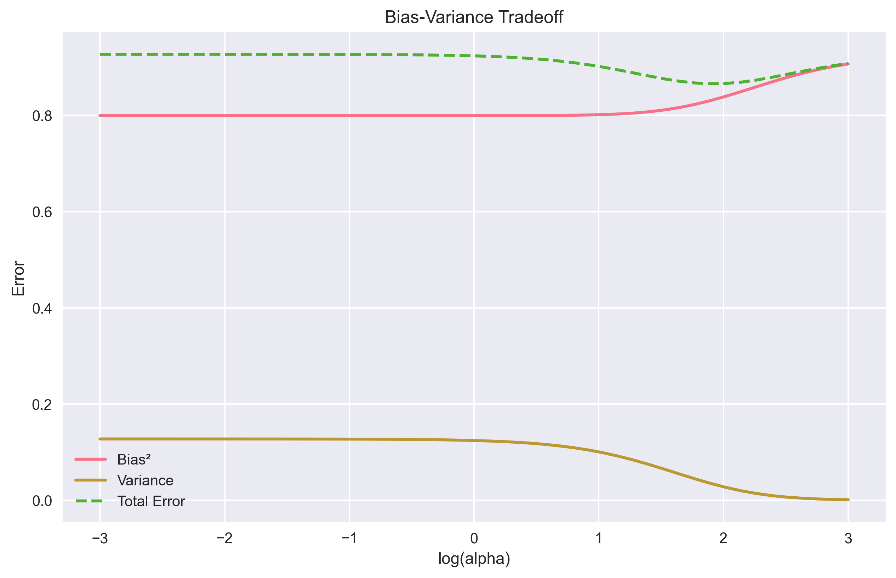
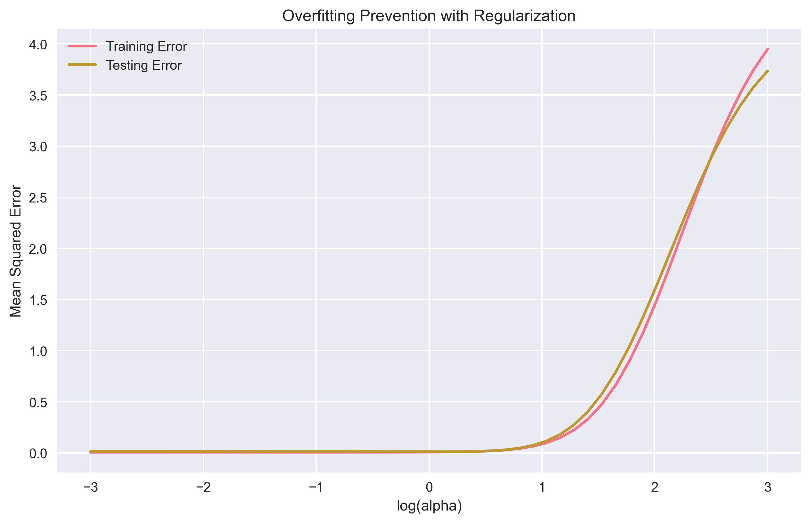
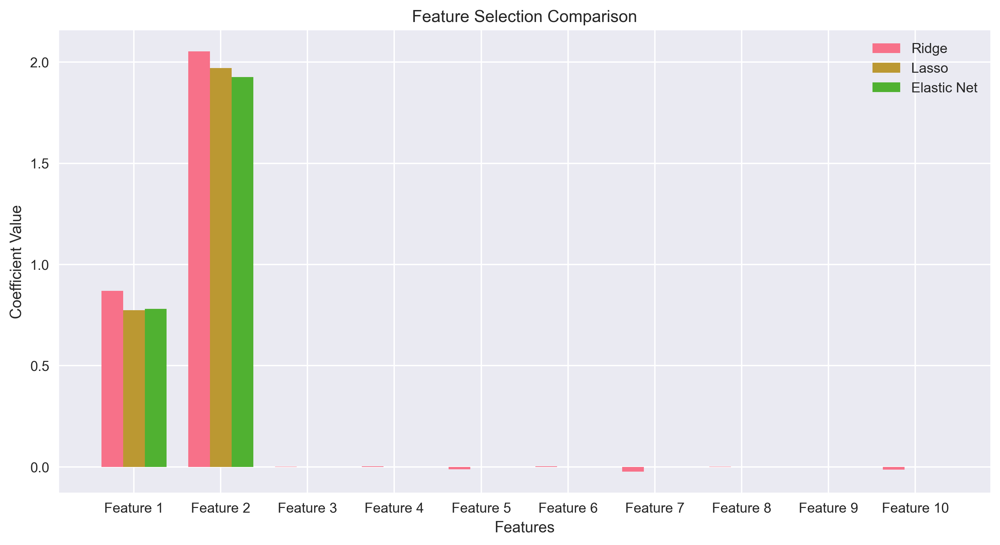

# Introduction to Regularization

Imagine you're learning to ride a bicycle. At first, you might use training wheels to prevent falling over. Regularization in machine learning works similarly - it's like adding training wheels to your model to prevent it from "falling over" (overfitting) when making predictions.


*Figure 1: How regularization affects model coefficients as the regularization strength () changes*

## What is Regularization?

Regularization is a technique that helps prevent overfitting by adding a penalty to your model's complexity. Think of it like a parent setting rules for a child - the rules (regularization) help keep behavior (model predictions) in check.

### Real-World Analogy: The Goldilocks Principle

Just like Goldilocks wanted her porridge "not too hot, not too cold, but just right," regularization helps find the "just right" level of model complexity - not too simple (underfitting) and not too complex (overfitting).


*Figure 2: The tradeoff between bias and variance as regularization strength changes*

## Understanding Regularization

Regularization works by adding a penalty term to the model's loss function:

```python
Loss = Error_on_training_data + λ * Complexity_of_model
```

Where:

- λ (lambda) is the regularization strength - think of it as how strict the rules are
- Complexity_of_model measures how complicated the model is - like counting how many rules the model is trying to learn

### Why This Matters

Without regularization, models can become like students who memorize answers without understanding the concepts. Regularization helps models learn the underlying patterns rather than just memorizing the training data.


*Figure 3: How regularization helps prevent overfitting by controlling the gap between training and testing error*

## Types of Regularization 🔍

### 1. L1 Regularization (Lasso)

```python
Loss = MSE + λ * Σ|w|  # Sum of absolute weights
```

Think of L1 as a strict teacher who encourages students to focus on the most important subjects and drop the less relevant ones.

Features:

- Creates sparse models (like a minimalist wardrobe - only keeping essential items)
- Can eliminate irrelevant features (like removing unnecessary ingredients from a recipe)
- Good for feature selection (like picking the most important players for a team)

### 2. L2 Regularization (Ridge)

```python
Loss = MSE + λ * Σw²  # Sum of squared weights
```

L2 is like a gentle coach who helps all players contribute, but prevents any single player from dominating the game.

Features:

- Shrinks weights toward zero (like turning down the volume on all speakers, but keeping them all connected)
- Handles multicollinearity well (like managing a team where some players have similar skills)
- Keeps all features (like maintaining a complete toolkit, even if some tools are used less often)

### 3. Elastic Net

```python
Loss = MSE + λ₁ * Σ|w| + λ₂ * Σw²  # Combination of L1 and L2
```

Elastic Net is like having both a strict teacher and a gentle coach - it combines the best of both approaches.


*Figure 4: Comparison of how different regularization methods affect feature selection*

Features:

- Combines benefits of L1 and L2 (like having both structure and flexibility)
- More robust than pure L1 or L2 (like having multiple safety nets)
- Good for highly correlated features (like managing a team with overlapping skills)

## When to Use Regularization?

### Perfect For

- High-dimensional datasets (like analyzing customer behavior with many features)
- Models showing signs of overfitting (like a student who memorizes but doesn't understand)
- Feature selection (L1) (like choosing the most important factors for a decision)
- Handling multicollinearity (L2) (like managing related variables in a dataset)
- Complex model architectures (like building a sophisticated prediction system)

### Less Suitable For

- Very small datasets (like trying to learn from just a few examples)
- Already simple models (like using training wheels on a tricycle)
- When interpretability is crucial (like needing to explain decisions to stakeholders)
- When you need exact zero coefficients (L2) (like needing to completely eliminate certain factors)

## Advantages and Limitations

### Advantages

1. Prevents overfitting (like having a safety net)
2. Improves model generalization (like learning principles instead of memorizing)
3. Can perform feature selection (L1) (like focusing on what matters most)
4. Handles multicollinearity (L2) (like managing related variables effectively)
5. Reduces model complexity (like simplifying a complex system)

### Limitations

1. Additional hyperparameter to tune () (like finding the right balance of rules)
2. May underfit if  is too large (like having too many restrictions)
3. L1 can be unstable with correlated features (like having conflicting rules)
4. L2 never produces exact zero coefficients (like having some influence even when small)
5. Can be computationally intensive (like having more complex calculations)

## Common Mistakes to Avoid

1. Using too strong regularization (like having too many rules)
2. Not tuning the regularization parameter (like not adjusting the training wheels)
3. Applying the same regularization to all features (like treating all students the same)
4. Ignoring feature scaling (like comparing apples and oranges)
5. Not validating the regularization effect (like not checking if the rules are working)

## Prerequisites

Before diving deeper, ensure you understand:

1. Linear regression (like understanding basic relationships)
2. Loss functions (like knowing how to measure mistakes)
3. Gradient descent (like knowing how to improve step by step)
4. Cross-validation (like testing your understanding in different situations)
5. Model evaluation metrics (like knowing how to measure success)

## Next Steps

Ready to dive deeper? Continue to [Mathematical Foundation](2-math-foundation.md) to understand the theory behind Regularization!

## Additional Resources

- [Scikit-learn Regularization Documentation](https://scikit-learn.org/stable/modules/linear_model.html)
- [Regularization in Machine Learning](https://towardsdatascience.com/regularization-in-machine-learning-76441ddcf99a)
- [Understanding L1 and L2 Regularization](https://www.analyticsvidhya.com/blog/2016/01/complete-tutorial-ridge-lasso-regression-python/)
