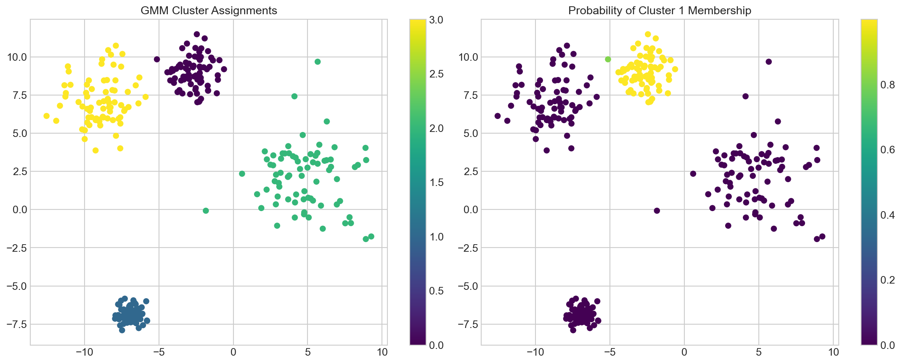
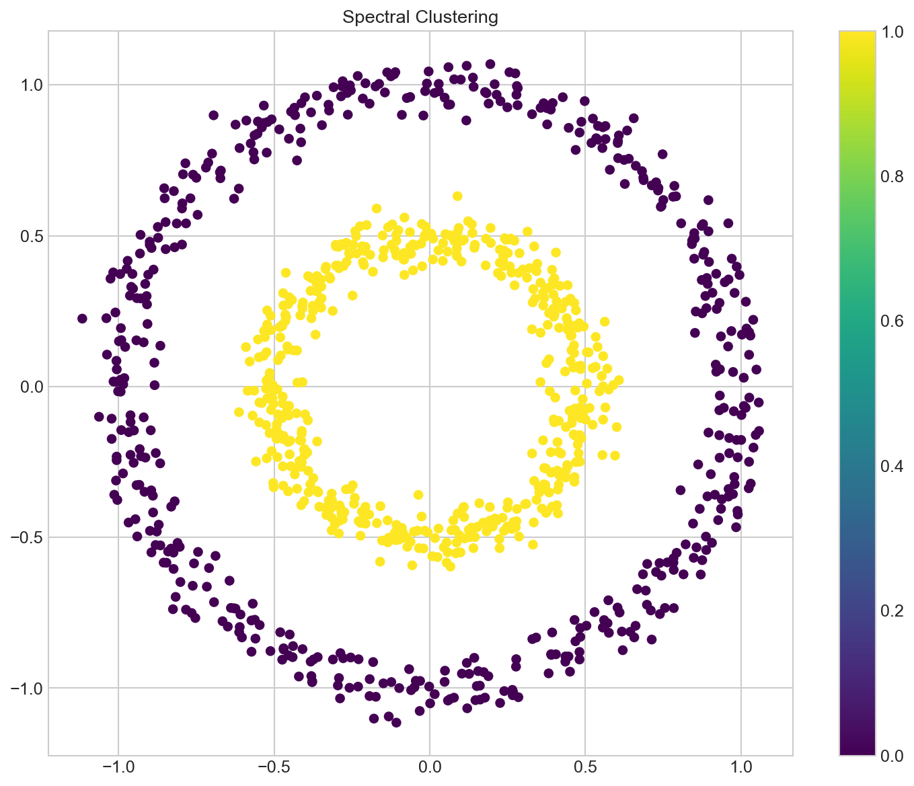

# Advanced Clustering Techniques

**After this lesson:** you can explain Advanced Clustering Techniques and try the examples in your own notebook.

## Overview

Spectral / mixture-model angles and practical checks when basic k-means or DBSCAN are not enough.

## HDBSCAN: Advanced Density-Based Clustering

HDBSCAN improves on DBSCAN by:

* Automatically adapting to varying densities
* Not requiring an epsilon parameter
* Providing cluster membership probabilities

Mixed Dataset and HDBSCAN Fit

Stack a moon-shaped and a blob-shaped distribution to create a dataset with varying density; HDBSCAN finds clusters without requiring an epsilon radius by adapting to local density.

Labels and Probabilities

First plot shows hard cluster labels; second uses `clusterer.probabilities_`, HDBSCAN's unique membership confidence score that shows how "core" each point is to its cluster.

<figure><figcaption><p>Figure 1: HDBSCAN adapts to curved and blob-shaped density regions, while membership probabilities show how confidently each point belongs to its cluster.</p></figcaption></figure>

## Gaussian Mixture Models (GMM)

GMM is like having multiple overlapping probability distributions:

1. Each cluster is a Gaussian distribution
2. Points can belong partially to multiple clusters
3. Model learns distribution parameters

GMM Fit with Varied Spreads

Create four blobs with different standard deviations; GMM handles unequal cluster sizes better than K-Means because each component has its own covariance; `predict_proba` gives soft membership scores.

Hard Labels vs Soft Membership

Left subplot shows argmax cluster assignments; right uses `probs[:, 0]` to color by probability of belonging to cluster 0, gradient color reveals the boundary uncertainty that hard labels hide.

<figure><figcaption><p>Figure 2: GMM Cluster Assignments</p></figcaption></figure>

## Spectral Clustering

Spectral clustering is like finding communities in a social network:

1. Build similarity graph
2. Find graph Laplacian
3. Use eigenvectors for clustering

Concentric Circles Setup

`make_circles` creates two interlocking rings that K-Means cannot separate; `affinity='nearest_neighbors'` builds a graph that captures the ring topology instead of Euclidean distance.

Spectral Fit and Plot

Spectral clustering maps points to a low-dimensional eigenspace before clustering; the result correctly separates inner and outer rings that would confuse centroid-based methods.

<figure><figcaption><p>Figure 3: Spectral Clustering</p></figcaption></figure>

## Real-World Applications

### 1. Topic Modeling with GMM

> _Illustrative only:_ in practice, topic modeling uses LDA or NMF (`sklearn.decomposition.LatentDirichletAllocation` / `NMF`). GMM on TF-IDF vectors is shown here to demonstrate soft membership, not as a recommended topic-modeling approach.

TF-IDF Vectorization

Convert five short documents to TF-IDF feature vectors; `.toarray()` converts the sparse matrix to dense, required for GMM which expects a dense input array.

GMM Topic Assignments

Fit GMM with 2 components to discover two topic groups; `predict_proba` shows the soft topic membership, documents about "deep learning" and "clustering" should land in different components.

```
Document: machine learning algorithms classification
Topic: 0
Topic Probabilities: [1. 0.]

Document: neural networks deep learning
Topic: 0
Topic Probabilities: [1. 0.]

Document: clustering unsupervised learning
Topic: 1
Topic Probabilities: [0. 1.]

Document: deep neural networks training
Topic: 0
Topic Probabilities: [1. 0.]

Document: kmeans clustering algorithm
Topic: 1
Topic Probabilities: [0. 1.]
```

### 2. Image Segmentation with HDBSCAN

Pixel Feature Extraction

Convert to CIELAB color space (`rgb2lab`) where Euclidean distance matches perceptual color difference; reshape flattens the image to a (height×width, 3) pixel array for clustering.

Segment and Display

HDBSCAN groups pixels by color similarity; reshaping labels back to (height, width) creates a segmentation map where each color region gets a cluster index.

## Advanced Techniques

### 1. Ensemble Clustering

Three Diverse Clusterers

Combine HDBSCAN, GMM, and SpectralClustering, each with different inductive biases; diversity across methods reduces the chance that all three make the same mistakes.

Majority Vote Ensemble

Collect per-clusterer predictions in a matrix, then `mode(axis=1)` picks the most common label per point, note that cluster label alignment across methods is a known challenge for real ensemble implementations.

### 2. Semi-Supervised Clustering

```python
def semi_supervised_gmm(X, labeled_indices, true_labels):
    # NOTE: GaussianMixture.fit(X, y) ignores y: it is unsupervised.
    # To actually use the labels, seed each Gaussian with the mean of a
    # labeled class via means_init (this is what makes it semi-supervised).
    y_known = true_labels[labeled_indices]
    classes = np.unique(y_known)
    means_init = np.array([
        X[labeled_indices][y_known == c].mean(axis=0) for c in classes
    ])

    gmm = GaussianMixture(n_components=len(classes),
                          means_init=means_init, random_state=42)
    gmm.fit(X)              # fit on all data, guided by the labeled class means
    return gmm.predict(X)
```

### 3. Online Clustering

```python
from sklearn.cluster import MiniBatchKMeans

def online_clustering(data_generator, n_clusters=3):
    # Initialize online clusterer
    clusterer = MiniBatchKMeans(n_clusters=n_clusters)

    # Process data in batches
    for batch in data_generator:
        clusterer.partial_fit(batch)

    return clusterer
```

## Best Practices

### 1. Model Selection

```python
def select_best_model(X, models, n_splits=5):
    from sklearn.metrics import silhouette_score
    scores = {}

    for name, model in models.items():
        labels = model.fit_predict(X)
        score = silhouette_score(X, labels)
        scores[name] = score

    return scores
```

### 2. Parameter Optimization

Init Best Trackers

Set up variables to track the best silhouette score and corresponding parameter combination found so far.

Grid Search Loop

Try every combination of `min_cluster_size` and `min_samples`, scoring each valid clustering with silhouette to find the best params.

## Common Pitfalls and Solutions

1. **Model Selection Issues**
   * Try multiple algorithms
   * Use ensemble methods
   * Validate results
2. **Parameter Sensitivity**
   * Use parameter search
   * Cross-validate results
   * Consider stability
3. **Scalability**
   * Use mini-batch methods
   * Consider data sampling
   * Implement parallel processing

## Gotchas

* **Ensemble clustering with naive majority voting is broken by label misalignment**: different clustering algorithms assign arbitrary integers to clusters, so cluster "0" in HDBSCAN and cluster "0" in GMM may refer to completely different groups. A majority vote on raw labels is meaningless; use a proper consensus method like co-association matrices.
* **GMM's `n_components` is not the same as the true number of clusters**: GMM fits a mixture of Gaussians regardless of whether your data is actually Gaussian. Setting `n_components` too high causes it to split one real cluster into multiple Gaussian blobs, inflating the apparent cluster count.
* **HDBSCAN's `min_cluster_size` has a large impact on results**: setting it too small produces many tiny clusters and noise, too large merges distinct groups. Unlike DBSCAN's `eps`, there is no k-distance plot guide; validate with silhouette scores while excluding noise points (`labels != -1`).
* **Spectral clustering is not scalable**: it builds an n×n affinity matrix, making it O(n²) in memory and up to O(n³) in the eigendecomposition. On more than a few thousand points it becomes impractical; cluster a representative subsample, or switch to a scalable method (HDBSCAN, MiniBatchKMeans). The faster `eigen_solver='amg'` path exists but requires the optional `pyamg` package.
* **`GaussianMixture.fit` can fail to converge**: EM for GMM can collapse when a Gaussian component shrinks to fit a single point (covariance → 0). Add `reg_covar=1e-6` to regularize covariance matrices and prevent `ConvergenceWarning` or `NaN` outputs.
* **`MiniBatchKMeans` for online clustering produces slightly different centroids each run**: mini-batch updates introduce randomness beyond the initial seed; results will vary across runs even with `random_state` set, which is expected behavior, not a bug.

## Next Steps

Now that you've mastered clustering techniques, try the [assignment](assignments/coding.md) to apply these concepts to real-world problems!
