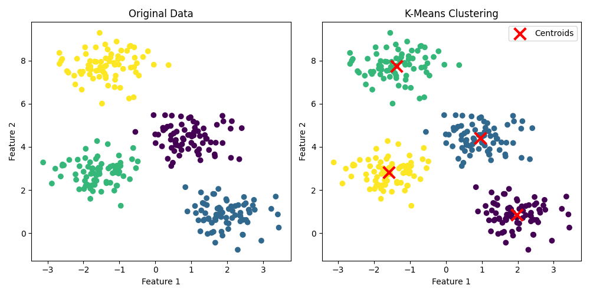
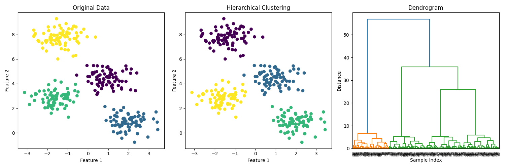

# Clustering: Finding Natural Groups in Data

**After this lesson:** you can explain Clustering: Finding Natural Groups in Data and try the examples in your own notebook.

## Overview

Hub for **clustering** ideas: choosing $k$, distances, and validation without labels.

## What is Clustering?

Clustering is like having a smart assistant who can look at a pile of items and automatically organize them into meaningful groups. It's particularly useful when:

* You don't know what groups exist in your data
* You want to discover natural patterns
* You need to segment your data into meaningful categories

## Why Do We Need Clustering?

1. **Customer Segmentation**: Like grouping customers based on their shopping habits
2. **Image Organization**: Like automatically sorting photos by content
3. **Document Clustering**: Like organizing articles by topic
4. **Anomaly Detection**: Like finding unusual patterns in data

## Types of Clustering Algorithms

### 1. K-Means Clustering

Think of K-Means as a smart organizer who:

* Decides how many groups to make (k)
* Places items in the group they're closest to
* Keeps adjusting until everything is in the right place

Data and K-Means Fit

Generate four synthetic Gaussian blobs, then fit `KMeans(n_clusters=4)`; `predict` assigns each point to the nearest centroid, producing integer cluster labels.

Side-by-side Comparison

Left subplot shows true labels from `make_blobs`; right shows K-Means assignments with red X markers at `cluster_centers_`, comparing the two reveals how well the algorithm recovered the true groups.

<figure><figcaption><p>Figure 1: K-Means works well on compact, blob-shaped clusters and marks each learned centroid with a red X.</p></figcaption></figure>

Expected prediction output:

```
First 10 labels: [0 2 1 2 0 0 3 1 2 2]
Centroids:
[[ 1.98  0.87]
 [ 0.95  4.42]
 [-1.37  7.75]
 [-1.58  2.83]]
Inertia: 212.01
```

### 2. Hierarchical Clustering

Think of Hierarchical Clustering as building a family tree of your data:

* Starts with each item as its own group
* Gradually combines similar groups
* Creates a tree-like structure of relationships

Agglomerative Clustering

Fit `AgglomerativeClustering(n_clusters=4)` on the same blob data as K-Means; `fit_predict` returns integer labels assigned by bottom-up merging.

Three-panel Figure

Left: original labels; middle: hierarchical assignments; right: `dendrogram` from scipy's `linkage` (Ward method), the dendrogram's branch heights show at what distances clusters merged.

<figure><figcaption><p>Figure 2: Hierarchical clustering produces both flat cluster labels and a dendrogram that shows how groups merge as distance increases.</p></figcaption></figure>

Expected prediction output:

```
First 10 labels: [2 0 1 0 2 2 3 1 0 0]
Cluster ids: [0 1 2 3]
Cluster counts: [75 75 75 75]
```

### 3. DBSCAN (Density-Based Spatial Clustering of Applications with Noise)

Think of DBSCAN as a smart city planner who:

* Identifies dense neighborhoods (clusters)
* Marks sparse areas as noise
* Doesn't need to know how many neighborhoods to look for

DBSCAN Parameters

`eps=0.25` sets the neighborhood radius; `min_samples=5` sets the density threshold; points labeled -1 by `fit_predict` are noise (outliers not in any cluster).

Visualize Results

Side-by-side comparison with true blob labels; DBSCAN may find different cluster boundaries or label some points as noise (-1), shown as a distinct color in the right subplot.

<figure><figcaption><p>Figure 3: DBSCAN follows dense regions, so it can separate curved clusters without being told the number of clusters.</p></figcaption></figure>

Expected prediction output:

```
Cluster ids: [0 1]
Cluster counts: [150 150]
Noise fraction: 0.0
```

## How to Choose the Right Algorithm

### Use K-Means when

* You know how many clusters you want
* Your clusters are roughly spherical
* You have a large dataset

### Use Hierarchical Clustering when

* You don't know how many clusters you want
* You want to see the relationships between clusters
* You have a small to medium dataset

### Use DBSCAN when

* You don't know how many clusters you want
* Your clusters can be any shape
* You want to identify outliers

## Best Practices

1. **Data Preprocessing**:

```python
def preprocess_for_clustering(X):
    # Remove missing values
    X = np.nan_to_num(X)

    # Scale data
    scaler = StandardScaler()
    X_scaled = scaler.fit_transform(X)

    return X_scaled
```

2. **Finding the Right Number of Clusters**:

Inertia Sweep

Fit K-Means for each k from 1 to `max_clusters` and collect `inertia_` (sum of squared distances to centroids); inertia always decreases as k grows but the rate of decrease slows past the true cluster count.

Elbow Plot

Plot inertia vs k; the "elbow", where the curve bends sharply, is the heuristic choice for the optimal number of clusters.

<figure><figcaption><p>Figure 4: The elbow method looks for the point where adding another cluster stops reducing inertia substantially.</p></figcaption></figure>

Expected numeric output for `k=1..10`:

```
[2812.1, 1190.8, 546.9, 212.0, 188.8, 170.1, 154.0, 138.2, 126.6, 112.8]
```

## Common Mistakes to Avoid

1. **Not Scaling Data**: Always standardize your data first
2. **Choosing Wrong Number of Clusters**: Use methods like the elbow method
3. **Using Wrong Algorithm**: Consider your data's characteristics
4. **Ignoring Outliers**: Some algorithms are sensitive to outliers

## Gotchas

* **Cluster labels are arbitrary integers**: running K-Means twice with different random seeds can produce the same clusters but with swapped label numbers (e.g., cluster 0 and cluster 2 swap). Never compare raw label values across runs; use metrics like silhouette score instead.
* **The elbow method is subjective and sometimes has no clear elbow**: on real-world data the inertia curve often decreases smoothly without a visible kink. Pair it with silhouette scores or domain knowledge rather than relying on it alone.
* **Forgetting to scale before clustering**: Euclidean distance is scale-sensitive; a feature in thousands will dominate a feature measured in units, and K-Means/DBSCAN will cluster on that dominant feature almost exclusively.
* **DBSCAN's `eps` is not unitless**: its meaning depends entirely on the scale of your features, so after standardization the same `eps=0.5` behaves very differently than on raw data. Always tune `eps` on scaled data, not the raw values.
* **AgglomerativeClustering can't predict new points**: unlike K-Means, `AgglomerativeClustering` has no `predict` method; you must refit on the combined old + new data to assign labels to unseen points.
* **Assuming clusters found equal ground-truth classes**: clustering is unsupervised, so a "4-cluster" result on the Iris dataset doesn't map cleanly to 3 true species. Validate with adjusted rand index if labels are available, or with domain expertise if they're not.

## Further Reading

1. [Scikit-learn Clustering Documentation](https://scikit-learn.org/stable/modules/clustering.html)
2. [Understanding K-Means Clustering](https://towardsdatascience.com/understanding-k-means-clustering-in-machine-learning-6a6e67336aa1)
3. [DBSCAN Algorithm Explained](https://towardsdatascience.com/dbscan-algorithm-explained-13e3f82f62c6)

## Practice Exercise

Try clustering the famous Iris dataset:

1. Load the data
2. Preprocess it
3. Try different clustering algorithms
4. Compare the results
5. Visualize the clusters

Remember: The goal is to find meaningful patterns in your data!
