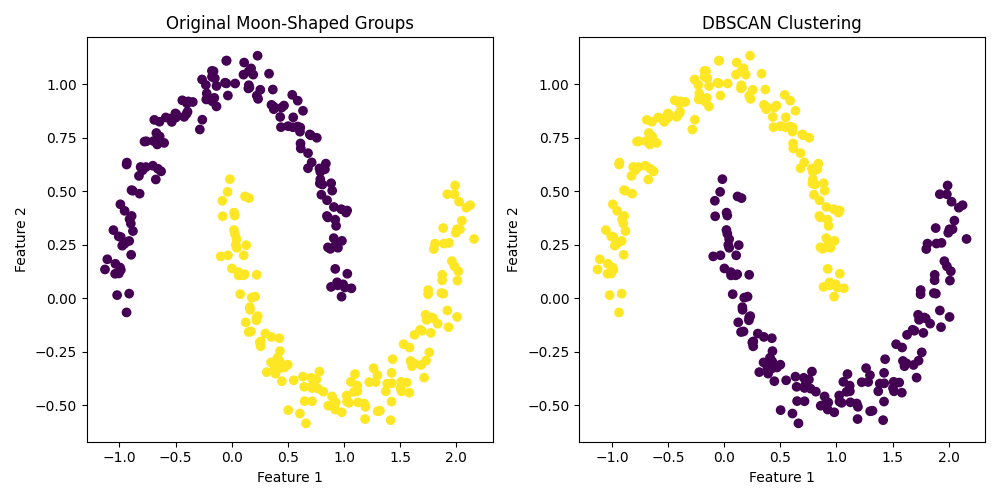
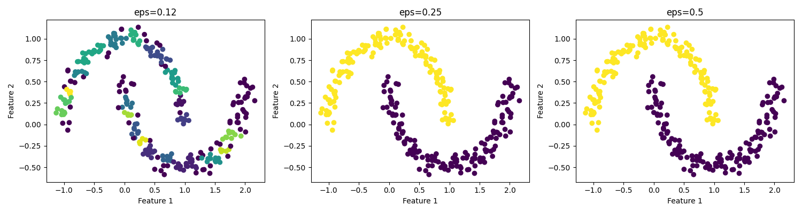

# DBSCAN (Density-Based Spatial Clustering)

**After this lesson:** you can fit DBSCAN, visualise its noise labels, and tune `eps` with a practical debugging workflow.

## Overview

DBSCAN finds dense neighborhoods in feature space. Unlike K-Means, it does not ask for the number of clusters in advance. Instead, it asks:

- How close must points be to count as neighbors? (`eps`)
- How many neighbors make an area dense enough? (`min_samples`)

Points in dense areas become clusters. Points that are too isolated are labeled `-1`, meaning noise or outlier.

This makes DBSCAN useful when the shape of the group matters. K-Means draws boundaries around centroids, so it prefers round groups. DBSCAN follows connected dense regions, so it can find crescents, rings, and irregular geographic or behavioral patterns.

The tradeoff is parameter sensitivity. DBSCAN does not need `k`, but it does need a good distance scale.

## Quick Reference



DBSCAN is ideal when:

- Clusters have arbitrary shapes rather than round blobs.
- You need to identify noise or outliers.
- You do not know the number of clusters.
- The dataset is scaled and distance is meaningful.

## Core, Border, and Noise Points

DBSCAN classifies points by density:

| Point type | Meaning | What happens |
| --- | --- | --- |
| Core point | Has at least `min_samples` points within distance `eps` | Starts or expands a cluster |
| Border point | Is close to a core point but does not have enough neighbors itself | Joins a nearby cluster |
| Noise point | Is not close enough to any core point | Receives label `-1` |

Clusters form by connecting core points that can reach each other through dense neighborhoods. This is why DBSCAN can follow curved shapes without using centroids.

## Worked Example

DBSCAN often shines on shapes that confuse centroid-based clustering. The two-moons dataset below has curved clusters, so "nearest centroid" is the wrong mental model.

```python
import matplotlib.pyplot as plt
from sklearn.cluster import DBSCAN
from sklearn.datasets import make_moons
from sklearn.preprocessing import StandardScaler

X, true_labels = make_moons(n_samples=300, noise=0.06, random_state=42)
X_scaled = StandardScaler().fit_transform(X)

dbscan = DBSCAN(eps=0.25, min_samples=5)
predicted_labels = dbscan.fit_predict(X_scaled)

plt.figure(figsize=(10, 5))

plt.subplot(121)
plt.scatter(X[:, 0], X[:, 1], c=true_labels, cmap="viridis")
plt.title("Original moon-shaped groups")
plt.xlabel("Feature 1")
plt.ylabel("Feature 2")

plt.subplot(122)
plt.scatter(X[:, 0], X[:, 1], c=predicted_labels, cmap="viridis")
plt.title("DBSCAN result")
plt.xlabel("Feature 1")
plt.ylabel("Feature 2")

plt.tight_layout()
plt.savefig("assets/dbscan_example.png")
plt.close()
```

<figure>

<figcaption>Figure 1: DBSCAN separates curved groups because it follows density instead of centroid distance.</figcaption>
</figure>

## How to Read the Chart

The two moons are not round. A centroid method would tend to split the shape with straight-ish regions. DBSCAN instead asks whether points are connected through nearby dense neighborhoods.

When reading a DBSCAN plot:

- Same-colored points are connected by density.
- A `-1` color means noise or outlier.
- Curved clusters are acceptable; DBSCAN does not require spherical groups.
- If one visible group is split into many fragments, `eps` is probably too small.
- If several visible groups merge together, `eps` is probably too large.

## Interpreting Labels

DBSCAN labels are still arbitrary integers, but `-1` has a special meaning:

```python
cluster_ids = set(predicted_labels)
noise_fraction = (predicted_labels == -1).mean()

print("Cluster ids:", cluster_ids)
print("Noise fraction:", round(noise_fraction, 3))
```

If almost everything is `-1`, `eps` is probably too small or `min_samples` is too high. If almost everything is one label, `eps` is probably too large.

## Tuning `eps`

The fastest beginner debugging move is to try a few `eps` values and visualise the result.

```python
eps_values = [0.12, 0.25, 0.50]

fig, axes = plt.subplots(1, len(eps_values), figsize=(15, 4))
for ax, eps in zip(axes, eps_values):
    labels = DBSCAN(eps=eps, min_samples=5).fit_predict(X_scaled)
    ax.scatter(X[:, 0], X[:, 1], c=labels, cmap="viridis")
    ax.set_title(f"eps={eps}")
    ax.set_xlabel("Feature 1")
    ax.set_ylabel("Feature 2")

plt.tight_layout()
plt.savefig("assets/dbscan_eps_sweep.png")
plt.close()
```

<figure>

<figcaption>Figure 2: Small `eps` creates too much noise; large `eps` merges groups. The middle setting preserves the two curved clusters.</figcaption>
</figure>

For a more systematic choice, plot each point's distance to its `min_samples`-th nearest neighbor and look for the elbow. Use that distance as a starting point for `eps`, then inspect the clusters visually.

## Choosing `min_samples`

`min_samples` controls how dense a region must be before it can become a cluster.

- Smaller values make DBSCAN more willing to form clusters.
- Larger values make DBSCAN stricter and label more points as noise.
- A common starting point is `min_samples = 2 * number_of_features`.

For a two-dimensional teaching dataset, `min_samples=5` is a reasonable default. For real data, tune it together with `eps` and always report the noise fraction.

## Beginner Workflow

Use this sequence when trying DBSCAN:

1. Choose numeric features where distance has a meaningful interpretation.
2. Scale the features with `StandardScaler`.
3. Start with `min_samples=5` for small 2D examples, or `2 * n_features` for larger tabular data.
4. Sweep a few `eps` values and plot the result.
5. Count clusters and noise points.
6. Inspect whether the noise points are plausible outliers or just a bad parameter setting.

## Mini Practice

Use the same `make_moons` dataset and try:

- `eps=0.10`
- `eps=0.25`
- `eps=0.60`

For each setting, answer:

1. How many clusters were found?
2. What fraction of points were labeled `-1`?
3. Does the result match the visible moon shapes?
4. Which setting would you keep, and why?

## Gotchas

- **Noise points labeled `-1` need special handling** - some metrics, including silhouette score, should be computed after filtering noise points (`labels != -1`) and reported alongside the noise fraction.
- **`eps` in raw feature space is meaningless** - DBSCAN uses Euclidean distance, so an `eps` value that works on standardized data can be wildly wrong on unscaled data.
- **All points classified as noise** - if `eps` is too small or `min_samples` is too large, DBSCAN assigns everything to noise. Increase `eps` or reduce `min_samples`.
- **All points in one cluster** - if `eps` is too large, DBSCAN merges everything into one dense region. Decrease `eps`.
- **Different densities are hard** - DBSCAN uses one global `eps`, so dense and sparse clusters can be hard to recover together. Consider HDBSCAN when density varies.

For a longer comparison with K-Means and hierarchical clustering, see the [Clustering Guide](clustering.md).
