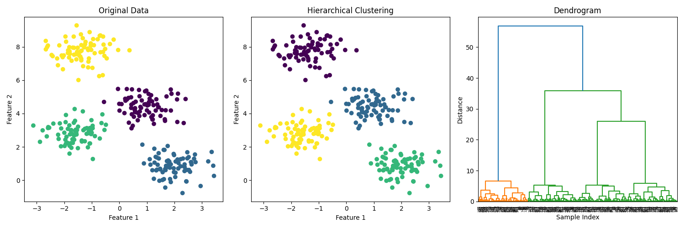

# Hierarchical Clustering

**After this lesson:** you can build a dendrogram, read merge distances, and choose a cluster cut from the tree.

## Overview

Hierarchical clustering builds a tree of relationships between observations. The most common version is **agglomerative clustering**:

1. Start with every point as its own cluster.
2. Merge the two closest clusters.
3. Repeat until everything belongs to one big cluster.
4. Cut the tree at a chosen height to get the final groups.

This is useful when you care about the nested structure of the data, not just one flat clustering result.

## Quick Reference



Hierarchical clustering is ideal when:

- You want to explore multiple cluster levels.
- You do not know the number of clusters in advance.
- You have a small to medium dataset.
- You need a dendrogram to explain how groups relate.

## Worked Example

The code below fits agglomerative clustering and plots the dendrogram next to the final cluster assignments.

```python
import matplotlib.pyplot as plt
from scipy.cluster.hierarchy import dendrogram, linkage
from sklearn.cluster import AgglomerativeClustering
from sklearn.datasets import make_blobs

X, true_labels = make_blobs(
    n_samples=300,
    centers=4,
    cluster_std=0.60,
    random_state=0,
)

model = AgglomerativeClustering(n_clusters=4, linkage="ward")
predicted_labels = model.fit_predict(X)

plt.figure(figsize=(15, 5))

plt.subplot(131)
plt.scatter(X[:, 0], X[:, 1], c=true_labels, cmap="viridis")
plt.title("Original synthetic groups")
plt.xlabel("Feature 1")
plt.ylabel("Feature 2")

plt.subplot(132)
plt.scatter(X[:, 0], X[:, 1], c=predicted_labels, cmap="viridis")
plt.title("Agglomerative result")
plt.xlabel("Feature 1")
plt.ylabel("Feature 2")

plt.subplot(133)
linkage_matrix = linkage(X, method="ward")
dendrogram(linkage_matrix, truncate_mode="lastp", p=20)
plt.title("Dendrogram")
plt.xlabel("Merged cluster")
plt.ylabel("Distance")

plt.tight_layout()
plt.savefig("assets/hierarchical_clustering.png")
plt.close()
```

<figure>

<figcaption>Figure 1: The dendrogram shows the merge history. Large vertical gaps suggest natural cut heights.</figcaption>
</figure>

## Reading a Dendrogram

In a dendrogram:

- Each leaf starts as one point or one small merged group.
- Each horizontal connection means two clusters were merged.
- The y-axis height is the merge distance.
- A horizontal cut through the tree produces the final cluster count.

Look for the largest vertical gap with no horizontal line crossing it. Cutting through that gap often gives a reasonable number of clusters.

## Linkage Choices

The linkage method defines "distance between clusters":

| Linkage | How it measures cluster distance | Typical behavior |
| --- | --- | --- |
| `ward` | Merge that increases within-cluster variance the least | Compact clusters; Euclidean only |
| `complete` | Farthest pair of points across clusters | Compact, conservative clusters |
| `average` | Average pairwise distance across clusters | Middle-ground behavior |
| `single` | Closest pair of points across clusters | Can create long chained clusters |

Use `ward` as a clean default for numeric, scaled Euclidean data. Try `complete` or `average` when the dendrogram looks too chained.

## Beginner Workflow

1. Scale numeric features first.
2. Plot a dendrogram on a sample if the dataset is large.
3. Pick a cut height or `n_clusters`.
4. Fit `AgglomerativeClustering`.
5. Visualise the cluster assignments in PCA/UMAP space if the original data has many features.

## Gotchas

- **Ward linkage requires Euclidean distance** - `method="ward"` in scipy only works with Euclidean geometry.
- **Cutting at the wrong height** - do not pick a cut because it looks neat; look for a large vertical gap in merge distances.
- **Scalability wall** - agglomerative clustering uses O(n²) memory, so large datasets become expensive quickly.
- **No `predict` for new points** - unlike K-Means, `AgglomerativeClustering` has no `predict` method. To assign new rows, refit on the combined old and new data.
- **Linkage choice changes cluster shapes** - `single`, `complete`, `average`, and `ward` can produce very different trees on the same data.

For the broader algorithm comparison, see the [Clustering Guide](clustering.md).
