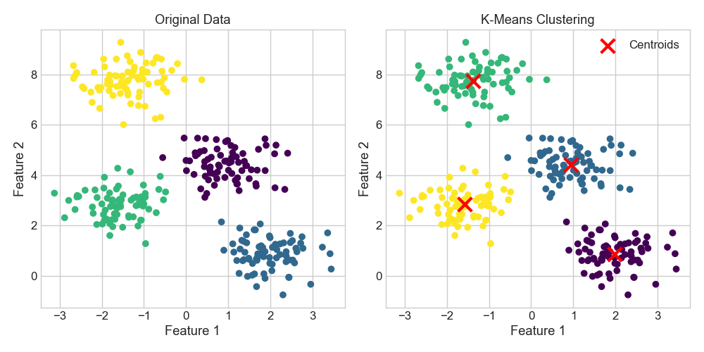
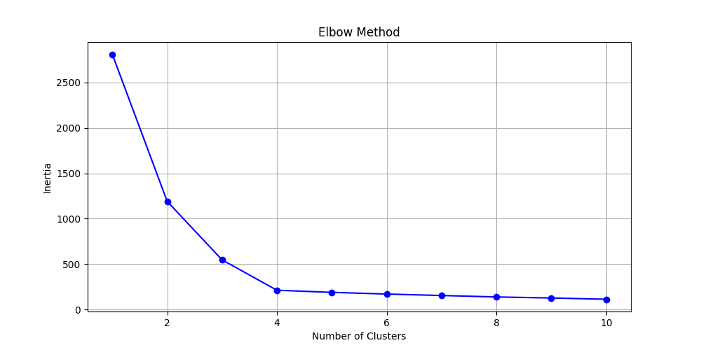

# K-means Clustering

**After this lesson:** you can fit K-Means, visualise the cluster assignments, and explain what the centroids and inertia mean.

## Overview

K-Means is a centroid-based clustering algorithm. It tries to divide points into `k` groups by repeatedly answering two questions:

1. Which centroid is each point closest to?
2. Where should each centroid move after seeing its assigned points?

It works best when the groups are compact, round-ish, and similar in size. It is a poor fit for long curved shapes, heavy outliers, or datasets where you do not have a reasonable guess for `k`.

In a real project, K-Means is usually a first clustering baseline. It gives you a fast answer to questions like:

- Are there natural customer segments in this table?
- Can similar products be grouped by price, size, or usage features?
- Do sensor readings fall into a few common operating states?

The important phrase is **fast answer**, not final truth. K-Means will always return clusters if you ask it to, even when the data does not contain meaningful groups. Your job is to inspect the result and decide whether the clusters make sense.

## Helpful video

StatQuest overview of K-means clustering.

<iframe width="560" height="315" src="https://www.youtube.com/embed/4b5d3muPQmA" title="K-means Clustering, Clearly Explained" frameborder="0" allow="accelerometer; autoplay; clipboard-write; encrypted-media; gyroscope; picture-in-picture" allowfullscreen></iframe>

## Mental Model



K-Means alternates between assignment and update steps:

- **Assign:** each point goes to the nearest centroid.
- **Update:** each centroid moves to the mean of the points assigned to it.
- **Repeat:** stop when assignments stop changing or the maximum iterations are reached.

The final cluster labels are arbitrary integers. Cluster `0` does not mean "first", "best", or "smallest"; it only names one discovered group.

## What K-Means Optimizes

K-Means tries to minimize the total squared distance between each point and the centroid assigned to it. Scikit-learn reports this value as `inertia_`.

Lower inertia means points are closer to their centroids, but inertia alone does not prove that the clusters are meaningful. If you increase `k`, inertia almost always goes down because each centroid has fewer points to cover. That is why the elbow method looks for the point where adding another cluster stops helping much.

## Step-by-Step Workflow

For beginner projects, use this sequence:

1. Select numeric features that describe the behavior you care about.
2. Scale the features with `StandardScaler`.
3. Pick a small range of `k` values to try.
4. Fit K-Means for each `k`.
5. Compare inertia, silhouette score, and the actual cluster profiles.
6. Visualise the clusters in two dimensions with PCA or UMAP if the data has many features.

Do not start by searching for the "perfect" `k`. Start by asking what cluster result would be useful for the problem.

## Worked Example

This example creates four obvious groups, fits K-Means, and plots the learned clusters beside the true synthetic labels.

```python
import matplotlib.pyplot as plt
from sklearn.cluster import KMeans
from sklearn.datasets import make_blobs

# Create a beginner-friendly dataset with four visible groups.
X, true_labels = make_blobs(
    n_samples=300,
    centers=4,
    cluster_std=0.60,
    random_state=0,
)

# n_init=10 tries 10 random centroid starts and keeps the best result.
kmeans = KMeans(n_clusters=4, n_init=10, random_state=42)
predicted_labels = kmeans.fit_predict(X)

plt.figure(figsize=(10, 5))

plt.subplot(121)
plt.scatter(X[:, 0], X[:, 1], c=true_labels, cmap="viridis")
plt.title("Original synthetic groups")
plt.xlabel("Feature 1")
plt.ylabel("Feature 2")

plt.subplot(122)
plt.scatter(X[:, 0], X[:, 1], c=predicted_labels, cmap="viridis")
plt.scatter(
    kmeans.cluster_centers_[:, 0],
    kmeans.cluster_centers_[:, 1],
    c="red",
    marker="x",
    s=200,
    linewidths=3,
    label="Centroids",
)
plt.title("K-Means result")
plt.xlabel("Feature 1")
plt.ylabel("Feature 2")
plt.legend()

plt.tight_layout()
plt.savefig("assets/kmeans_example.png")
plt.close()
```

<figure>

<figcaption>Figure 1: K-Means recovers compact blob-shaped groups and marks each centroid with a red X.</figcaption>
</figure>

## How to Read the Chart

The left plot shows the synthetic groups used to create the data. In real unsupervised learning you usually do not have these true labels; they are included here so you can learn what a good recovery looks like.

The right plot shows K-Means assignments:

- Points with the same color belong to the same learned cluster.
- Red X markers are centroids.
- A point is assigned to the nearest centroid, not to the visually closest color region.
- If centroids sit between two visible groups, K-Means may be merging groups that should stay separate.

When you inspect your own clusters, ask: do the colored groups form coherent regions, and do their feature averages make sense?

## Reading the Fitted Model

After fitting, the estimator stores useful attributes:

```python
print("Cluster labels:", predicted_labels[:10])
print("Centroids:")
print(kmeans.cluster_centers_.round(2))
print("Inertia:", round(kmeans.inertia_, 2))
```

Expected output:

```text
Cluster labels: [0 2 1 2 0 0 3 1 2 2]
Centroids:
[[ 1.98  0.87]
 [ 0.95  4.42]
 [-1.37  7.75]
 [-1.58  2.83]]
Inertia: 212.01
```

- `labels_` or `fit_predict(X)` gives one cluster id per row.
- `cluster_centers_` gives the learned centroid coordinates.
- `inertia_` is the total squared distance from points to their assigned centroids. Lower inertia is better for a fixed `k`, but it always decreases when you add more clusters.

## Choosing `k`

Start with a domain guess, then compare it with an elbow plot from the full [Clustering Guide](clustering.md). If `k=4` and `k=5` have similar inertia, prefer the simpler result unless domain knowledge says the fifth group matters.

<figure>

<figcaption>Figure 2: The elbow method looks for the point where the inertia curve starts flattening.</figcaption>
</figure>

The elbow plot is a heuristic. It is helpful when the bend is obvious. If the line decreases smoothly with no clear bend, use another signal:

- **Silhouette score:** are points closer to their own cluster than to other clusters?
- **Cluster sizes:** are some clusters tiny because they only contain outliers?
- **Cluster profiles:** do the average feature values tell a useful story?
- **Business constraint:** do stakeholders need 3 segments, 5 segments, or a small number that is easy to act on?

Use K-Means when:

- You can choose a reasonable `k`.
- Features are numeric and scaled.
- You expect compact, roughly spherical clusters.
- You need a fast baseline for many rows.

Avoid K-Means when:

- Clusters are crescent-shaped, ring-shaped, or strongly elongated.
- Outliers are important instead of noise to ignore.
- Cluster density varies a lot across the dataset.

## Beginner Checklist

Before you trust a K-Means result, check:

- Did you scale numeric features?
- Did you set `random_state` for reproducibility?
- Did you set `n_init` so the model tries multiple starts?
- Did you compare at least a few `k` values?
- Did you inspect the cluster centers in original feature units?
- Did you avoid treating cluster labels as true class labels?

## Mini Practice

Use the Iris dataset and try `k=2`, `k=3`, and `k=4`.

For each value:

1. Fit K-Means on scaled features.
2. Record `inertia_`.
3. Plot the clusters after PCA to two dimensions.
4. Compare the cluster profiles by taking the mean of each original feature per cluster.

Then answer: which `k` gives the most interpretable grouping, and why?

## Gotchas

- **Random initialization can produce poor local minima** - K-Means converges to the nearest local optimum. Set `n_init=10` explicitly to run multiple restarts and keep the best inertia.
- **K-Means assumes spherical, equally-sized clusters** - if your real clusters are elongated, ring-shaped, or very different in size, K-Means will split or merge them incorrectly. Always visualize the result and consider DBSCAN or GMM for non-spherical data.
- **`fit_predict` vs `predict`** - on the same data, `fit_predict(X)` and `predict(X)` return identical labels. Use `predict` only to assign new points to already-learned centroids without refitting.
- **Inertia always decreases with more clusters** - `k=n` gives inertia 0, which is useless. Pair the elbow method with silhouette score or business constraints.
- **Not scaling before K-Means** - a feature with large magnitude will dominate Euclidean distance, causing K-Means to ignore smaller-magnitude features.
