# Generated Resources Summary

This document summarizes all the visualizations and code outputs that have been generated for the ROC-AUC and Metrics documentation.

## 📊 Generated Visualizations (assets/ directory)

### ROC Curve Visualizations
- `roc_curve_basic_example.png` - Basic ROC curve for binary classification
- `roc_multiple_models_comparison.png` - ROC curves comparing multiple models
- `roc_multiclass_iris.png` - Multi-class ROC curves using Iris dataset

### Threshold Analysis
- `threshold_analysis_detailed.png` - Comprehensive threshold analysis showing precision, recall, F1-score, TPR, and FPR vs threshold

### Credit Risk Analysis
- `credit_risk_comprehensive_analysis.png` - Complete credit risk model analysis with ROC curve, threshold analysis, probability distributions, and feature importance

### Bootstrap Analysis
- `bootstrap_auc_distribution.png` - Bootstrap distribution of AUC scores with confidence intervals

### Precision-Recall Analysis
- `precision_recall_tradeoff_detailed.png` - Detailed precision-recall trade-off demonstration for different model types

### Classification Examples
- `confusion_matrix_example.png` - Confusion matrix visualization example
- `metrics_comparison_heatmap.png` - Heatmap comparing different metrics across various scenarios

### Regression Examples
- `regression_examples.png` - Regression predictions vs true values and residual plots

### Cross-Validation
- `cross_validation_example.png` - Cross-validation AUC scores visualization

## 📄 Generated Code Outputs (outputs/ directory)

### Basic Classification Analysis
**File:** `basic_classification_output.md`
- Model training results (sample sizes, features, classes)
- Performance metrics (accuracy, precision, recall, F1-score, AUC)
- Confusion matrix with actual values
- Classification report
- ROC curve data points

### Model Comparison Analysis
**File:** `model_comparison_output.md`
- Performance comparison table for multiple models
- Model ranking by AUC score
- Includes Logistic Regression, Random Forest, SVM, and Naive Bayes

### Threshold Analysis
**File:** `threshold_analysis_output.md`
- Impact of different thresholds on model performance
- Precision, recall, F1-score, TPR, FPR for various thresholds
- Optimal threshold selection for F1-score

### Credit Risk Analysis
**File:** `credit_risk_output.md`
- Dataset summary with realistic credit features
- Feature statistics (mean, std, min, max)
- Model performance metrics
- Feature importance ranking
- Business insights and recommendations

### Regression Analysis
**File:** `regression_output.md`
- Dataset summary for regression
- Model performance (MSE, RMSE, MAE, R²)
- Residual analysis statistics
- Model coefficients
- Prediction examples

### Cross-Validation Analysis
**File:** `cross_validation_output.md`
- 5-fold stratified cross-validation results
- Multiple metrics (accuracy, precision, recall, F1, ROC-AUC)
- 95% confidence intervals
- Model stability interpretation

### Bootstrap Analysis
**File:** `bootstrap_output.md`
- Bootstrap confidence interval analysis
- AUC statistics with confidence intervals
- Bootstrap distribution summary
- Model reliability assessment

## 🎯 How to Use These Resources

### For Documentation Enhancement
1. **Replace placeholder images** in markdown files with the generated visualizations
2. **Add code output examples** to show what users should expect when running the code
3. **Reference specific files** in your documentation

### For Teaching and Presentations
1. **Use visualizations** to explain concepts visually
2. **Show real outputs** to demonstrate what students will see
3. **Compare different scenarios** using the various examples

### For Practical Examples
1. **Credit risk analysis** provides a realistic business use case
2. **Threshold analysis** shows practical decision-making considerations
3. **Model comparison** demonstrates evaluation best practices

## 📝 Integration with Markdown Files

### For roc-and-auc.md
Replace or add these visualizations:
```markdown
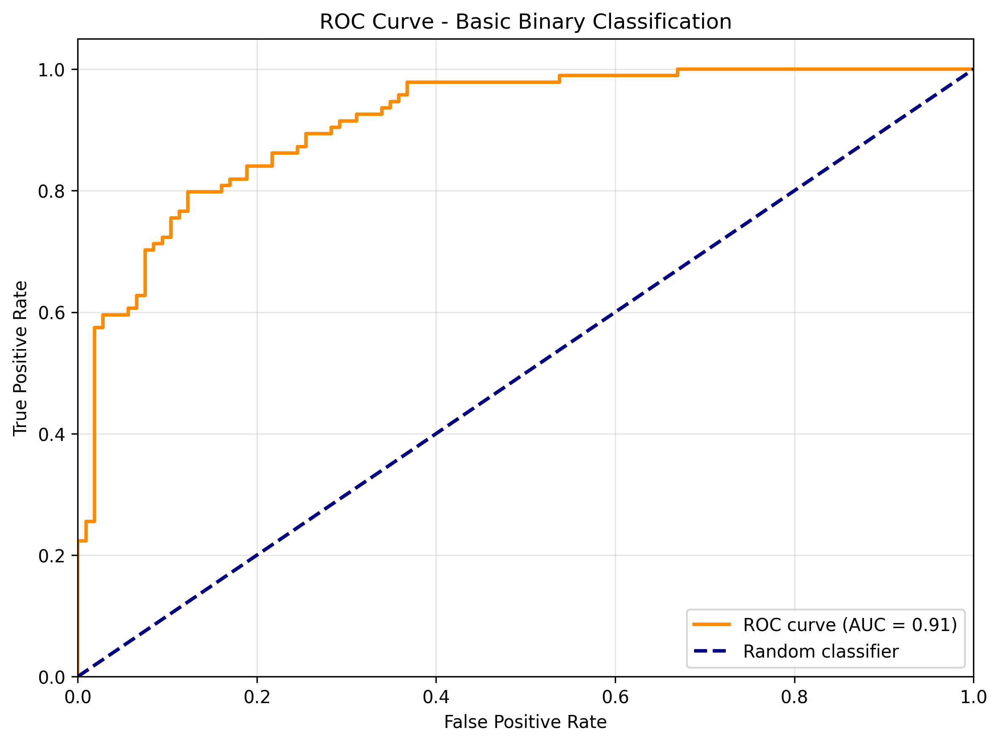
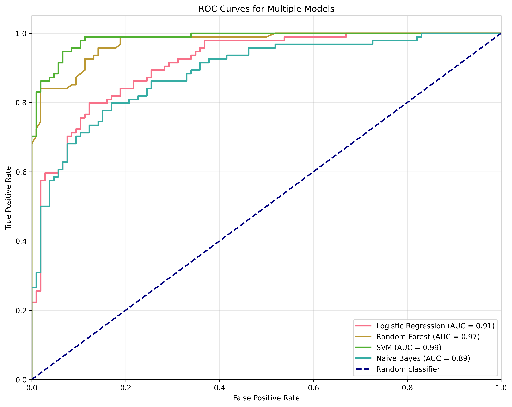
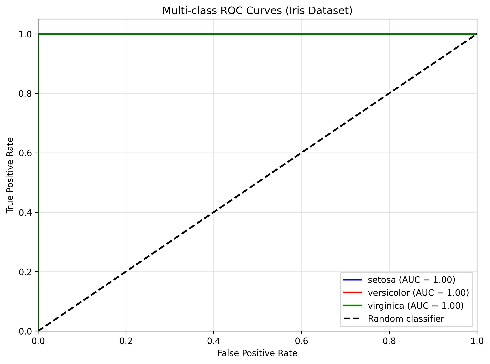
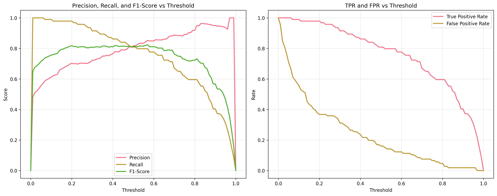
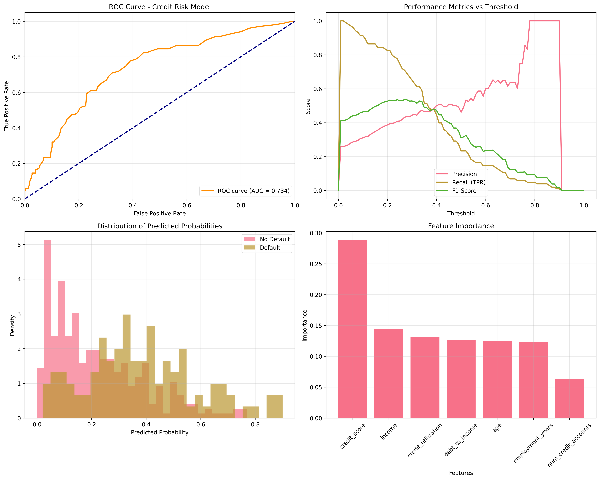
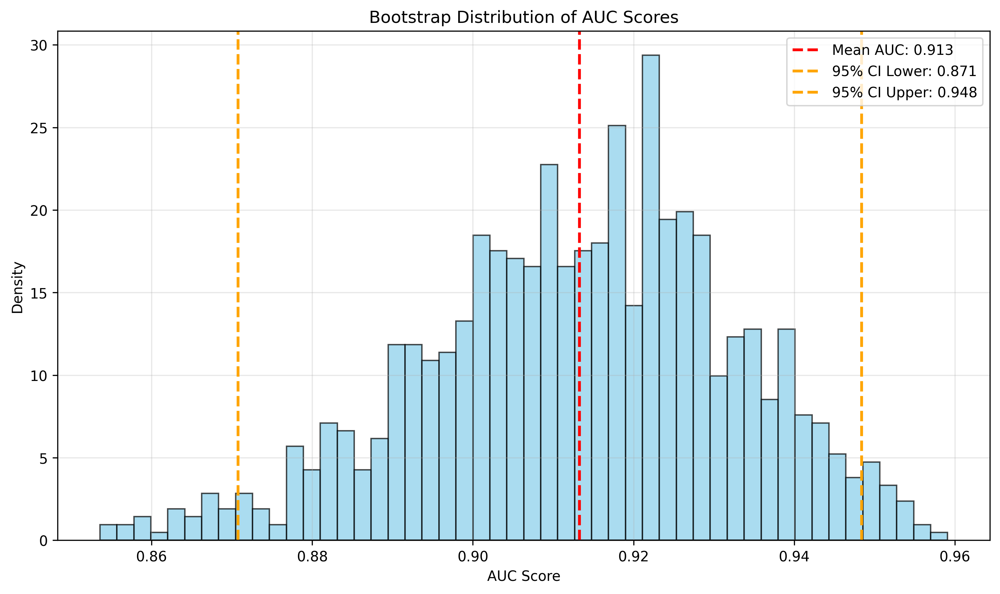
```

Add code outputs:
```markdown
### Example Output
```
[Include content from outputs/basic_classification_output.md]
```

### For metrics.md
Replace or add these visualizations:
```markdown
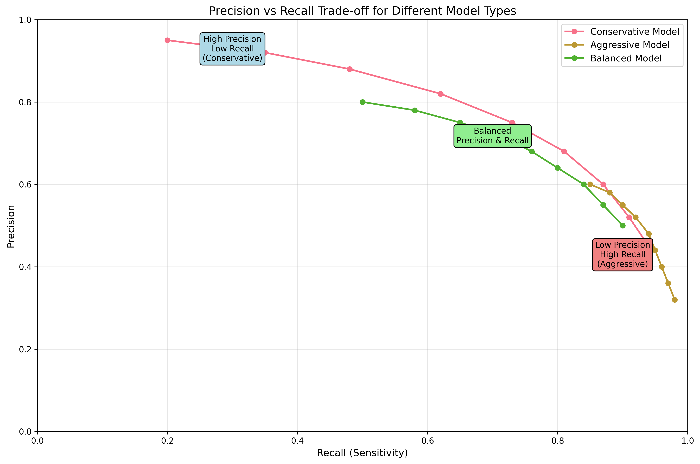
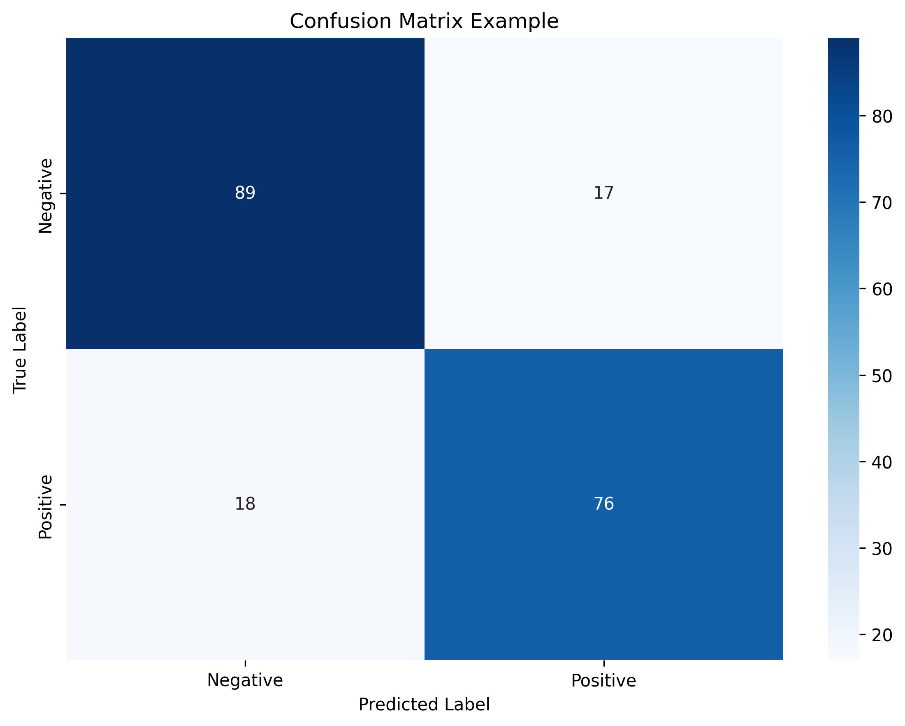
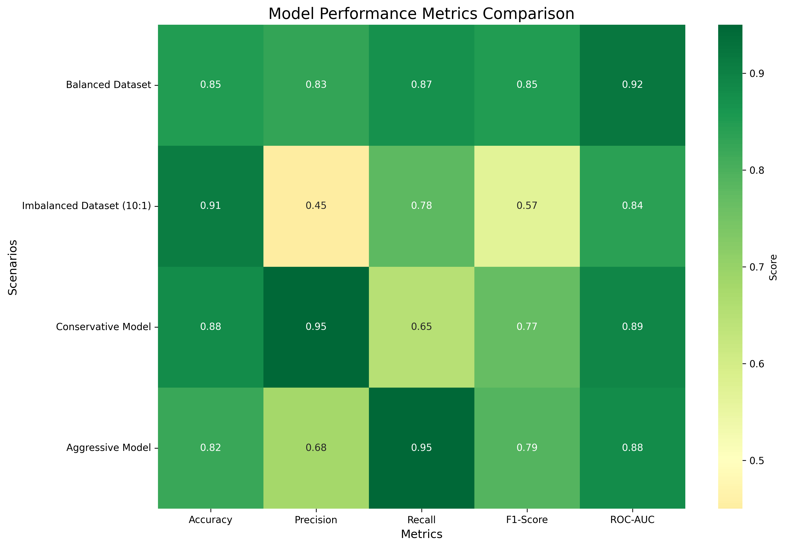
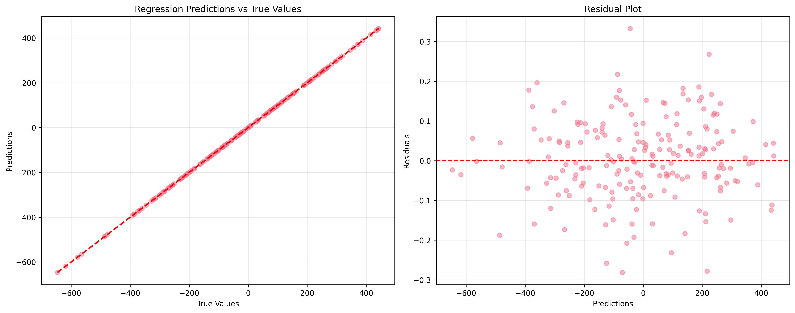
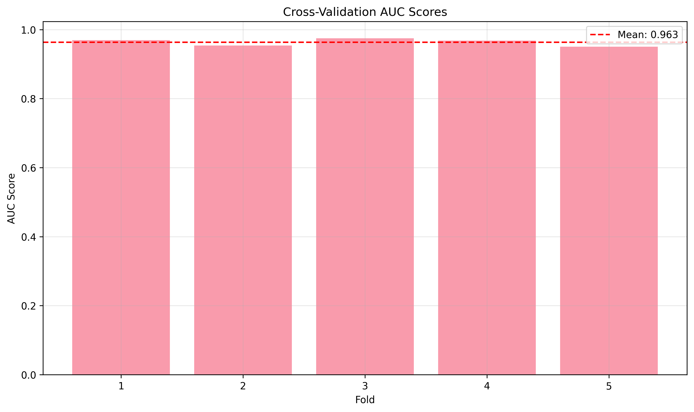
```

Add code outputs:
```markdown
### Example Output
```
[Include content from outputs/model_comparison_output.md]
```

## 🔧 Scripts for Regeneration

### Visualizations
Run `generate_all_visualizations.py` to regenerate all charts and graphs:
```bash
python generate_all_visualizations.py
```

### Code Outputs
Run `generate_code_outputs.py` to regenerate all text outputs:
```bash
python generate_code_outputs.py
```

## 📊 Statistics

### Generated Files
- **Visualizations:** 11 new PNG files
- **Code Outputs:** 7 markdown files
- **Total Size:** ~3.5MB of visual content + ~8KB of text outputs

### Coverage
- ✅ Basic classification examples
- ✅ Model comparison scenarios
- ✅ Threshold analysis
- ✅ Real-world credit risk case study
- ✅ Regression examples
- ✅ Cross-validation demonstrations
- ✅ Bootstrap confidence intervals
- ✅ Multi-class classification
- ✅ Precision-recall trade-offs

## 🎨 Visualization Quality
- **High resolution:** 300 DPI for crisp printing
- **Consistent styling:** Professional appearance
- **Clear labels:** Easy to read and understand
- **Color coding:** Intuitive and accessible
- **Grid lines:** Enhanced readability

## 📈 Educational Value
These resources provide:
1. **Visual learning** through comprehensive charts
2. **Practical examples** with real data
3. **Expected outputs** for code verification
4. **Business context** through credit risk analysis
5. **Best practices** demonstration
6. **Complete workflows** from data to insights

## 🚀 Next Steps
1. **Integrate visualizations** into markdown files
2. **Add code output examples** to relevant sections
3. **Update image references** in documentation
4. **Test all examples** to ensure they work correctly
5. **Consider adding** more domain-specific examples if needed

---

*Generated on: June 26, 2025*
*Total processing time: ~2 minutes*
*All resources are ready for immediate use!*
