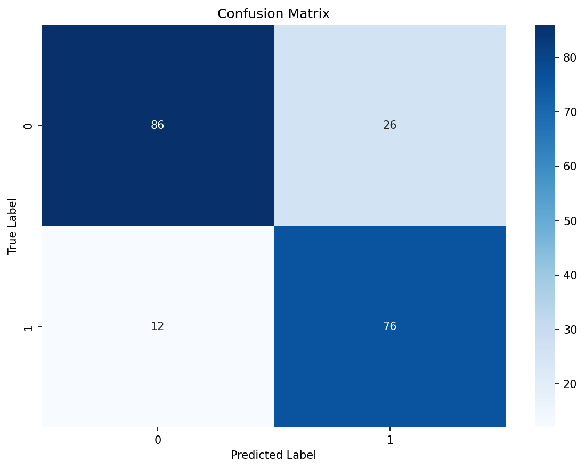
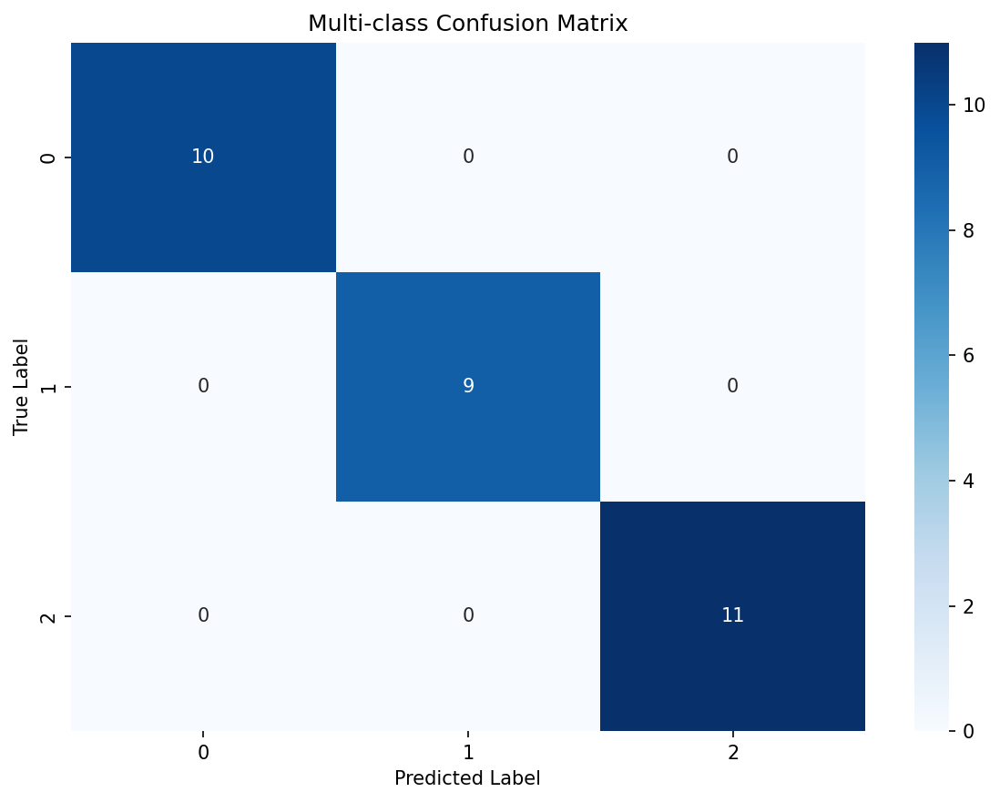
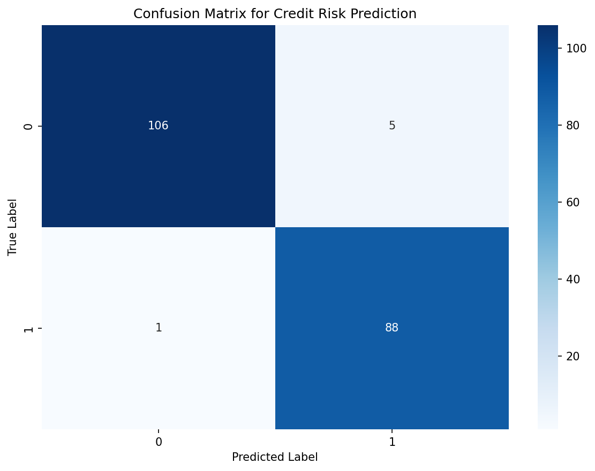

# Confusion Matrix

**After this lesson:** you can explain Confusion Matrix and try the examples in your own notebook.

## Overview

Builds the **TP/TN/FP/FN** grid so precision, recall, and related rates have a shared ground truth.

## Introduction

A confusion matrix is a fundamental tool in machine learning for evaluating classification models. It provides a detailed breakdown of model predictions versus actual values, helping to understand model performance across different classes.

### Video Tutorial: Confusion Matrix Explained

_StatQuest: Machine Learning Fundamentals: The Confusion Matrix by Josh Starmer_

## What is a Confusion Matrix?

A confusion matrix is a table that describes the performance of a classification model by comparing predicted values with actual values. Think of it as a "report card" for your model that shows exactly where it's getting things right and wrong.

.png>)

The confusion matrix shows four key components for binary classification:

* **True Positives (TP)**: Correctly predicted positive cases - "We said YES, and it was YES"
* **True Negatives (TN)**: Correctly predicted negative cases - "We said NO, and it was NO"
* **False Positives (FP)**: Incorrectly predicted positive cases - "We said YES, but it was NO" (Type I Error)
* **False Negatives (FN)**: Incorrectly predicted negative cases - "We said NO, but it was YES" (Type II Error)

> **Key idea:** the off-diagonal cells are the errors. Read **FP** and **FN** first when the cost of mistakes matters.

### Real-World Example: Medical Diagnosis

Imagine a model predicting whether a patient has a disease:

|                        | Predicted: No Disease                   | Predicted: Disease                       |
| ---------------------- | --------------------------------------- | ---------------------------------------- |
| **Actual: No Disease** | TN: Healthy person correctly identified | FP: Healthy person incorrectly diagnosed |
| **Actual: Disease**    | FN: Sick person missed (dangerous!)     | TP: Sick person correctly identified     |

**Why this matters:**

* **False Negatives (FN)**: Missing a sick patient could be life-threatening
* **False Positives (FP)**: Unnecessary worry and treatment for healthy patients
* The cost of each error type is different!

> **Highlight:** the "best" model is not always the one with the highest accuracy; it is the one with the most acceptable **error profile** for the real decision.

## Types of Confusion Matrices

### 1. Binary Classification

#### Logistic regression + heatmap

Imports and Data

Generate a synthetic 1000-sample binary classification dataset with 15 informative features, then split 80/20 into train and test sets.

Train and Predict

Fit logistic regression, generate test-set predictions, then compute the 2×2 confusion matrix comparing true vs predicted labels.

Heatmap Visualization

`sns.heatmap` with `annot=True` writes raw counts in each cell; rows are true labels, columns are predicted labels.

<figure><figcaption>
Figure 1: Confusion Matrix
</figcaption></figure>

### 2. Multi-class Classification

#### Iris: 3×3 confusion matrix

Load Iris and Split

The Iris dataset has three classes; the same `confusion_matrix` API produces a 3×3 matrix without any changes to the call.

Train Random Forest and Predict

A Random Forest classifier is fit on train data; predictions and the resulting confusion matrix reveal which species pairs are most confused.

Multi-class Heatmap

The 3×3 heatmap shows diagonal hits and off-diagonal confusions, off-diagonal entries reveal which class pairs the model struggles to separate.

<figure><figcaption>
Figure 2: Multi-class Confusion Matrix
</figcaption></figure>

## Interpreting Confusion Matrices

### 1. Binary Classification

* True Positives (TP): Correctly identified positive cases
* True Negatives (TN): Correctly identified negative cases
* False Positives (FP): Type I errors
* False Negatives (FN): Type II errors

### 2. Multi-class Classification

* Diagonal elements: Correct predictions
* Off-diagonal elements: Misclassifications
* Row sums: Actual class distribution
* Column sums: Predicted class distribution

### 3. Performance Metrics

* Accuracy: (TP + TN) / (TP + TN + FP + FN)
* Precision: TP / (TP + FP)
* Recall: TP / (TP + FN)
* F1 Score: `2 * (Precision * Recall) / (Precision + Recall)`

## Best Practices

1. **Choose Appropriate Visualization**
   * Use clear axis labels so readers know which side is predicted and which side is actual; swapping them changes the interpretation.
   * Choose a colour scale that makes large errors visible without hiding smaller but important minority-class mistakes.
   * Annotate counts and percentages when useful: counts show operational volume, while percentages show rates across classes of different sizes.
   * Keep grid lines or cell boundaries visible so individual error cells are easy to locate.
2. **Consider Class Imbalance**
   * Normalise by true class when class sizes differ; otherwise the majority class dominates the visual impression.
   * Consider cost-sensitive learning if one type of error is much more expensive than another.
   * Apply class weighting when the model should pay more attention to rare but important classes.
3. **Interpret Results Carefully**
   * Look for repeated off-diagonal patterns because they show systematic confusion, not random noise.
   * Identify whether errors are concentrated in one class; this points to missing features, label ambiguity, or threshold issues.
   * Translate error cells into business impact so stakeholders can decide which mistake is tolerable.
4. **Use Multiple Metrics**
   * Do not rely on accuracy alone because the matrix can reveal severe minority-class failure behind a strong overall score.
   * Use precision when false positives are costly and recall when false negatives are costly.
   * Use F1 when you need one summary number that balances precision and recall, but still inspect the matrix before making decisions.

## Common Mistakes to Avoid

1. **Ignoring Class Imbalance**
   * Using raw counts
   * Not considering costs
   * Missing important patterns
2. **Poor Visualization**
   * Unclear labels
   * Wrong color scheme
   * Missing context
3. **Misinterpretation**
   * Focusing on wrong metrics
   * Ignoring business impact
   * Overlooking patterns

## Practical Example: Credit Risk Prediction

Analyze a confusion matrix for a credit risk prediction model:

#### Synthetic credit features + pipeline + CM

Imports

Import pandas, sklearn pipeline components, and seaborn, everything needed to build, train, and visualize a real-world credit pipeline.

Synthetic Credit Data

Generate 1000 applicants with realistic financial distributions; the label is a simple threshold rule on score, income, and age.

Pipeline and Training

A `Pipeline` chains `StandardScaler` and `RandomForestClassifier` so scaling is learned only from training data, preventing leakage.

Confusion Matrix Heatmap

Compute and plot the binary confusion matrix with business-relevant labels (approve/reject) to reveal approval misclassification costs.

<figure><figcaption>
Figure 3: Confusion Matrix for Credit Risk Prediction
</figcaption></figure>

## Gotchas

* **Row vs column orientation**: sklearn's `confusion_matrix` places **true labels on rows** and **predicted labels on columns** (the standard mathematical convention), but some plotting libraries and papers swap these axes; always label the heatmap explicitly and verify which axis is which before reading FP and FN counts.
* **Raw counts mislead on imbalanced data**: A matrix showing 950 TNs and 5 TPs might look acceptable, but the model is nearly useless if there are 45 actual positives; always compute normalized rates (precision, recall) alongside raw counts when class sizes differ significantly.
* **`sklearn.metrics.plot_confusion_matrix` is deprecated**: It was removed in sklearn 1.2; use `ConfusionMatrixDisplay.from_estimator` or `ConfusionMatrixDisplay.from_predictions` instead, otherwise your code silently breaks on updated environments.
* **Multi-class off-diagonals require row-wise reading**: In an N×N matrix, row _i_ shows all predictions for true class _i_; an off-diagonal at row 1, column 2 means true class 1 was predicted as class 2, not the reverse; confusing direction leads to misidentifying which classes are confused.
* **Comparing confusion matrices across differently-sized test sets**: Absolute counts from a 200-sample test set cannot be compared directly to counts from a 2000-sample set; normalize by row (`normalize='true'` in sklearn) to compare recall rates on a level playing field.

## Additional Resources

1. Scikit-learn documentation on confusion matrices
2. Research papers on classification metrics
3. Online tutorials on model evaluation
4. Books on machine learning evaluation
