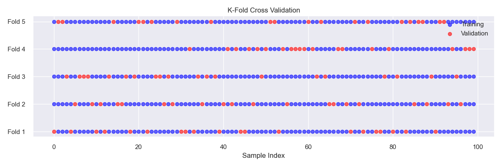
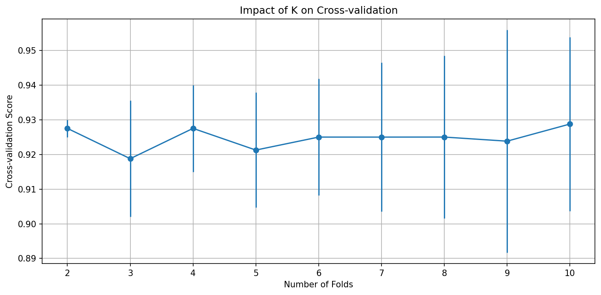

# Cross-Validation

**After this lesson:** you can explain Cross-Validation and try the examples in your own notebook.

## Overview

**Cross-validation** repeatedly trains on a subset of the data and validates on held-out folds so the score reflects **generalization**, not one lucky split. Use it for model comparison and tuning; reserve a final **test** set (or outer CV) for unbiased reporting. **Prerequisites:** [ML workflow](../5.1-intro-to-ml/ml-workflow.md); later lessons such as [hyperparameter tuning](hyperparameter-tuning.md) build on the same splits.

## What is Cross-Validation?

Cross-validation is a resampling method that uses different portions of the data to test and train a model on different iterations.

### Video Tutorial: Cross-Validation Explained

_StatQuest: Cross Validation by Josh Starmer_

### Why Cross-Validation Matters

Think of cross validation like a student taking multiple practice tests before the final exam. It helps us:

1. Get a more reliable estimate of how well our model will perform
2. Catch if our model is "memorizing" the data (overfitting) instead of learning patterns
3. Compare different models fairly
4. Make sure our model is stable and reliable

> **Key idea:** cross-validation is for **choosing and estimating**. Keep a final **test set** untouched when you need one unbiased final report.

## Real-World Analogies

### The Restaurant Menu Analogy

Imagine you're opening a new restaurant. You wouldn't just serve your menu to one group of customers and call it a success. Instead, you'd:

* Test different dishes with various groups of customers
* Get feedback from different demographics
* Try different times of day
* Consider different seasons

This is exactly what cross validation does for machine learning models!

### The Sports Team Analogy

Think of cross validation like a sports team's practice games:

* Each fold is like a practice game
* The training data is like your team's practice
* The validation data is like the practice game
* The final model is like your team going into the real season

## Types of Cross-Validation

### K-Fold Cross-Validation

The data is divided into k subsets (called "folds"), and the holdout method is repeated k times. Each time, one fold is the validation set while the remaining k-1 folds form the training set.



**How it works:**

1. Split data into k equal-sized folds
2. For each fold:
   * Train model on k-1 folds
   * Validate on the remaining fold
3. Average the k validation scores

> **Read the mean and spread together:** the mean estimates performance; the spread tells you whether that estimate is stable enough to trust.

**Example with k=5:**

#### K-fold CV with `cross_val_score`

Data and Imports

Import KFold and cross\_val\_score, then create a small random dataset to demonstrate k-fold splitting.

Five-fold CV

Run 5-fold cross-validation, training the RandomForest on each fold in turn and printing mean accuracy with ±2σ spread.

```
Cross-validation scores: [0.5  0.45 0.6  0.55 0.5 ]
Mean CV score: 0.520 (+/- 0.102)
```

### Leave-One-Out Cross-Validation (LOOCV)

Each observation is used once as a validation set while the remaining observations form the training set. This is equivalent to k-fold where k equals the number of samples.

**When to use:**

* Small datasets (< 100 samples)
* When you need maximum use of training data
* Computationally expensive for large datasets

**Example:**

#### Leave-one-out CV

**Purpose:** Show the exhaustive CV version where each individual sample becomes the validation set once.

```python
import numpy as np
from sklearn.model_selection import LeaveOneOut, cross_val_score
from sklearn.ensemble import RandomForestClassifier

# Same toy X, y as k-fold example above (or define here)
np.random.seed(42)
X = np.random.randn(100, 4)
y = np.random.randint(0, 2, 100)
model = RandomForestClassifier(random_state=42)

loo = LeaveOneOut()
scores = cross_val_score(model, X, y, cv=loo)
print(f"LOOCV mean score: {scores.mean():.3f}")
```

```
LOOCV mean score: 0.490
```

### Stratified K-Fold Cross-Validation

Similar to K-Fold but ensures that the proportions of samples for each class are the same in each fold. This is important for imbalanced datasets.


**Why stratification matters:**

* Prevents folds with very few or no samples from minority classes
* Ensures each fold is representative of the overall dataset
* Provides more reliable performance estimates for imbalanced data

**Example:**

#### Stratified vs ordinary K-fold on imbalanced labels

Imbalanced Dataset

Use `make_classification` with `weights=[0.8, 0.2]` to build an 80/20 split with real signal, then sort by label so the classes are grouped, this is where regular k-fold goes wrong and the minority class is easily lost.

Two Splitter Strategies

`StratifiedKFold` keeps \~20% minority class in each fold; plain `KFold(shuffle=False)` on label-sorted data concentrates each class into separate folds, producing wildly variable scores.

Compare Results

Printing mean ± 2 std for both strategies shows that stratified scoring is more stable, smaller standard deviation, on imbalanced data.

```
Stratified CV: 0.885 (+/- 0.081)
Regular CV: 0.760 (+/- 0.761)
```

### Time Series Cross-Validation

For time series data, we need to respect the temporal order and avoid using future data to predict the past.


**Key principles:**

* Training data always comes before validation data
* No shuffling of data
* Expanding or sliding window approaches

**Example:**

#### Time-ordered splits with `TimeSeriesSplit`

Setup

Create an ordered index array simulating 100 timesteps; `TimeSeriesSplit(n_splits=5)` will produce expanding train windows that never see future validation data.

Print Fold Ranges

Each fold's train block grows while validation always starts immediately after the last training point, confirming no temporal leakage across folds.

```
Fold 1:
  Train indices: [0 1 2 3 4]...[15 16 17 18 19]
  Val indices: [20 21 22 23 24]...[31 32 33 34 35]
Fold 2:
  Train indices: [0 1 2 3 4]...[31 32 33 34 35]
  Val indices: [36 37 38 39 40]...[47 48 49 50 51]
Fold 3:
  Train indices: [0 1 2 3 4]...[47 48 49 50 51]
  Val indices: [52 53 54 55 56]...[63 64 65 66 67]
Fold 4:
  Train indices: [0 1 2 3 4]...[63 64 65 66 67]
  Val indices: [68 69 70 71 72]...[79 80 81 82 83]
Fold 5:
  Train indices: [0 1 2 3 4]...[79 80 81 82 83]
  Val indices: [84 85 86 87 88]...[95 96 97 98 99]
```

## Benefits of Cross-Validation

1. Better assessment of model performance
2. Reduced overfitting
3. More reliable model evaluation

## Implementation Tips

1. Choose appropriate k value
2. Consider data distribution
3. Use stratification when needed

## Common Pitfalls

1. Data leakage
2. Inappropriate fold size
3. Ignoring data dependencies

## Practical Example: Credit Risk Prediction

Look at how cross validation helps in a real-world scenario:

#### Manual fold loop with a pipeline (credit risk sketch)

Synthetic Credit Data

Generate age, income, and credit score features, then create a binary target based on a threshold combination of those features.

Pipeline and Splitter

Wrap scaler and classifier in a pipeline to prevent data leakage, then set up stratified 5-fold splitting.

Fold Loop

Iterate through each fold, fit the pipeline on train indices, score on validation indices, and print each fold accuracy plus the overall mean.

```
Fold 1: 0.980
Fold 2: 0.980
Fold 3: 0.985
Fold 4: 0.975
Fold 5: 0.985

Mean CV score: 0.981 (+/- 0.007)
```

## Best Practices

### 1. Choosing the Right Number of Folds

#### Sweep k and plot mean score with error bars

Data Setup

Generate a classification dataset with 800 samples and 20 features to analyse how fold count affects CV stability.

Sweep k Values

Loop k from 2 to 10, compute cross-validated mean accuracy and standard deviation for each fold count.

Error-bar Plot

Plot mean score ± std for each k to visually identify the fold count with the best bias-variance trade-off.

<figure><figcaption><p>Figure 1: Impact of K on Cross-validation</p></figcaption></figure>

## Gotchas

* **Fitting preprocessing on the full dataset before CV**: Calling `scaler.fit_transform(X)` before passing `X` to `cross_val_score` leaks test-fold statistics into the training folds; the scaler has "seen" the test samples during fitting, inflating CV scores; always wrap preprocessing inside a `Pipeline` so each fold's scaler fits only on that fold's training data.
* **Using plain `KFold` on imbalanced classification data**: Random splits can create folds where a minority class appears in only one or two folds, causing wildly variable CV scores; use `StratifiedKFold` for classification tasks so each fold preserves the original class distribution.
* **Shuffling time-series data before CV**: For temporal data, randomly shuffling rows before `KFold` creates future-leakage: the model trains on data from next week and validates on data from last week; use `TimeSeriesSplit` to ensure validation always comes after the training window.
* **Treating cross-validation score as an unbiased test set estimate**: CV score is an unbiased estimate of _model-selection_ performance, but if you use it to also pick hyperparameters, the score is optimistic; use nested CV or a held-out test set that is never touched during model selection.
* **Choosing `k=2` or `k=3` to save time**: Very small `k` means each fold trains on only 50-67% of the data (k=2 trains on 50%, k=3 on 67%) and validates on the remaining 33-50%, producing high-variance score estimates with wide confidence intervals; `k=5` or `k=10` is standard and typically adds little extra computation for tabular data.
* **Ignoring the standard deviation across folds**: Reporting only mean CV accuracy hides instability; a mean of 0.85 with std of 0.12 is far less trustworthy than a mean of 0.83 with std of 0.02; always report `mean ± 2*std` to convey the reliability of the estimate.

## Additional Resources

For more information on cross-validation techniques and best practices, check out:

* [Cross Validation Guide](https://scikit-learn.org/stable/modules/cross_validation.html)
* [Time Series Cross Validation](https://scikit-learn.org/stable/modules/generated/sklearn.model_selection.TimeSeriesSplit.html)
* [Model Evaluation Best Practices](https://scikit-learn.org/stable/modules/model_evaluation.html)

Remember: Cross validation is essential for reliable model evaluation!

## Next Steps

Ready to learn more? Check out:

1. [Hyperparameter Tuning](hyperparameter-tuning.md) to optimize your model's performance
2. [Model Metrics](metrics.md) to understand different ways to evaluate your model
3. [Model Selection](model-selection.md) to choose the best model for your problem
