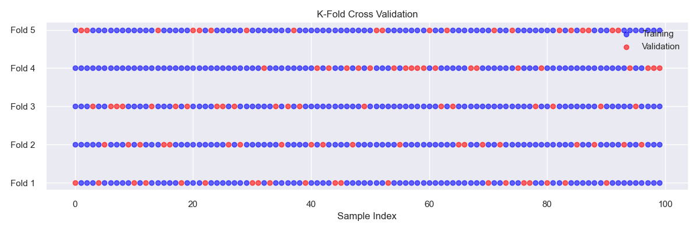
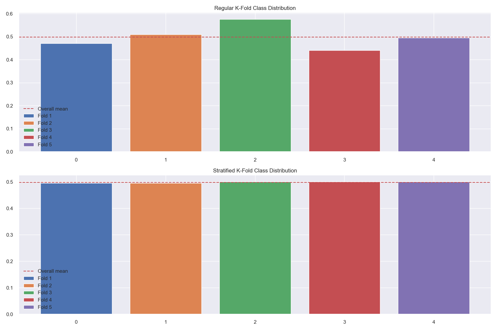
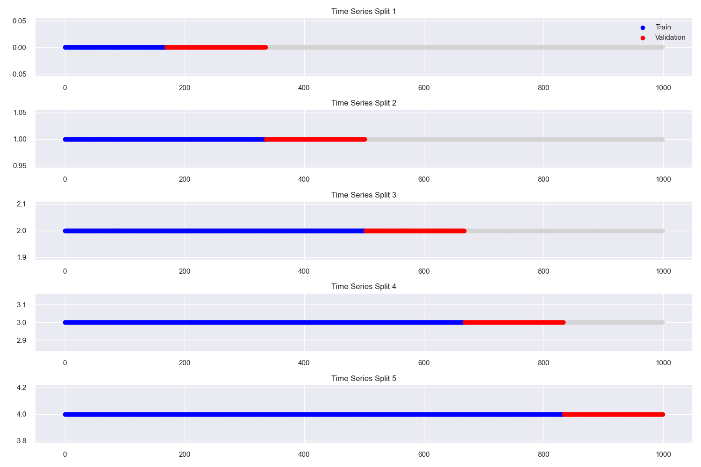

# Cross-Validation

## What is Cross-Validation?

Cross-validation is a resampling method that uses different portions of the data to test and train a model on different iterations.

### Video Tutorial: Cross-Validation Explained

<iframe width="560" height="315" src="https://www.youtube.com/embed/fSytzGwwBVw" frameborder="0" allow="accelerometer; autoplay; clipboard-write; encrypted-media; gyroscope; picture-in-picture" allowfullscreen></iframe>

*StatQuest: Cross Validation by Josh Starmer*

### Why Cross-Validation Matters

Think of cross validation like a student taking multiple practice tests before the final exam. It helps us:

1. Get a more reliable estimate of how well our model will perform
2. Catch if our model is "memorizing" the data (overfitting) instead of learning patterns
3. Compare different models fairly
4. Make sure our model is stable and reliable

## Real-World Analogies

### The Restaurant Menu Analogy

Imagine you're opening a new restaurant. You wouldn't just serve your menu to one group of customers and call it a success. Instead, you'd:

- Test different dishes with various groups of customers
- Get feedback from different demographics
- Try different times of day
- Consider different seasons

This is exactly what cross validation does for machine learning models!

### The Sports Team Analogy

Think of cross validation like a sports team's practice games:

- Each fold is like a practice game
- The training data is like your team's practice
- The validation data is like the practice game
- The final model is like your team going into the real season

## Types of Cross-Validation

### K-Fold Cross-Validation

The data is divided into k subsets (called "folds"), and the holdout method is repeated k times. Each time, one fold serves as the validation set while the remaining k-1 folds form the training set.



**How it works:**
1. Split data into k equal-sized folds
2. For each fold:
   - Train model on k-1 folds
   - Validate on the remaining fold
3. Average the k validation scores

**Example with k=5:**
```python
from sklearn.model_selection import KFold, cross_val_score
from sklearn.ensemble import RandomForestClassifier
import numpy as np

# Create sample data
X = np.random.randn(100, 4)
y = np.random.randint(0, 2, 100)

# 5-fold cross-validation
kf = KFold(n_splits=5, shuffle=True, random_state=42)
model = RandomForestClassifier(random_state=42)

# What this does: Trains and evaluates the model 5 times,
# each time using a different fold as validation set
scores = cross_val_score(model, X, y, cv=kf)

print(f"Cross-validation scores: {scores}")
print(f"Mean CV score: {scores.mean():.3f} (+/- {scores.std() * 2:.3f})")
```

### Leave-One-Out Cross-Validation (LOOCV)

Each observation is used once as a validation set while the remaining observations form the training set. This is equivalent to k-fold where k equals the number of samples.

**When to use:**
- Small datasets (< 100 samples)
- When you need maximum use of training data
- Computationally expensive for large datasets

**Example:**
```python
from sklearn.model_selection import LeaveOneOut

loo = LeaveOneOut()
scores = cross_val_score(model, X, y, cv=loo)
print(f"LOOCV mean score: {scores.mean():.3f}")
```

### Stratified K-Fold Cross-Validation

Similar to K-Fold but ensures that the proportions of samples for each class are the same in each fold. This is crucial for imbalanced datasets.



**Why stratification matters:**
- Prevents folds with very few or no samples from minority classes
- Ensures each fold is representative of the overall dataset
- Provides more reliable performance estimates for imbalanced data

**Example:**
```python
from sklearn.model_selection import StratifiedKFold

# Create imbalanced dataset
y_imbalanced = np.concatenate([np.zeros(80), np.ones(20)])
X_imbalanced = np.random.randn(100, 4)

# Compare regular vs stratified k-fold
skf = StratifiedKFold(n_splits=5, shuffle=True, random_state=42)
kf = KFold(n_splits=5, shuffle=True, random_state=42)

# Stratified scores
stratified_scores = cross_val_score(model, X_imbalanced, y_imbalanced, cv=skf)
# Regular scores  
regular_scores = cross_val_score(model, X_imbalanced, y_imbalanced, cv=kf)

print(f"Stratified CV: {stratified_scores.mean():.3f} (+/- {stratified_scores.std() * 2:.3f})")
print(f"Regular CV: {regular_scores.mean():.3f} (+/- {regular_scores.std() * 2:.3f})")
```

### Time Series Cross-Validation

For time series data, we need to respect the temporal order and avoid using future data to predict the past.



**Key principles:**
- Training data always comes before validation data
- No shuffling of data
- Expanding or sliding window approaches

**Example:**
```python
from sklearn.model_selection import TimeSeriesSplit

# Time series split
tscv = TimeSeriesSplit(n_splits=5)

# What this does: Creates 5 splits where each validation set
# comes after its corresponding training set in time
for fold, (train_idx, val_idx) in enumerate(tscv.split(X)):
    print(f"Fold {fold+1}:")
    print(f"  Train indices: {train_idx[:5]}...{train_idx[-5:]}")
    print(f"  Val indices: {val_idx[:5]}...{val_idx[-5:]}")
```

## Benefits of Cross-Validation

1. Better assessment of model performance
2. Reduced overfitting
3. More reliable model evaluation

## Implementation Tips

1. Choose appropriate k value
2. Consider data distribution
3. Use stratification when needed

## Common Pitfalls

1. Data leakage
2. Inappropriate fold size
3. Ignoring data dependencies

## Practical Example: Credit Risk Prediction

Let's see how cross validation helps in a real-world scenario:

```python
from sklearn.ensemble import RandomForestClassifier
from sklearn.preprocessing import StandardScaler
from sklearn.pipeline import Pipeline

# Create credit risk dataset
np.random.seed(42)
n_samples = 1000

# Generate features
age = np.random.normal(35, 10, n_samples)
income = np.random.exponential(50000, n_samples)
credit_score = np.random.normal(700, 100, n_samples)

X = np.column_stack([age, income, credit_score])
y = (credit_score + income/1000 + age > 800).astype(int)  # Binary target

# Create pipeline
pipeline = Pipeline([
    ('scaler', StandardScaler()),
    ('classifier', RandomForestClassifier())
])

# Perform stratified cross-validation
skf = StratifiedKFold(n_splits=5, shuffle=True, random_state=42)

scores = []
for fold, (train_idx, val_idx) in enumerate(skf.split(X, y)):
    X_train, X_val = X[train_idx], X[val_idx]
    y_train, y_val = y[train_idx], y[val_idx]
    
    pipeline.fit(X_train, y_train)
    score = pipeline.score(X_val, y_val)
    scores.append(score)
    print(f"Fold {fold+1}: {score:.3f}")

print(f"\nMean CV score: {np.mean(scores):.3f} (+/- {np.std(scores) * 2:.3f})")
```

## Best Practices

### 1. Choosing the Right Number of Folds

```python
def choose_optimal_k(X, y, k_range=range(2, 11)):
    scores = []
    stds = []
    
    for k in k_range:
        cv_scores = cross_val_score(
            LogisticRegression(),
            X, y,
            cv=k
        )
        scores.append(cv_scores.mean())
        stds.append(cv_scores.std())
    
    plt.figure(figsize=(10, 5))
    plt.errorbar(k_range, scores, yerr=stds, fmt='o-')
    plt.xlabel('Number of Folds')
    plt.ylabel('Cross-validation Score')
    plt.title('Impact of K on Cross-validation')
    plt.grid(True)
    plt.savefig('assets/optimal_k_selection.png')
    plt.show()

choose_optimal_k(X, y)
```

## Additional Resources

For more information on cross-validation techniques and best practices, check out:

- [Cross Validation Guide](https://scikit-learn.org/stable/modules/cross_validation.html)
- [Time Series Cross Validation](https://scikit-learn.org/stable/modules/generated/sklearn.model_selection.TimeSeriesSplit.html)
- [Model Evaluation Best Practices](https://scikit-learn.org/stable/modules/model_evaluation.html)

Remember: Cross validation is essential for reliable model evaluation!

## Next Steps

Ready to learn more? Check out:

1. [Hyperparameter Tuning](./hyperparameter-tuning.md) to optimize your model's performance
2. [Model Metrics](./metrics.md) to understand different ways to evaluate your model
3. [Model Selection](./model-selection.md) to choose the best model for your problem
