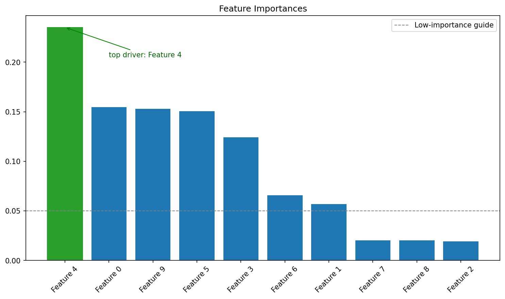
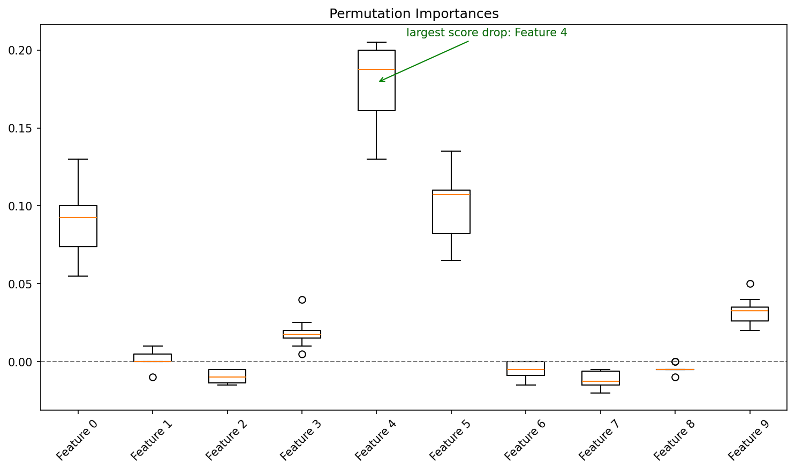

# Feature Importance

**After this lesson:** you can explain Feature Importance and try the examples in your own notebook.

## Overview

Tree importances, permutation importance, and caveats, correlation and baseline comparisons matter.

## Introduction

Feature importance is a important concept in machine learning that helps us understand which features contribute most to our model's predictions. This understanding is essential for model interpretability, feature selection, and domain knowledge validation.

> **Key idea:** feature importance explains **model behaviour**, not truth about the world. Treat it as evidence to investigate, not proof of causality.

## What is Feature Importance?

Feature importance measures how much each feature contributes to the model's predictions. It helps us:

1. Identify the most influential features
2. Remove irrelevant features
3. Understand **model behavior**
4. Challenge or validate **domain knowledge**

> **Read the diagram:** each method answers a slightly different question. Tree importance asks how the fitted trees split. Permutation importance asks how much score drops when a feature is broken. SHAP asks how features contributed to individual predictions and then summarizes those effects.

## Types of Feature Importance

### 1. Tree-Based Methods

#### Gini-based `feature_importances_`

Data and Model

Generate a 10-feature dataset with only 5 truly informative features; the Random Forest should rank those 5 higher than the redundant and noise features.

Extract and Sort Importances

`feature_importances_` gives mean impurity-decrease per feature summed to 1; `argsort[::-1]` ranks them highest to lowest for a sorted bar chart.

Bar Plot

Plot bars in sorted order using original feature-index labels; `rotation=45` prevents label overlap for 10 features.

<figure><figcaption><p>Figure 1: Feature Importances</p></figcaption></figure>

> **Read Figure 1:** the bars are normalized impurity importances from the fitted forest. Taller bars mean the model often used that feature for useful splits, but continuous or high-cardinality features can be favored even when their true signal is not stronger.

### 2. Permutation Importance

#### Model-agnostic drop in score

**Purpose:** Fit the same random forest, shuffle each feature repeatedly, and plot how much the score drops.

```python
import numpy as np
import matplotlib.pyplot as plt
from sklearn.datasets import make_classification
from sklearn.ensemble import RandomForestClassifier
from sklearn.model_selection import train_test_split
from sklearn.inspection import permutation_importance

X, y = make_classification(n_samples=1000, n_features=10,
                           n_informative=5, n_redundant=2,
                           random_state=42)
# Hold out a test set: permutation importance must be measured on data the
# model did not train on, otherwise it reflects memorisation, not generalisation.
X_train, X_test, y_train, y_test = train_test_split(
    X, y, test_size=0.2, random_state=42)
rf = RandomForestClassifier(n_estimators=100, random_state=42)
rf.fit(X_train, y_train)

# Calculate permutation importance on the held-out test set
result = permutation_importance(rf, X_test, y_test, n_repeats=10, random_state=42)

# Plot results
plt.figure(figsize=(10, 6))
plt.title('Permutation Importances')
plt.boxplot(result.importances.T, tick_labels=[f'Feature {i}' for i in range(X.shape[1])])
top_feature = int(np.argmax(result.importances_mean))
top_drop = result.importances_mean[top_feature]
plt.axhline(0, color='gray', linestyle='--', linewidth=1)
plt.annotate(f'largest score drop: Feature {top_feature}', xy=(top_feature + 1, top_drop),
             xytext=(top_feature + 1.4, top_drop + 0.03),
             arrowprops=dict(arrowstyle='->', color='green'), color='darkgreen')
plt.xticks(rotation=45)
plt.tight_layout()
plt.show()
```

<figure><figcaption><p>Figure 2: Permutation Importances</p></figcaption></figure>

> **Read Figure 2:** each box shows the score drop across repeated shuffles of one feature. A large positive drop means the model relies on that feature for held-out performance. A box near zero means shuffling that feature barely changes predictions.

### 3. SHAP Values

#### TreeExplainer + summary plot

**Purpose:** Illustrate the SHAP workflow; this is marked no-output because it requires the optional `shap` package and a fitted model from the previous example.

```python
# no-output
import shap

# Calculate SHAP values
explainer = shap.TreeExplainer(rf)
shap_values = explainer.shap_values(X)

# Plot summary
plt.figure(figsize=(10, 6))
shap.summary_plot(shap_values, X, plot_type="bar")
plt.tight_layout()
plt.show()
```

## Best Practices

1. **Use Multiple Methods**
   * Compare impurity-based, permutation, and model-specific explanations because each answers a slightly different question.
   * Check importance across folds or repeated runs; a feature that ranks first only once may be a sampling accident rather than a reliable driver.
   * Bring in domain knowledge before acting on the ranking: a high-importance feature can be a proxy, leakage source, or post-outcome variable that should not be used.
2. **Handle Correlated Features**
   * Group highly correlated features when interpreting importance because the model may split signal across them, making each individual bar look less important.
   * Prefer permutation tests or grouped permutation when correlation is high; simple tree importances can overstate variables that offer many split points.
   * Check interactions when the model is non-linear. A feature can matter only in combination with another feature and still look modest in a one-feature ranking.
3. **Validate Results**
   * Recompute importance on validation folds or a holdout set so the ranking reflects generalisation, not memorisation of training quirks.
   * Look for stable top features across seeds; unstable rankings are a signal to simplify the model, collect more data, or avoid strong claims.
   * Compare the ranking with expected causal direction. If "loan approved" predicts "default", for example, the model may be seeing information that would not exist at prediction time.
4. **Visualize Effectively**
   * Sort bars descending and highlight the top feature so the viewer can immediately see the main driver.
   * Show error bars or repeated-run variation for permutation importance; small differences without uncertainty bands should not be overinterpreted.
   * Use meaningful feature names instead of column numbers whenever possible, otherwise the chart is not actionable for debugging or stakeholder review.

## Common Mistakes to Avoid

1. **Ignoring Feature Correlations**
   * Not considering interactions
   * Missing important relationships
   * Overlooking multicollinearity
2. **Overlooking Scale**
   * Not normalizing features
   * Comparing different scales
   * Misinterpreting results
3. **Poor Visualization**
   * Unclear plots
   * Missing context
   * Inappropriate scales

## Practical Example: Credit Risk Prediction

Analyze feature importance in a credit risk prediction task:

#### Pipeline importances + SHAP on the forest

Synthetic Credit Data

Five financial features with realistic distributions; the binary label is a threshold on credit score, income, and age, meaning those three should dominate importance.

Pipeline Fit

Scale then classify in a single pipeline; access the fitted forest through `pipeline.named_steps['classifier']` to extract importances and build the SHAP explainer.

Ranked Bar Chart

Extract importances from the classifier step, sort descending, and plot with real column names so stakeholders can read which financial factors drive the model.

SHAP Summary Plot

`TreeExplainer` is applied to the inner forest (not the scaler); the summary plot shows both magnitude and direction of each feature's impact on the output.

## Gotchas

* **Tree-based impurity importance is biased toward high-cardinality features**: `feature_importances_` from Random Forest sums mean impurity decrease over splits; features with many unique values (e.g., a continuous numeric column) get more split opportunities and can appear more important than they truly are; use permutation importance or SHAP for a less biased view.
* **Permutation importance computed on training data is misleading**: Shuffling a feature on the training set measures how much the model _relied_ on it during training, not how useful it is for new data; always compute permutation importance on a held-out validation or test set to measure true generalisation contribution.
* **Correlated features split importance between them**: If `income` and `wealth_score` are strongly correlated, the model may use one or the other interchangeably; both features will show lower individual importances than either deserves alone, and removing one may not hurt performance; cluster correlated features before interpreting rankings.
* **SHAP values require the model, not just predictions**: `shap.TreeExplainer` needs the fitted estimator object; if you only serialised `predict` output without saving the model, you cannot compute SHAP values retrospectively; always save the full fitted model, not just predictions.
* **Treating feature importance as a ranking for causal inference**: A high-importance feature in a predictive model tells you the model uses that feature, not that it causally drives the outcome; recommending business actions based on feature importances alone (e.g., "increase credit score to get approved") conflates correlation with causation.
* **Negative permutation importance does not mean the feature hurts**: A small negative value (near zero) for permutation importance usually means the feature adds negligible predictive value and the drop in score is within random noise, not that the feature actively harms the model; check confidence intervals before removing features with slightly negative scores.

## Additional Resources

1. [Scikit-learn: feature importance user guide](https://scikit-learn.org/stable/modules/permutation_importance.html)
2. [Scikit-learn: permutation importance API](https://scikit-learn.org/stable/modules/generated/sklearn.inspection.permutation_importance.html)
3. [Scikit-learn example: impurity vs permutation importance](https://scikit-learn.org/stable/auto_examples/inspection/plot_permutation_importance.html)
4. [SHAP documentation](https://shap.readthedocs.io/)
