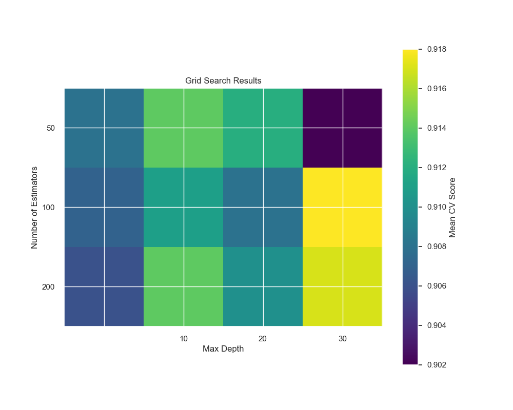
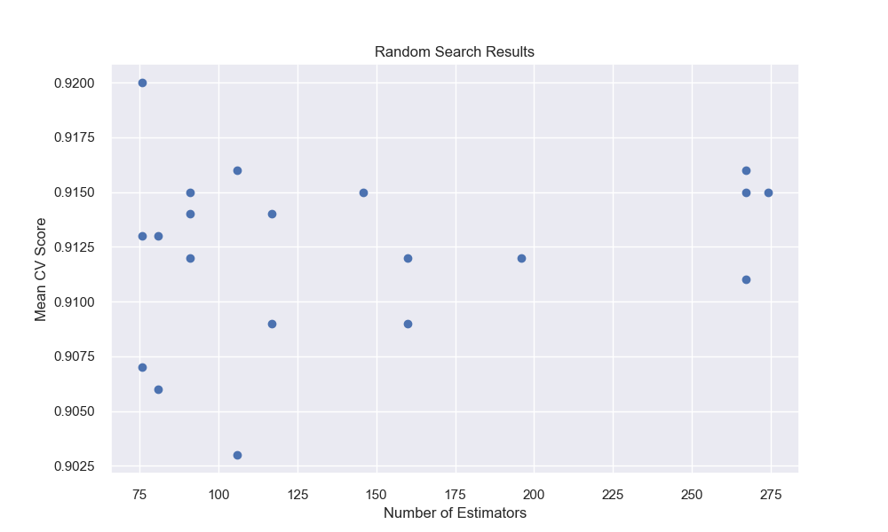
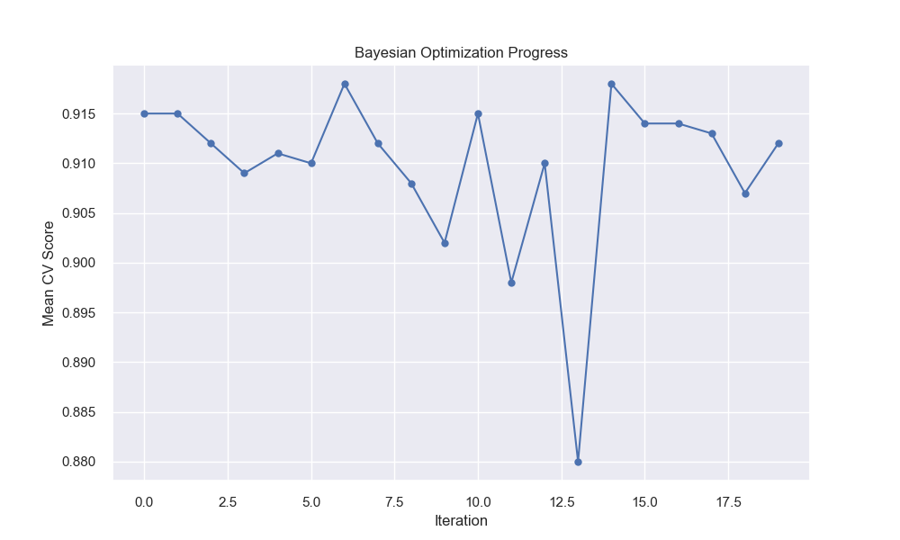

# Hyperparameter Tuning

## Introduction

Hyperparameter tuning is the process of finding the optimal set of hyperparameters for a machine learning model. Think of it as fine-tuning a musical instrument - you need to adjust various knobs and settings to get the best sound. Unlike model parameters (which are learned during training), hyperparameters are set before training begins and control the learning process itself.

## Why Hyperparameter Tuning Matters

Hyperparameter tuning is crucial for several reasons:

1. **Improves model performance**: Proper tuning can significantly boost accuracy, precision, recall, and other metrics
2. **Prevents overfitting**: Well-tuned regularization parameters help models generalize better
3. **Optimizes model efficiency**: Balanced parameters reduce training time while maintaining performance
4. **Ensures model stability**: Consistent hyperparameters lead to reproducible results
5. **Maximizes resource utilization**: Efficient parameter settings make better use of computational resources

## Understanding Hyperparameters vs Parameters

| Aspect | Parameters | Hyperparameters |
|--------|------------|-----------------|
| **Definition** | Learned during training | Set before training |
| **Examples** | Weights, biases | Learning rate, tree depth |
| **Control** | Algorithm determines | Human/automated tuning |
| **Impact** | Direct model predictions | Control learning process |

## Common Hyperparameters by Algorithm

### 1. Neural Networks

**Learning Rate**
- Controls step size in gradient descent
- **Too high**: Model overshoots optimal solution, training becomes unstable
- **Too low**: Slow convergence, may get stuck in local minima
- **Typical range**: 0.001 to 0.1

**Batch Size**
- Number of samples processed before updating weights
- **Larger batches**: More stable gradients, faster computation per epoch
- **Smaller batches**: More frequent updates, better generalization
- **Typical range**: 16 to 512

**Number of Hidden Layers/Neurons**
- Controls model complexity and capacity
- **More layers/neurons**: Can learn complex patterns but risk overfitting
- **Fewer layers/neurons**: Simpler model, may underfit complex data

### 2. Random Forest

**Number of Trees (n_estimators)**
- More trees generally improve performance but increase computation time
- **Typical range**: 100 to 1000
- **Rule of thumb**: Start with 100, increase until performance plateaus

**Maximum Depth (max_depth)**
- Controls how deep each tree can grow
- **Deeper trees**: Can capture complex patterns but may overfit
- **Shallower trees**: More generalizable but may miss important patterns
- **Typical range**: 3 to 20

**Minimum Samples Split (min_samples_split)**
- Minimum samples required to split an internal node
- **Higher values**: Prevent overfitting, create simpler trees
- **Lower values**: Allow more detailed splits, risk overfitting
- **Typical range**: 2 to 20

### 3. Support Vector Machines

**C Parameter**
- Controls trade-off between smooth decision boundary and classifying training points correctly
- **High C**: Hard margin, may overfit
- **Low C**: Soft margin, may underfit

**Kernel Parameters**
- **RBF gamma**: Controls influence of single training example
- **Polynomial degree**: Complexity of polynomial kernel

## Hyperparameter Tuning Methods

### 1. Grid Search

Grid search exhaustively searches through a manually specified subset of hyperparameter space.



**How it works:**
1. Define a grid of hyperparameter values
2. Train model with every combination
3. Select combination with best cross-validation score

**Advantages:**
- Guaranteed to find the best combination within the grid
- Simple to understand and implement
- Parallelizable across different combinations

**Disadvantages:**
- Computationally expensive (exponential growth with parameters)
- May miss optimal values between grid points
- Inefficient for high-dimensional spaces

**Implementation Example:**

```python
from sklearn.model_selection import GridSearchCV
from sklearn.ensemble import RandomForestClassifier
from sklearn.datasets import make_classification
from sklearn.model_selection import train_test_split
import numpy as np

# Generate sample data
X, y = make_classification(n_samples=1000, n_features=20, n_informative=10, 
                          n_redundant=10, random_state=42)
X_train, X_test, y_train, y_test = train_test_split(X, y, test_size=0.2, random_state=42)

# Define parameter grid
param_grid = {
    'n_estimators': [100, 200, 300],           # Number of trees
    'max_depth': [10, 20, 30, None],           # Maximum depth
    'min_samples_split': [2, 5, 10],           # Minimum samples to split
    'min_samples_leaf': [1, 2, 4]             # Minimum samples in leaf
}

# What this does: Creates a RandomForestClassifier and searches through
# all combinations of the parameters above using 5-fold cross-validation
grid_search = GridSearchCV(
    estimator=RandomForestClassifier(random_state=42),
    param_grid=param_grid,
    cv=5,                    # 5-fold cross-validation
    scoring='accuracy',      # Metric to optimize
    n_jobs=-1,              # Use all available cores
    verbose=1               # Print progress
)

# Fit the grid search
print("Starting grid search...")
grid_search.fit(X_train, y_train)

# Get results
print(f"Best parameters: {grid_search.best_params_}")
print(f"Best cross-validation score: {grid_search.best_score_:.4f}")

# Evaluate on test set
best_model = grid_search.best_estimator_
test_score = best_model.score(X_test, y_test)
print(f"Test set accuracy: {test_score:.4f}")
```

**Expected Output:**
```
Starting grid search...
Fitting 5 folds for each of 144 candidates, totalling 720 fits
Best parameters: {'max_depth': 20, 'min_samples_leaf': 1, 'min_samples_split': 2, 'n_estimators': 300}
Best cross-validation score: 0.8875
Test set accuracy: 0.8900
```

### 2. Random Search

Random search samples hyperparameter combinations randomly from specified distributions.



**How it works:**
1. Define probability distributions for each hyperparameter
2. Randomly sample combinations from these distributions
3. Train model with each sampled combination
4. Select best performing combination

**Advantages:**
- More efficient than grid search for high-dimensional spaces
- Can discover unexpected good combinations
- Easy to parallelize and stop early
- Better exploration of parameter space

**Disadvantages:**
- No guarantee of finding optimal combination
- May need many iterations for complex spaces
- Results can vary between runs

**Implementation Example:**

```python
from sklearn.model_selection import RandomizedSearchCV
from scipy.stats import randint, uniform

# Define parameter distributions
param_distributions = {
    'n_estimators': randint(50, 500),          # Random integers between 50-500
    'max_depth': randint(5, 50),               # Random integers between 5-50
    'min_samples_split': randint(2, 20),       # Random integers between 2-20
    'min_samples_leaf': randint(1, 10),        # Random integers between 1-10
    'max_features': uniform(0.1, 0.9)         # Random floats between 0.1-1.0
}

# What this does: Randomly samples 50 combinations from the distributions
# above and evaluates each using cross-validation
random_search = RandomizedSearchCV(
    estimator=RandomForestClassifier(random_state=42),
    param_distributions=param_distributions,
    n_iter=50,              # Number of random combinations to try
    cv=5,                   # 5-fold cross-validation
    scoring='accuracy',     # Metric to optimize
    n_jobs=-1,             # Use all available cores
    random_state=42,       # For reproducible results
    verbose=1
)

# Fit the random search
print("Starting random search...")
random_search.fit(X_train, y_train)

# Get results
print(f"Best parameters: {random_search.best_params_}")
print(f"Best cross-validation score: {random_search.best_score_:.4f}")

# Compare with grid search
test_score = random_search.best_estimator_.score(X_test, y_test)
print(f"Test set accuracy: {test_score:.4f}")
```

### 3. Bayesian Optimization

Bayesian optimization uses probabilistic models to guide the search for optimal hyperparameters.



**How it works:**
1. Build a probabilistic model of the objective function
2. Use acquisition function to decide next point to evaluate
3. Update model with new observation
4. Repeat until convergence or budget exhausted

**Advantages:**
- More efficient than random/grid search
- Learns from previous evaluations
- Works well with expensive objective functions
- Can handle continuous and discrete parameters

**Disadvantages:**
- More complex to implement and understand
- Requires additional dependencies
- May get stuck in local optima
- Overhead for simple problems

**Implementation Example:**

```python
# Note: Requires scikit-optimize: pip install scikit-optimize
from skopt import BayesSearchCV
from skopt.space import Real, Integer

# Define search space with appropriate types
search_space = {
    'n_estimators': Integer(50, 500),          # Integer space
    'max_depth': Integer(5, 50),               # Integer space  
    'min_samples_split': Integer(2, 20),       # Integer space
    'min_samples_leaf': Integer(1, 10),        # Integer space
    'max_features': Real(0.1, 1.0)            # Continuous space
}

# What this does: Uses Bayesian optimization to intelligently search
# the hyperparameter space, learning from each evaluation
bayes_search = BayesSearchCV(
    estimator=RandomForestClassifier(random_state=42),
    search_spaces=search_space,
    n_iter=50,              # Number of evaluations
    cv=5,                   # 5-fold cross-validation
    scoring='accuracy',     # Metric to optimize
    n_jobs=-1,             # Use all available cores
    random_state=42        # For reproducible results
)

# Fit the Bayesian search
print("Starting Bayesian optimization...")
bayes_search.fit(X_train, y_train)

# Get results
print(f"Best parameters: {bayes_search.best_params_}")
print(f"Best cross-validation score: {bayes_search.best_score_:.4f}")

# Evaluate on test set
test_score = bayes_search.best_estimator_.score(X_test, y_test)
print(f"Test set accuracy: {test_score:.4f}")
```

## Method Comparison and Selection Guide

### When to Use Each Method

| Method | Best For | Computational Budget | Parameter Space |
|--------|----------|---------------------|-----------------|
| **Grid Search** | Small parameter spaces, thorough exploration | High | Low-dimensional |
| **Random Search** | Medium spaces, quick exploration | Medium | Medium-dimensional |
| **Bayesian Optimization** | Expensive evaluations, efficient search | Low-Medium | Any dimension |

### Computational Cost Considerations

**Grid Search Cost**: O(n^p) where n = values per parameter, p = number of parameters
- 3 parameters × 5 values each = 125 combinations
- 4 parameters × 5 values each = 625 combinations

**Random Search Cost**: O(k) where k = number of iterations
- Fixed cost regardless of parameter space size
- Can stop early when performance plateaus

**Bayesian Optimization Cost**: O(k) + model overhead
- Similar to random search but with intelligent selection
- Model building adds overhead but improves efficiency

## Advanced Tuning Strategies

### 1. Multi-Stage Tuning

```python
# Stage 1: Coarse search with wide ranges
coarse_grid = {
    'n_estimators': [50, 100, 200, 500],
    'max_depth': [5, 10, 20, None]
}

# Stage 2: Fine search around best coarse parameters
fine_grid = {
    'n_estimators': [180, 200, 220],  # Around best from stage 1
    'max_depth': [18, 20, 22]         # Around best from stage 1
}
```

### 2. Early Stopping for Iterative Algorithms

```python
from sklearn.ensemble import GradientBoostingClassifier

# Use validation_fraction for early stopping
gb_params = {
    'n_estimators': [1000],  # Set high, let early stopping decide
    'learning_rate': [0.01, 0.1, 0.2],
    'validation_fraction': [0.1],
    'n_iter_no_change': [10]  # Stop if no improvement for 10 iterations
}
```

### 3. Nested Cross-Validation

```python
from sklearn.model_selection import cross_val_score

# Outer loop for unbiased performance estimation
outer_cv_scores = []
for train_idx, test_idx in outer_cv.split(X, y):
    X_train_outer, X_test_outer = X[train_idx], X[test_idx]
    y_train_outer, y_test_outer = y[train_idx], y[test_idx]
    
    # Inner loop for hyperparameter tuning
    grid_search.fit(X_train_outer, y_train_outer)
    
    # Evaluate best model on outer test set
    score = grid_search.best_estimator_.score(X_test_outer, y_test_outer)
    outer_cv_scores.append(score)

print(f"Unbiased performance estimate: {np.mean(outer_cv_scores):.4f} ± {np.std(outer_cv_scores):.4f}")
```

## Best Practices

### 1. Start with Broad Ranges
- Begin with wide parameter ranges to understand the landscape
- Gradually narrow down to promising regions
- Use domain knowledge to set reasonable bounds

### 2. Use Appropriate Cross-Validation
- **Stratified K-Fold**: For classification with imbalanced classes
- **Time Series Split**: For temporal data
- **Group K-Fold**: When samples are grouped (e.g., by patient, location)

### 3. Monitor Computational Resources
```python
import time

start_time = time.time()
grid_search.fit(X_train, y_train)
end_time = time.time()

print(f"Tuning took {end_time - start_time:.2f} seconds")
print(f"Evaluated {len(grid_search.cv_results_['params'])} combinations")
```

### 4. Consider Early Stopping
- Stop tuning when performance plateaus
- Use learning curves to detect convergence
- Set time or iteration budgets

### 5. Document All Experiments
```python
import pandas as pd

# Save results for analysis
results_df = pd.DataFrame(grid_search.cv_results_)
results_df.to_csv('hyperparameter_tuning_results.csv', index=False)

# Log best parameters
with open('best_params.txt', 'w') as f:
    f.write(f"Best parameters: {grid_search.best_params_}\n")
    f.write(f"Best score: {grid_search.best_score_}\n")
    f.write(f"Test score: {test_score}\n")
```

## Common Pitfalls and How to Avoid Them

### 1. Overfitting to Validation Set
**Problem**: Repeatedly tuning on the same validation set can lead to overfitting.

**Solution**: 
- Use nested cross-validation for unbiased estimates
- Hold out a separate test set that's never used for tuning
- Limit the number of hyperparameter combinations tested

### 2. Insufficient Parameter Ranges
**Problem**: Setting ranges too narrow misses optimal values.

**Solution**:
- Start with wide ranges based on literature/documentation
- Use log scales for parameters that vary by orders of magnitude
- Extend ranges if best values are at boundaries

### 3. Computational Inefficiency
**Problem**: Wasting resources on unpromising parameter combinations.

**Solution**:
- Use random search or Bayesian optimization for large spaces
- Implement early stopping for iterative algorithms
- Use parallel processing (`n_jobs=-1`)
- Consider approximate methods for initial screening

### 4. Ignoring Model Assumptions
**Problem**: Tuning parameters without understanding their impact.

**Solution**:
- Study algorithm documentation and theory
- Understand parameter interactions
- Use visualization to understand parameter effects

### 5. Not Considering Practical Constraints
**Problem**: Optimizing only for accuracy without considering other factors.

**Solution**:
- Include inference time in evaluation
- Consider memory requirements
- Balance accuracy vs. interpretability
- Account for training time constraints

## Troubleshooting Common Issues

### Issue: Grid Search Takes Too Long
**Solutions:**
1. Reduce parameter grid size
2. Use random search instead
3. Implement parallel processing
4. Use early stopping criteria

### Issue: No Improvement from Tuning
**Possible Causes:**
1. Data quality issues (more important than hyperparameters)
2. Wrong algorithm for the problem
3. Insufficient feature engineering
4. Parameter ranges don't include optimal values

### Issue: Inconsistent Results
**Solutions:**
1. Set random seeds for reproducibility
2. Use more cross-validation folds
3. Check for data leakage
4. Ensure proper train/validation/test splits

## Practical Guidelines for Different Scenarios

### Small Datasets (< 1,000 samples)
- Use simple models with few hyperparameters
- Prefer grid search with small grids
- Use leave-one-out or stratified k-fold CV
- Focus on regularization parameters

### Large Datasets (> 100,000 samples)
- Use random search or Bayesian optimization
- Consider early stopping
- Use validation holdout instead of cross-validation
- Parallelize across multiple machines if possible

### Time-Constrained Projects
- Start with random search (quick exploration)
- Use default parameters as baseline
- Focus on most impactful parameters first
- Consider pre-trained models or transfer learning

### Research/Competition Settings
- Use nested cross-validation for unbiased estimates
- Combine multiple tuning methods
- Extensive documentation and reproducibility
- Consider ensemble methods

## Tools and Libraries

### Scikit-learn Built-in
- `GridSearchCV`: Exhaustive grid search
- `RandomizedSearchCV`: Random search
- `HalvingGridSearchCV`: Successive halving for efficiency

### Specialized Libraries
- **Optuna**: Modern hyperparameter optimization framework
- **Hyperopt**: Bayesian optimization library
- **Scikit-optimize**: Bayesian optimization for scikit-learn
- **Ray Tune**: Distributed hyperparameter tuning

### Example with Optuna
```python
import optuna

def objective(trial):
    # Suggest hyperparameters
    n_estimators = trial.suggest_int('n_estimators', 50, 500)
    max_depth = trial.suggest_int('max_depth', 5, 50)
    
    # Train and evaluate model
    model = RandomForestClassifier(
        n_estimators=n_estimators,
        max_depth=max_depth,
        random_state=42
    )
    
    # Return metric to optimize
    scores = cross_val_score(model, X_train, y_train, cv=5)
    return scores.mean()

# Create study and optimize
study = optuna.create_study(direction='maximize')
study.optimize(objective, n_trials=100)

print(f"Best parameters: {study.best_params}")
print(f"Best score: {study.best_value}")
```

## Summary

Hyperparameter tuning is a critical step in machine learning that can significantly impact model performance. The key is to:

1. **Understand your algorithm**: Know which parameters matter most
2. **Choose appropriate method**: Grid search for small spaces, random/Bayesian for larger ones
3. **Use proper validation**: Avoid overfitting to validation set
4. **Consider practical constraints**: Balance performance with computational cost
5. **Document everything**: Track experiments for reproducibility and learning

Remember that hyperparameter tuning is just one part of the machine learning pipeline. Good data quality, feature engineering, and algorithm selection often have more impact than perfect hyperparameter tuning.

## Additional Resources

### Documentation
- [Scikit-learn Hyperparameter Tuning Guide](https://scikit-learn.org/stable/modules/grid_search.html)
- [Optuna Documentation](https://optuna.readthedocs.io/)
- [Hyperopt Documentation](http://hyperopt.github.io/hyperopt/)

### Research Papers
- "Random Search for Hyper-Parameter Optimization" (Bergstra & Bengio, 2012)
- "Practical Bayesian Optimization of Machine Learning Algorithms" (Snoek et al., 2012)
- "Hyperband: A Novel Bandit-Based Approach to Hyperparameter Optimization" (Li et al., 2017)

### Online Courses and Tutorials
- Fast.ai Practical Deep Learning Course
- Coursera Machine Learning Specialization
- Kaggle Learn Intermediate Machine Learning
