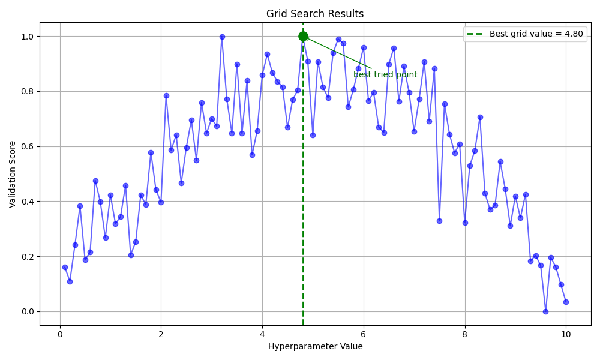
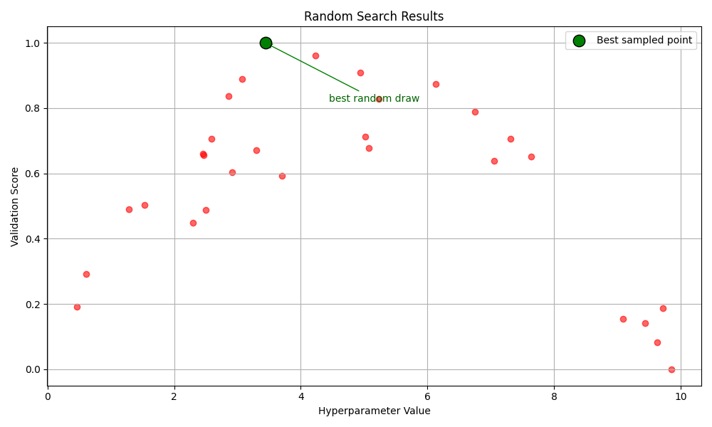
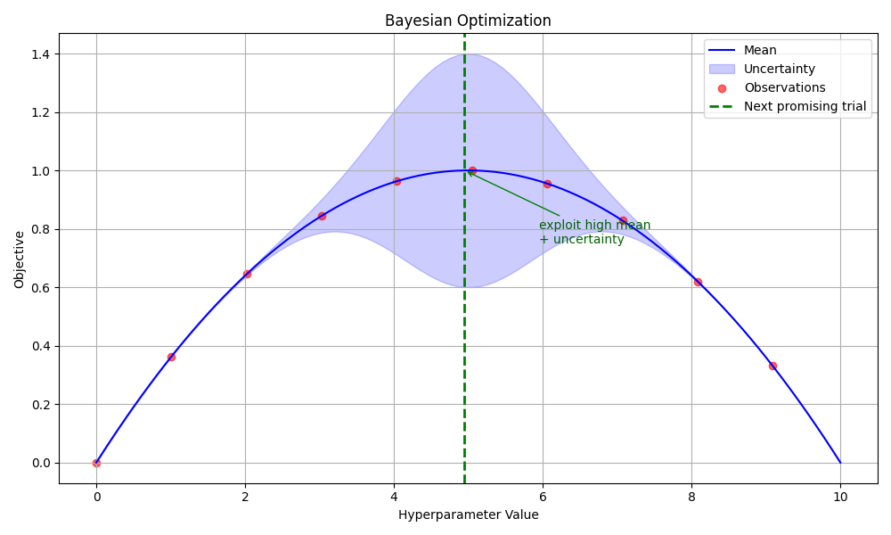

# Hyperparameter Tuning

**After this lesson:** you can explain Hyperparameter Tuning and try the examples in your own notebook.

## Overview

**Grid search**, **random search**, and workflow tips so tuning does not leak into the test set.


## Introduction

Hyperparameter tuning is the process of finding the optimal set of hyperparameters for a machine learning model. Think of it as fine-tuning a musical instrument - you need to adjust various knobs and settings to get the best sound. Unlike model parameters (which are learned during training), hyperparameters are set before training begins and control the learning process itself.

> **Key idea:** tuning is model selection over settings. The validation score chooses settings; the test score reports the final result once.

## Why Hyperparameter Tuning Matters

Hyperparameter tuning is important for several reasons:

1. **Improves model performance**: Proper tuning can significantly boost accuracy, precision, recall, and other metrics
2. **Prevents overfitting**: Well-tuned regularization parameters help models generalize better
3. **Optimizes model efficiency**: Balanced parameters reduce training time while maintaining performance
4. **Ensures model stability**: Consistent hyperparameters lead to reproducible results
5. **Maximizes resource utilization**: Efficient parameter settings make better use of computational resources



> **Highlight:** always fit the search object on **train data only**. The **test set** is touched once, at the very end, to report final performance.

> **Read the diagram:** tuning is a nested decision process. The search object repeatedly trains candidate models inside cross-validation, chooses the best candidate from validation scores, refits that candidate on the full training set, and only then evaluates once on the held-out test set.

## Understanding Hyperparameters vs Parameters

| Aspect | Parameters | Hyperparameters |
|--------|------------|-----------------|
| **Definition** | Learned during training | Set before training |
| **Examples** | Weights, biases | Learning rate, tree depth |
| **Control** | Algorithm determines | Human/automated tuning |
| **Impact** | Direct model predictions | Control learning process |

> **Remember:** parameters are the model's learned contents; hyperparameters are the knobs that control how those contents are learned.

## Common Hyperparameters by Algorithm

### 1. Neural Networks

**Learning Rate**
- Controls step size in gradient descent
- **Too high**: Model overshoots optimal solution, training becomes unstable
- **Too low**: Slow convergence, may get stuck in local minima
- **Typical range**: 0.001 to 0.1

**Batch Size**
- Number of samples processed before updating weights
- **Larger batches**: More stable gradients, faster computation per epoch
- **Smaller batches**: More frequent updates, better generalization
- **Typical range**: 16 to 512

**Number of Hidden Layers/Neurons**
- Controls model complexity and capacity
- **More layers/neurons**: Can learn complex patterns but risk overfitting
- **Fewer layers/neurons**: Simpler model, may underfit complex data

### 2. Random Forest

**Number of Trees (n_estimators)**
- More trees generally improve performance but increase computation time
- **Typical range**: 100 to 1000
- **Rule of thumb**: Start with 100, increase until performance plateaus

**Maximum Depth (max_depth)**
- Controls how deep each tree can grow
- **Deeper trees**: Can capture complex patterns but may overfit
- **Shallower trees**: More generalizable but may miss important patterns
- **Typical range**: 3 to 20

**Minimum Samples Split (min_samples_split)**
- Minimum samples required to split an internal node
- **Higher values**: Prevent overfitting, create simpler trees
- **Lower values**: Allow more detailed splits, risk overfitting
- **Typical range**: 2 to 20

### 3. Support Vector Machines

**C Parameter**
- Controls trade-off between smooth decision boundary and classifying training points correctly
- **High C**: Hard margin, may overfit
- **Low C**: Soft margin, may underfit

**Kernel Parameters**
- **RBF gamma**: Controls influence of single training example
- **Polynomial degree**: Complexity of polynomial kernel

## Hyperparameter Tuning Methods

### 1. Grid Search

Grid search exhaustively searches through a manually specified subset of hyperparameter space.



> **Read the diagram:** grid search is like checking every point on a fixed board. It is easy to audit because every combination is known in advance, but the number of model fits multiplies quickly as you add more parameters or values.

**How it works:**
1. Define a grid of hyperparameter values
2. Train model with every combination
3. Select combination with best cross-validation score

**Advantages:**
- Guaranteed to find the best combination within the grid
- Simple to understand and implement
- Parallelizable across different combinations

**Disadvantages:**
- Computationally expensive (exponential growth with parameters)
- May miss optimal values between grid points
- Inefficient for high-dimensional spaces

**Implementation Example:**

#### `GridSearchCV` on a random forest

<div class="code-explainer" data-code-explainer>
<div class="code-explainer__code">


from sklearn.model_selection import GridSearchCV
from sklearn.ensemble import RandomForestClassifier
from sklearn.datasets import make_classification
from sklearn.model_selection import train_test_split
import numpy as np

# Generate sample data
X, y = make_classification(n_samples=1000, n_features=20, n_informative=10,
                           n_redundant=10, random_state=42)
X_train, X_test, y_train, y_test = train_test_split(X, y, test_size=0.2, random_state=42)

# Define parameter grid
param_grid = {
    'n_estimators': [100, 200, 300],           # Number of trees
    'max_depth': [10, 20, 30, None],           # Maximum depth
    'min_samples_split': [2, 5, 10],           # Minimum samples to split
    'min_samples_leaf': [1, 2, 4]             # Minimum samples in leaf
}

# What this does: Creates a RandomForestClassifier and searches through
# all combinations of the parameters above using 5-fold cross-validation
grid_search = GridSearchCV(
    estimator=RandomForestClassifier(random_state=42),
    param_grid=param_grid,
    cv=5,                    # 5-fold cross-validation
    scoring='accuracy',      # Metric to optimize
    n_jobs=-1,              # Use all available cores
    verbose=1               # Print progress
)

# Fit the grid search
print("Starting grid search...")
grid_search.fit(X_train, y_train)

# Get results
print(f"Best parameters: {grid_search.best_params_}")
print(f"Best cross-validation score: {grid_search.best_score_:.4f}")

# Evaluate on test set
best_model = grid_search.best_estimator_
test_score = best_model.score(X_test, y_test)
print(f"Test set accuracy: {test_score:.4f}")


</div>
<aside class="code-explainer__callouts" aria-label="Code walkthrough">
  <div class="code-callout" data-lines="1-10" data-tint="1">
    <div class="code-callout__meta">
      <span class="code-callout__lines"></span>
      <span class="code-callout__title">Data and Imports</span>
    </div>
    <div class="code-callout__body">
      <p>Generate a 1000-sample classification problem and hold 20% back as the final test set, this test set is touched only once after the search finishes.</p>
    </div>
  </div>
  <div class="code-callout" data-lines="12-18" data-tint="2">
    <div class="code-callout__meta">
      <span class="code-callout__lines"></span>
      <span class="code-callout__title">Parameter Grid</span>
    </div>
    <div class="code-callout__body">
      <p>Four hyperparameters with 3-4 values each, 108 total combinations that <code>GridSearchCV</code> will evaluate exhaustively.</p>
    </div>
  </div>
  <div class="code-callout" data-lines="20-30" data-tint="3">
    <div class="code-callout__meta">
      <span class="code-callout__lines"></span>
      <span class="code-callout__title">GridSearchCV Setup</span>
    </div>
    <div class="code-callout__body">
      <p><code>cv=5</code> means 5-fold cross-validation per candidate; <code>n_jobs=-1</code> parallelizes across all CPU cores; <code>verbose=1</code> prints per-fold progress.</p>
    </div>
  </div>
  <div class="code-callout" data-lines="32-43" data-tint="4">
    <div class="code-callout__meta">
      <span class="code-callout__lines"></span>
      <span class="code-callout__title">Fit, Report, and Test</span>
    </div>
    <div class="code-callout__body">
      <p>After searching, <code>best_estimator_</code> is refit on the full train set with the winning params; evaluate it once on the held-out test set for an unbiased accuracy estimate.</p>
    </div>
  </div>
</aside>
</div>

```
Starting grid search...
Fitting 5 folds for each of 108 candidates, totalling 540 fits
Best parameters: {'max_depth': 10, 'min_samples_leaf': 1, 'min_samples_split': 5, 'n_estimators': 300}
Best cross-validation score: 0.9075
Test set accuracy: 0.9450
```

> **Read the output:** `540 fits` comes from 108 parameter combinations times 5 CV folds. The CV score selected the hyperparameters; the test accuracy is the separate final check and should not be used to keep tuning the grid.

### 2. Random Search

Random search samples hyperparameter combinations randomly from specified distributions.



> **Read the diagram:** random search spends a fixed trial budget on scattered points in the search space. It often finds good regions faster than grid search when only a few hyperparameters strongly affect performance.

**How it works:**
1. Define probability distributions for each hyperparameter
2. Randomly sample combinations from these distributions
3. Train model with each sampled combination
4. Select best performing combination

**Advantages:**
- More efficient than grid search for high-dimensional spaces
- Can discover unexpected good combinations
- Easy to parallelize and stop early
- Better exploration of parameter space

**Disadvantages:**
- No guarantee of finding optimal combination
- May need many iterations for complex spaces
- Results can vary between runs

**Implementation Example:**

#### `RandomizedSearchCV` with scipy distributions

<div class="code-explainer" data-code-explainer>
<div class="code-explainer__code">


from sklearn.model_selection import RandomizedSearchCV
from sklearn.ensemble import RandomForestClassifier
from scipy.stats import randint, uniform

# Define parameter distributions
param_distributions = {
    'n_estimators': randint(50, 500),          # Random integers between 50-500
    'max_depth': randint(5, 50),               # Random integers between 5-50
    'min_samples_split': randint(2, 20),       # Random integers between 2-20
    'min_samples_leaf': randint(1, 10),        # Random integers between 1-10
    'max_features': uniform(0.1, 0.9)         # Random floats between 0.1-1.0
}

# What this does: Randomly samples 50 combinations from the distributions
# above and evaluates each using cross-validation
random_search = RandomizedSearchCV(
    estimator=RandomForestClassifier(random_state=42),
    param_distributions=param_distributions,
    n_iter=50,              # Number of random combinations to try
    cv=5,                   # 5-fold cross-validation
    scoring='accuracy',     # Metric to optimize
    n_jobs=-1,             # Use all available cores
    random_state=42,       # For reproducible results
    verbose=1
)

# Fit the random search
print("Starting random search...")
random_search.fit(X_train, y_train)

# Get results
print(f"Best parameters: {random_search.best_params_}")
print(f"Best cross-validation score: {random_search.best_score_:.4f}")

# Compare with grid search
test_score = random_search.best_estimator_.score(X_test, y_test)
print(f"Test set accuracy: {test_score:.4f}")


</div>
<aside class="code-explainer__callouts" aria-label="Code walkthrough">
  <div class="code-callout" data-lines="1-12" data-tint="1">
    <div class="code-callout__meta">
      <span class="code-callout__lines"></span>
      <span class="code-callout__title">Continuous Distributions</span>
    </div>
    <div class="code-callout__body">
      <p>Instead of discrete grids, use scipy distributions, <code>randint</code> for integers and <code>uniform</code> for floats, to sample a richer parameter space with the same budget.</p>
    </div>
  </div>
  <div class="code-callout" data-lines="14-25" data-tint="2">
    <div class="code-callout__meta">
      <span class="code-callout__lines"></span>
      <span class="code-callout__title">Randomized Search Setup</span>
    </div>
    <div class="code-callout__body">
      <p><code>n_iter=50</code> draws 50 random combinations; this covers far more of the space than a fixed grid while running in a fraction of the time.</p>
    </div>
  </div>
  <div class="code-callout" data-lines="27-37" data-tint="3">
    <div class="code-callout__meta">
      <span class="code-callout__lines"></span>
      <span class="code-callout__title">Fit and Report</span>
    </div>
    <div class="code-callout__body">
      <p>Same reporting pattern as grid search: print best params and CV score, then evaluate the refitted best estimator on the held-out test set.</p>
    </div>
  </div>
</aside>
</div>

```
Starting random search...
Fitting 5 folds for each of 50 candidates, totalling 250 fits
Best parameters: {'max_depth': 32, 'max_features': np.float64(0.42066805426927745), 'min_samples_leaf': 1, 'min_samples_split': 2, 'n_estimators': 426}
Best cross-validation score: 0.9037
Test set accuracy: 0.9500
```

> **Read the output:** the random search tried fewer candidates than the grid search but reached a similar or better test score on this run. That does not prove random search is always better; it shows why random search is attractive when broad exploration matters.

### 3. Bayesian Optimization

Bayesian optimization uses probabilistic models to guide the search for optimal hyperparameters.



> **Read the diagram:** Bayesian optimization uses previous trials to decide where to look next. Early trials explore broadly; later trials exploit promising regions predicted by the surrogate model.

**How it works:**
1. Build a probabilistic model of the objective function
2. Use acquisition function to decide next point to evaluate
3. Update model with new observation
4. Repeat until convergence or budget exhausted

**Advantages:**
- More efficient than random/grid search
- Learns from previous evaluations
- Works well with expensive objective functions
- Can handle continuous and discrete parameters

**Disadvantages:**
- More complex to implement and understand
- Requires additional dependencies
- May get stuck in local optima
- Overhead for simple problems

**Implementation Example:**

#### `BayesSearchCV` (scikit-optimize)

<div class="code-explainer" data-code-explainer>
<div class="code-explainer__code">


# no-output
# Note: Requires scikit-optimize: pip install scikit-optimize
from sklearn.ensemble import RandomForestClassifier
from skopt import BayesSearchCV
from skopt.space import Real, Integer

# Define search space with appropriate types
search_space = {
    'n_estimators': Integer(50, 500),          # Integer space
    'max_depth': Integer(5, 50),               # Integer space
    'min_samples_split': Integer(2, 20),       # Integer space
    'min_samples_leaf': Integer(1, 10),        # Integer space
    'max_features': Real(0.1, 1.0)             # Continuous space
}

# What this does: Uses Bayesian optimization to intelligently search
# the hyperparameter space, learning from each evaluation
bayes_search = BayesSearchCV(
    estimator=RandomForestClassifier(random_state=42),
    search_spaces=search_space,
    n_iter=50,              # Number of evaluations
    cv=5,                   # 5-fold cross-validation
    scoring='accuracy',     # Metric to optimize
    n_jobs=-1,              # Use all available cores
    random_state=42         # For reproducible results
)

# Fit the Bayesian search
print("Starting Bayesian optimization...")
bayes_search.fit(X_train, y_train)

# Get results
print(f"Best parameters: {bayes_search.best_params_}")
print(f"Best cross-validation score: {bayes_search.best_score_:.4f}")

# Evaluate on test set
test_score = bayes_search.best_estimator_.score(X_test, y_test)
print(f"Test set accuracy: {test_score:.4f}")


</div>
<aside class="code-explainer__callouts" aria-label="Code walkthrough">
  <div class="code-callout" data-lines="1-13" data-tint="1">
    <div class="code-callout__meta">
      <span class="code-callout__lines"></span>
      <span class="code-callout__title">Search Space</span>
    </div>
    <div class="code-callout__body">
      <p>Define typed integer and continuous bounds for each hyperparameter that the Bayesian surrogate model will explore.</p>
    </div>
  </div>
  <div class="code-callout" data-lines="16-26" data-tint="2">
    <div class="code-callout__meta">
      <span class="code-callout__lines"></span>
      <span class="code-callout__title">BayesSearchCV Setup</span>
    </div>
    <div class="code-callout__body">
      <p>Configure 50 surrogate-guided trials with 5-fold CV, optimizing accuracy using all available CPU cores.</p>
    </div>
  </div>
  <div class="code-callout" data-lines="28-38" data-tint="3">
    <div class="code-callout__meta">
      <span class="code-callout__lines"></span>
      <span class="code-callout__title">Fit and Evaluate</span>
    </div>
    <div class="code-callout__body">
      <p>Run the Bayesian search, then print the best parameter set, CV score, and final test accuracy.</p>
    </div>
  </div>
</aside>
</div>

## Method Comparison and Selection Guide

### When to Use Each Method

| Method | Best For | Computational Budget | Parameter Space |
|--------|----------|---------------------|-----------------|
| **Grid Search** | Small parameter spaces, thorough exploration | High | Low-dimensional |
| **Random Search** | Medium spaces, quick exploration | Medium | Medium-dimensional |
| **Bayesian Optimization** | Expensive evaluations, efficient search | Low-Medium | Any dimension |

### Computational Cost Considerations

**Grid Search Cost**: O(n^p) where n = values per parameter, p = number of parameters
- 3 parameters × 5 values each = 125 combinations
- 4 parameters × 5 values each = 625 combinations

**Random Search Cost**: O(k) where k = number of iterations
- Fixed cost regardless of parameter space size
- Can stop early when performance plateaus

**Bayesian Optimization Cost**: O(k) + model overhead
- Similar to random search but with intelligent selection
- Model building adds overhead but improves efficiency

## Advanced Tuning Strategies

### 1. Multi-Stage Tuning

#### Coarse then fine grids

**Purpose:** Define staged search spaces: a wide first pass, then a narrow second pass around the first pass winner.

```python
# no-output
# Stage 1: Coarse search with wide ranges
coarse_grid = {
    'n_estimators': [50, 100, 200, 500],
    'max_depth': [5, 10, 20, None]
}

# Stage 2: Fine search around best coarse parameters
fine_grid = {
    'n_estimators': [180, 200, 220],  # Around best from stage 1
    'max_depth': [18, 20, 22]         # Around best from stage 1
}
```

### 2. Early Stopping for Iterative Algorithms

#### Gradient boosting with `n_iter_no_change`

**Purpose:** Show the parameter pattern for using early stopping during iterative model tuning.

```python
# no-output
from sklearn.ensemble import GradientBoostingClassifier

# Use validation_fraction for early stopping
gb_params = {
    'n_estimators': [1000],  # Set high, let early stopping decide
    'learning_rate': [0.01, 0.1, 0.2],
    'validation_fraction': [0.1],
    'n_iter_no_change': [10]  # Stop if no improvement for 10 iterations
}
```

### 3. Nested Cross-Validation

#### Outer CV + inner `GridSearchCV`

<div class="code-explainer" data-code-explainer>
<div class="code-explainer__code">


import numpy as np
from sklearn.datasets import make_classification
from sklearn.model_selection import KFold, GridSearchCV
from sklearn.ensemble import RandomForestClassifier

X, y = make_classification(n_samples=1000, n_features=20, random_state=42)
param_grid = {"max_depth": [5, 10, 20], "n_estimators": [100, 200]}

outer_cv = KFold(n_splits=5, shuffle=True, random_state=42)
outer_cv_scores = []
for train_idx, test_idx in outer_cv.split(X, y):
    X_train_outer, X_test_outer = X[train_idx], X[test_idx]
    y_train_outer, y_test_outer = y[train_idx], y[test_idx]

    grid_search = GridSearchCV(
        RandomForestClassifier(random_state=42),
        param_grid,
        cv=5,
        n_jobs=-1,
    )
    grid_search.fit(X_train_outer, y_train_outer)

    score = grid_search.best_estimator_.score(X_test_outer, y_test_outer)
    outer_cv_scores.append(score)

print(
    f"Unbiased performance estimate: {np.mean(outer_cv_scores):.4f} ± {np.std(outer_cv_scores):.4f}"
)


</div>
<aside class="code-explainer__callouts" aria-label="Code walkthrough">
  <div class="code-callout" data-lines="1-7" data-tint="1">
    <div class="code-callout__meta">
      <span class="code-callout__lines"></span>
      <span class="code-callout__title">Data and Grid</span>
    </div>
    <div class="code-callout__body">
      <p>Generate a classification dataset and define a small hyperparameter grid for the nested search.</p>
    </div>
  </div>
  <div class="code-callout" data-lines="9-24" data-tint="2">
    <div class="code-callout__meta">
      <span class="code-callout__lines"></span>
      <span class="code-callout__title">Nested CV Loop</span>
    </div>
    <div class="code-callout__body">
      <p>For each outer fold, run an independent inner GridSearchCV to select hyperparameters, then score the winner on the held-out outer test fold.</p>
    </div>
  </div>
  <div class="code-callout" data-lines="26-29" data-tint="3">
    <div class="code-callout__meta">
      <span class="code-callout__lines"></span>
      <span class="code-callout__title">Unbiased Estimate</span>
    </div>
    <div class="code-callout__body">
      <p>Report mean ± std across outer folds as an unbiased generalization estimate uncorrupted by hyperparameter search.</p>
    </div>
  </div>
</aside>
</div>

```
Unbiased performance estimate: 0.8970 ± 0.0279
```

> **Read the output:** the mean is the estimated generalization score after repeating selection across outer folds. The `±` value shows how much performance varied across folds; a wide spread means model ranking is unstable.

## Best Practices

### 1. Start with Broad Ranges
- Begin with wide parameter ranges to understand the landscape. A first pass should reveal whether the best value is near the middle, stuck at an edge, or part of a flat plateau.
- Narrow down only after the first search identifies a promising region; otherwise you may spend compute precisely searching the wrong area.
- Use domain knowledge and documentation to set reasonable bounds. For example, learning rates often need log-scale ranges, while tree depth has practical limits from interpretability and overfitting.

### 2. Use Appropriate Cross-Validation
- **Stratified K-Fold**: Use this for classification with imbalanced classes so each fold preserves the class distribution that the production model will face.
- **Time Series Split**: Use this for temporal data because random folds let the model train on future observations and validate on the past.
- **Group K-Fold**: Use this when samples are grouped (for example, by patient, customer, school, or location) so related records do not appear in both train and validation folds.

### 3. Monitor Computational Resources

#### Wall-clock for one tuning run

**Purpose:** Time a completed grid search and report how many hyperparameter combinations were evaluated.

```python
# no-output
import time

start_time = time.time()
grid_search.fit(X_train, y_train)
end_time = time.time()

print(f"Tuning took {end_time - start_time:.2f} seconds")
print(f"Evaluated {len(grid_search.cv_results_['params'])} combinations")
```

```
Fitting 5 folds for each of 108 candidates, totalling 540 fits
Tuning took 14.01 seconds
Evaluated 108 combinations
```

> **Read the output:** wall-clock time is part of model quality in real projects. If a modest grid already takes this long, widen the search with random search, successive halving, or a smaller first-pass grid before spending more compute.

### 4. Consider Early Stopping
- Stop tuning when performance plateaus across several trials, not after one non-improving run; noisy metrics can briefly dip even when the search is still useful.
- Use learning or validation curves to detect convergence. If the curve is flat and uncertainty bands overlap, additional search is unlikely to change the decision.
- Set time or iteration budgets before starting large searches so compute cost is a controlled design choice rather than an accident.

### 5. Document All Experiments

#### Export `cv_results_` and best params

**Purpose:** Persist the full search table and the winning parameters so tuning decisions are auditable later.

```python
# no-output
import pandas as pd

# Save results for analysis
results_df = pd.DataFrame(grid_search.cv_results_)
results_df.to_csv('hyperparameter_tuning_results.csv', index=False)

# Log best parameters
with open('best_params.txt', 'w') as f:
    f.write(f"Best parameters: {grid_search.best_params_}\n")
    f.write(f"Best score: {grid_search.best_score_}\n")
    f.write(f"Test score: {test_score}\n")
```

## Common Pitfalls and How to Avoid Them

### 1. Overfitting to Validation Set
**Problem**: Repeatedly tuning on the same validation set can lead to overfitting.

**Solution**:
- Use nested cross-validation for unbiased estimates because the outer folds evaluate the full tuning process, not one chosen model.
- Hold out a separate test set that is never used for tuning so the final score remains a true final estimate.
- Limit the number of hyperparameter combinations tested when using one validation set; every extra trial is another chance to fit validation noise.

### 2. Insufficient Parameter Ranges
**Problem**: Setting ranges too narrow misses optimal values.

**Solution**:
- Start with wide ranges based on literature or documentation so the search has a plausible chance of containing useful values.
- Use log scales for parameters that vary by orders of magnitude because linear spacing wastes trials in the wrong part of the range.
- Extend ranges if best values are at boundaries; a boundary winner means the true optimum may sit outside the current search space.

### 3. Computational Inefficiency
**Problem**: Wasting resources on unpromising parameter combinations.

**Solution**:
- Use random search or Bayesian optimisation for large spaces because full grids grow exponentially with each added parameter.
- Implement early stopping for iterative algorithms so clearly unpromising settings stop consuming compute.
- Use parallel processing (`n_jobs=-1`) when memory allows; parallel fits can multiply RAM usage.
- Consider approximate methods for initial screening, then reserve expensive exhaustive searches for the narrowed region.

### 4. Ignoring Model Assumptions
**Problem**: Tuning parameters without understanding their impact.

**Solution**:
- Study algorithm documentation and theory so each parameter change has an expected effect to verify.
- Understand parameter interactions because tuning one parameter at a time can miss combinations such as tree depth plus minimum leaf size.
- Use visualisation to understand parameter effects; plots reveal plateaus, unstable regions, and boundary optima faster than tables.

### 5. Not Considering Practical Constraints
**Problem**: Optimizing only for accuracy without considering other factors.

**Solution**:
- Include inference time in evaluation when the model will serve real-time predictions.
- Consider memory requirements because a slightly more accurate model may be too large for deployment.
- Balance accuracy versus interpretability when decisions need explanation, auditability, or user trust.
- Account for training time constraints so retraining remains practical as data grows.

## Troubleshooting Common Issues

### Issue: Grid Search Takes Too Long
**Solutions:**
1. Reduce parameter grid size
2. Use random search instead
3. Implement parallel processing
4. Use early stopping criteria

### Issue: No Improvement from Tuning
**Possible Causes:**
1. Data quality issues (more important than hyperparameters)
2. Wrong algorithm for the problem
3. Insufficient feature engineering
4. Parameter ranges don't include optimal values

### Issue: Inconsistent Results
**Solutions:**
1. Set random seeds for reproducibility
2. Use more cross-validation folds
3. Check for data leakage
4. Ensure proper train/validation/test splits

## Practical Guidelines for Different Scenarios

### Small Datasets (< 1,000 samples)
- Use simple models with few hyperparameters because small datasets cannot support high-capacity search spaces reliably.
- Prefer grid search with small grids when every trial is cheap and coverage matters.
- Use leave-one-out or stratified k-fold CV when each sample matters, but report uncertainty because estimates can still vary.
- Focus on regularisation parameters because they directly control overfitting risk in low-data settings.

### Large Datasets (> 100,000 samples)
- Use random search or Bayesian optimisation because exhaustive grids become expensive quickly.
- Consider early stopping to prevent weak candidates from consuming full training budgets.
- Use a validation holdout instead of cross-validation when the dataset is large enough for a stable split.
- Parallelise across multiple machines if possible, but keep seeds, versions, and result logging consistent.

### Time-Constrained Projects
- Start with random search for quick exploration because it gives broad coverage with a fixed trial budget.
- Use default parameters as a baseline so tuning effort has a clear reference point.
- Focus on the most impactful parameters first, such as regularisation strength, tree depth, or learning rate.
- Consider pre-trained models or transfer learning when model choice matters more than fine-grained tuning.

### Research/Competition Settings
- Use nested cross-validation for unbiased estimates when the reported score itself will be scrutinised.
- Combine multiple tuning methods only after establishing strong baselines; otherwise complexity can hide weak evaluation.
- Keep extensive documentation and reproducibility artifacts so experiments can be rerun and audited.
- Consider ensemble methods when marginal gains matter and deployment simplicity is not the main constraint.

## Tools and Libraries

### Scikit-learn Built-in
- <code>GridSearchCV</code>: Exhaustive grid search
- <code>RandomizedSearchCV</code>: Random search
- <code>HalvingGridSearchCV</code>: Successive halving for efficiency

### Specialized Libraries
- **Optuna**: Modern hyperparameter optimization framework
- **Hyperopt**: Bayesian optimization library
- **Scikit-optimize**: Bayesian optimization for scikit-learn
- **Ray Tune**: Distributed hyperparameter tuning

### Example with Optuna

#### Trial object + `cross_val_score`

<div class="code-explainer" data-code-explainer>
<div class="code-explainer__code">


# no-output
import optuna
from sklearn.datasets import make_classification
from sklearn.model_selection import train_test_split, cross_val_score
from sklearn.ensemble import RandomForestClassifier

X, y = make_classification(n_samples=1000, n_features=20, random_state=42)
X_train, X_test, y_train, y_test = train_test_split(
    X, y, test_size=0.2, random_state=42
)

def objective(trial):
    # Suggest hyperparameters
    n_estimators = trial.suggest_int('n_estimators', 50, 500)
    max_depth = trial.suggest_int('max_depth', 5, 50)

    # Train and evaluate model
    model = RandomForestClassifier(
        n_estimators=n_estimators,
        max_depth=max_depth,
        random_state=42
    )

    # Return metric to optimize
    scores = cross_val_score(model, X_train, y_train, cv=5)
    return scores.mean()

# Create study and optimize
study = optuna.create_study(direction='maximize')
study.optimize(objective, n_trials=100)

print(f"Best parameters: {study.best_params}")
print(f"Best score: {study.best_value}")


</div>
<aside class="code-explainer__callouts" aria-label="Code walkthrough">
  <div class="code-callout" data-lines="1-9" data-tint="1">
    <div class="code-callout__meta">
      <span class="code-callout__lines"></span>
      <span class="code-callout__title">Data Prep</span>
    </div>
    <div class="code-callout__body">
      <p>Generate and split a classification dataset so the objective function can evaluate on training data only.</p>
    </div>
  </div>
  <div class="code-callout" data-lines="12-27" data-tint="2">
    <div class="code-callout__meta">
      <span class="code-callout__lines"></span>
      <span class="code-callout__title">Objective Function</span>
    </div>
    <div class="code-callout__body">
      <p>Define the Optuna objective: sample integer hyperparameters via <code>trial.suggest_int</code>, then return mean 5-fold CV accuracy.</p>
    </div>
  </div>
  <div class="code-callout" data-lines="29-34" data-tint="3">
    <div class="code-callout__meta">
      <span class="code-callout__lines"></span>
      <span class="code-callout__title">Study and Results</span>
    </div>
    <div class="code-callout__body">
      <p>Create a maximization study, run 100 trials with automatic pruning, and print the best parameters and score found.</p>
    </div>
  </div>
</aside>
</div>

## Summary

Hyperparameter tuning is a critical step in machine learning that can significantly impact model performance. The key is to:

1. **Understand your algorithm**: Know which parameters matter most
2. **Choose appropriate method**: Grid search for small spaces, random/Bayesian for larger ones
3. **Use proper validation**: Avoid overfitting to validation set
4. **Consider practical constraints**: Balance performance with computational cost
5. **Document everything**: Track experiments for reproducibility and learning

Remember that hyperparameter tuning is just one part of the machine learning pipeline. Good data quality, feature engineering, and algorithm selection often have more impact than perfect hyperparameter tuning.

## Gotchas

- **Evaluating on the test set during tuning**: Running `best_estimator_.score(X_test, y_test)` after every trial and picking the highest-scoring trial effectively makes the test set a validation set; reserve the test set for a single final report after all tuning is done.
- **Best CV score higher than test score is expected, not a bug**: Cross-validation optimistically inflates scores slightly because the search selects the best-scoring configuration; a small drop on the true held-out test is normal and not a sign of leakage.
- **Grid boundaries that contain the optimum**: If the best parameter is at the edge of your grid (e.g., `max_depth=30` when you searched `[10, 20, 30]`), the true optimum likely lies outside the range; always inspect `best_params_` and extend ranges that hit boundaries.
- **Forgetting `random_state` in `RandomizedSearchCV`**: Without a fixed seed, re-running the search yields different best parameters each time, making results non-reproducible; always pass `random_state=42` (or any fixed integer) when you need stable comparisons.
- **Fitting preprocessing outside the search object**: Calling `scaler.fit_transform(X_train)` before passing data to `GridSearchCV` leaks validation-fold statistics into training; wrap the scaler in a `Pipeline` so it re-fits on each CV training fold independently.
- **Combinatorial explosion with grid search**: Three hyperparameters with 5 values each and 5-fold CV already requires 375 model fits; adding a fourth 5-value parameter multiplies that to 1875 fits; use `RandomizedSearchCV` or Bayesian optimization once the grid exceeds ~100 combinations.

## Additional Resources

### Documentation
- [Scikit-learn Hyperparameter Tuning Guide](https://scikit-learn.org/stable/modules/grid_search.html)
- [Optuna Documentation](https://optuna.readthedocs.io/)
- [Hyperopt Documentation](http://hyperopt.github.io/hyperopt/)

### Research Papers
- "Random Search for Hyper-Parameter Optimization" (Bergstra & Bengio, 2012)
- "Practical Bayesian Optimization of Machine Learning Algorithms" (Snoek et al., 2012)
- "Hyperband: A Novel Bandit-Based Approach to Hyperparameter Optimization" (Li et al., 2017)

### Worked Examples
- [Scikit-learn example: randomized search vs grid search](https://scikit-learn.org/stable/auto_examples/model_selection/plot_randomized_search.html)
- [Scikit-learn example: successive halving iterations](https://scikit-learn.org/stable/auto_examples/model_selection/plot_successive_halving_iterations.html)
- [Optuna tutorial: first optimization](https://optuna.readthedocs.io/en/stable/tutorial/10_key_features/001_first.html)
