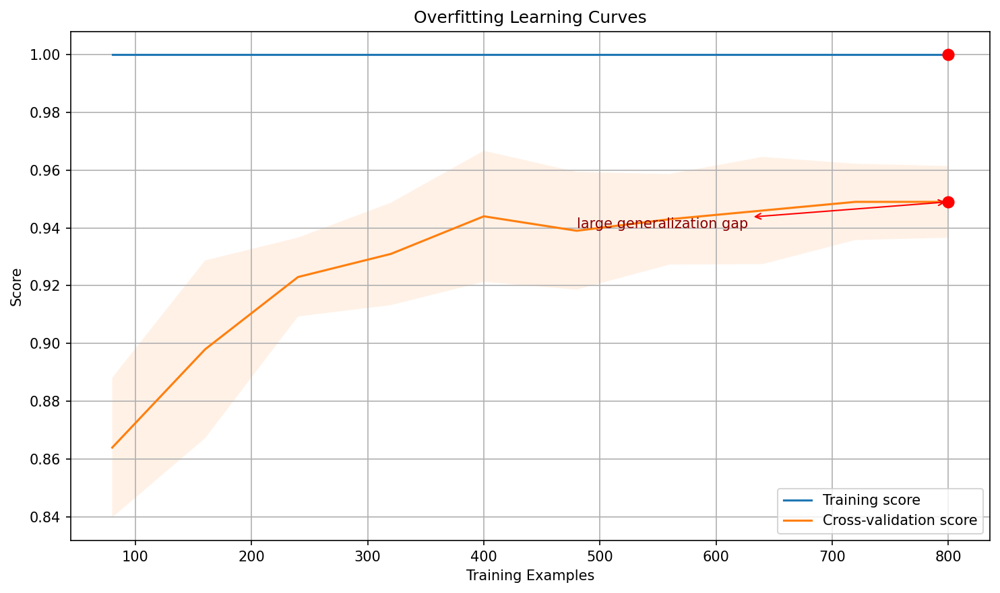
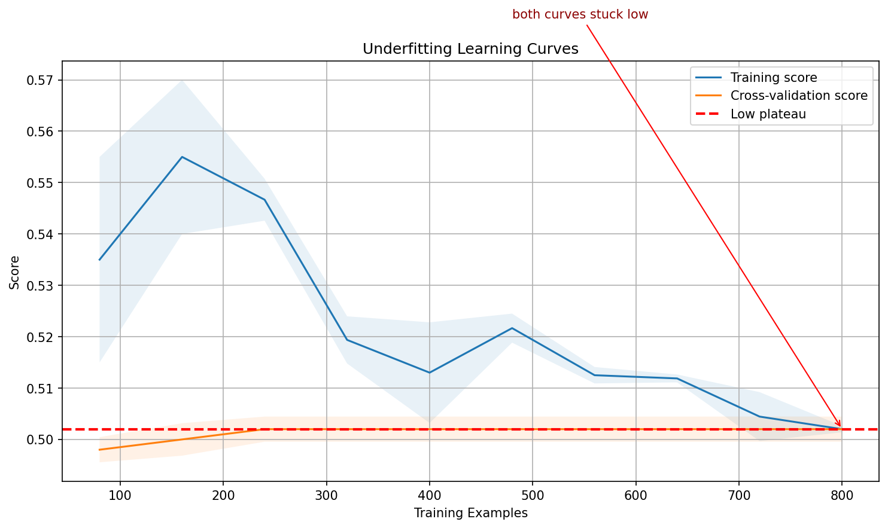

# Learning Curves

**After this lesson:** you can explain Learning Curves and try the examples in your own notebook.

## Overview

**Learning curves**: training vs validation error vs sample size, diagnosing bias, variance, and data needs.

## Introduction

Learning curves are powerful tools for diagnosing model performance and understanding how our model learns from data. They help us identify issues like overfitting and underfitting, and guide us in making better decisions about model complexity and data requirements.

> **Key idea:** learning curves answer **"will more data help?"** They do not tune a hyperparameter directly.

## What are Learning Curves?

Learning curves plot the model's performance (e.g., accuracy or error) against the amount of training data. They show us how the model's performance changes as we add more training examples.

### Why Learning Curves Matter

1. Diagnose **model performance issues**
2. Determine whether **more data** would help
3. Identify **overfitting or underfitting**
4. Guide **model selection and tuning**

## Real-World Analogies

### The Student Learning Analogy

Think of learning curves like a student's progress:

* Training curve: How well the student performs on practice problems
* Validation curve: How well the student performs on new problems
* Gap between curves: How well the student generalizes

### The Sports Training Analogy

Learning curves are like sports training:

* Training curve: Performance in practice
* Validation curve: Performance in games
* Gap between curves: Ability to apply skills in real situations

## Understanding Learning Curves

> **Read the diagram:** the x-axis is training-set size, not model complexity. Read the final right-hand side first: if both curves end low, the model is underfitting; if the training curve stays much higher than validation, it is overfitting; if both end high and close together, the model is generalizing.

### 1. Ideal Learning Curve

#### `learning_curve` with logistic regression

Data and Setup

Generate a 1000-sample binary classification problem; `learning_curve` will subsample this at 10 increasing fractions from 10% to 100%.

Compute Curves

`learning_curve` returns score arrays shaped (train\_size, cv\_folds); taking `mean(axis=1)` and `std(axis=1)` collapses folds into a single mean and spread per size.

Plot with Confidence Bands

`fill_between` adds a ±1 std band around each curve; converging curves with a narrow gap indicate a well-generalizing model.

<figure><figcaption>
Figure 1: Learning Curves
</figcaption></figure>

> **Read Figure 1:** the training score usually starts high because small training sets are easy to memorize. The validation score should rise as more examples are added. A useful curve ends with the two lines close together at a strong score, which means the model has enough data to generalize.

### 2. Overfitting Learning Curve

#### Larger MLP (typical gap)

> This example reuses `X, y` (and the imported `np`/`plt`) from the first block above.

High-capacity Model

A two-hidden-layer MLP (100, 50 neurons) is more flexible than logistic regression; its training score typically stays high while validation lags, revealing overfitting.

Compute Mean and Std

Same aggregation as the ideal-fit example, collapse CV fold scores into per-size mean and standard deviation for plotting.

Overfitting Diagnostic

A large visible gap between the training and validation bands is the visual signature of overfitting, the model memorizes training patterns rather than generalizing.

<figure><figcaption>
Figure 2: Overfitting Learning Curves
</figcaption></figure>

> **Read Figure 2:** the training curve remaining high while the validation curve stays lower is the key warning sign. More data may help if the validation curve is still climbing at the right edge, but regularization or a simpler model is usually the faster first response.

### 3. Underfitting Learning Curve

#### Dummy baseline (high bias)

> This example reuses `X, y` (and the imported `np`/`plt`) from the first block above.

Dummy Baseline

`DummyClassifier` predicts the majority class regardless of input, a worst-case underfitter whose plateau score equals the class frequency.

Aggregate Scores

Mean and std across folds collapse the raw score matrix to per-size statistics, consistent with the previous two examples.

Underfitting Diagnostic

Both curves plateau at a low, flat score with a small gap, the characteristic shape of underfitting where more data provides no improvement.

<figure><figcaption>
Figure 3: Underfitting Learning Curves
</figcaption></figure>

> **Read Figure 3:** both curves are close together, but that is not automatically good. Because they plateau at a weak score, the model is too simple to learn the pattern. Adding more rows will not fix the main problem; add better features or use a stronger model.

## Interpreting Learning Curves

### 1. High Bias (Underfitting)

* Both curves plateau at low performance
* Small gap between curves
* More data won't help much

### 2. High Variance (Overfitting)

* Training curve much higher than validation curve
* Large gap between curves
* More data might help

### 3. Good Fit

* Both curves plateau at high performance
* Small gap between curves
* Model generalizes well

## Best Practices

1. **Data Preparation**
   * Use training sizes that cover both small-data and near-full-data regimes; the left side shows how quickly the model learns, while the right side shows whether more data is still likely to help.
   * Put preprocessing inside the cross-validation pipeline so each fold learns scaling, imputation, and encoding from its own training subset only.
   * Investigate extreme outliers before plotting; a few corrupted rows can make the early training-size points look unstable and lead to the wrong diagnosis.
2. **Model Selection**
   * Start with a simple baseline because its curve tells you whether the dataset is learnable before adding model complexity.
   * Increase complexity only when the simple model plateaus at low train and validation scores; if the simple model already has a high validation plateau, extra complexity mostly adds variance risk.
   * Use cross-validation curves rather than one split so the final gap reflects typical behaviour across folds.
3. **Regularization**
   * If the training curve stays high but the validation curve remains much lower, add regularisation or simplify the model; the gap is evidence that the model is memorising patterns that do not transfer.
   * Tune regularisation with validation curves after reading the learning curve; the learning curve tells you whether regularisation is the right lever.
   * Watch the validation curve, not only training score: stronger regularisation is useful only if validation performance improves or becomes more stable.
4. **Monitoring**
   * Track train and validation scores together because each score alone is ambiguous: low validation score could mean underfitting, overfitting, or a noisy split.
   * Replot the curve after major feature-engineering or modelling changes so the diagnosis stays current.
   * Use early stopping when validation performance stops improving while training performance continues to rise; this is the point where additional training begins to buy memorisation rather than generalisation.

## Common Mistakes to Avoid

1. **Overfitting**
   * Using too complex models
   * Not using validation sets
   * Ignoring regularization
2. **Underfitting**
   * Using too simple models
   * Not considering feature engineering
   * Insufficient training time

## Gotchas

* **Confusing learning curves with validation curves**: Learning curves vary _training set size_ on the x-axis; validation curves vary a _hyperparameter_ on the x-axis; mixing them up leads to wrong diagnoses (e.g., concluding "more data won't help" when you're actually looking at a validation curve showing overfitting onset).
* **Interpreting a converging gap as always meaning "good fit"**: Train and validation curves that converge at a _low_ value both indicate underfitting, not a good model; a converging gap only confirms a good fit when the convergence point is also _high_ (close to your target performance).
* **Using too few or too many training size points**: With `train_sizes=np.linspace(0.1, 1.0, 5)` you get only 5 data points and miss the curve's shape; with 50 points the computation time multiplies; 8-15 points (the default 5 in sklearn is often too few) balances resolution and cost.
* **Not shuffling before calling `learning_curve`**: If data is sorted by class or time, small training subsets may contain only one class, causing artificially low scores at the left end of the curve; pass `shuffle=True` (or use a pre-shuffled dataset) to get representative subsamples at each size.
* **Assuming more data always closes an overfitting gap**: For a high-capacity model like an unregularised deep tree, adding data eventually helps, but the convergence may require far more samples than you have; if the gap is still wide at 100% of your data, regularisation or a simpler model is the right lever, not more data collection.
* **Drawing the curve with training set size in samples vs fractions**: `learning_curve` returns raw sample counts in `train_sizes`; plotting fractions (0 to 1) without dividing by `n_samples` compresses the x-axis and makes it hard to know whether you need 500 or 5000 additional examples to close the gap.

## Additional Resources

1. [Scikit-learn: learning curve user guide](https://scikit-learn.org/stable/modules/learning_curve.html#learning-curve)
2. [Scikit-learn: `learning_curve` API](https://scikit-learn.org/stable/modules/generated/sklearn.model_selection.learning_curve.html)
3. [Scikit-learn example: plotting learning curves](https://scikit-learn.org/stable/auto_examples/model_selection/plot_learning_curve.html)
4. [Scikit-learn: underfitting vs overfitting example](https://scikit-learn.org/stable/auto_examples/model_selection/plot_underfitting_overfitting.html)
