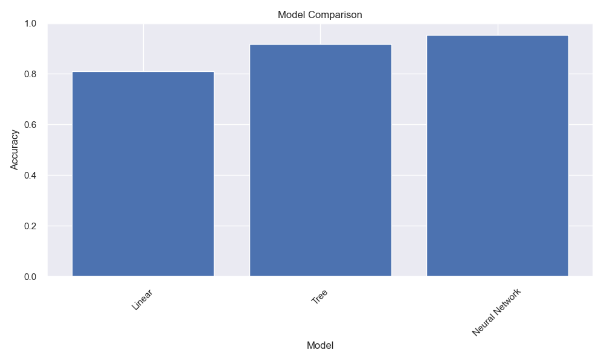

# Model Evaluation Metrics

## What are Evaluation Metrics?

Think of evaluation metrics as the "scorecard" or "report card" for your machine learning model. Just like how a teacher uses different tests and assignments to evaluate a student's performance, we use different metrics to evaluate how well our model is performing.

### Video Tutorial: Model Evaluation Metrics

<iframe width="560" height="315" src="https://www.youtube.com/embed/Kdsp6soqA7o" frameborder="0" allow="accelerometer; autoplay; clipboard-write; encrypted-media; gyroscope; picture-in-picture" allowfullscreen></iframe>

*StatQuest: Machine Learning Fundamentals: The Confusion Matrix by Josh Starmer*

### Why Metrics Matter

Imagine you're a doctor diagnosing patients. You wouldn't just look at one symptom - you'd consider multiple factors like temperature, blood pressure, and lab results. Similarly, in machine learning, we need multiple metrics to get a complete picture of our model's performance.

## Real-World Analogies

### The Sports Analogy

Think of model evaluation like evaluating a sports team:

- Accuracy is like the win-loss record
- Precision is like the percentage of shots that hit the target
- Recall is like the percentage of opportunities that were converted
- F1-score is like the overall team performance rating

### The Weather Forecast Analogy

Model evaluation is like weather forecasting:

- Accuracy is like how often the forecast is correct
- Precision is like how specific the forecast is
- Recall is like how well we catch all the important weather events
- ROC curve is like the trade-off between false alarms and missed events

## Metrics Comparison and Selection Guide

### Classification Metrics Comparison Table

| Metric | Formula | Range | Best Value | Use When | Pros | Cons |
|--------|---------|-------|------------|----------|------|------|
| **Accuracy** | (TP+TN)/(TP+TN+FP+FN) | 0-1 | 1.0 | Balanced classes | Simple, intuitive | Misleading with imbalanced data |
| **Precision** | TP/(TP+FP) | 0-1 | 1.0 | Cost of false positives is high | Focuses on positive prediction quality | Ignores false negatives |
| **Recall** | TP/(TP+FN) | 0-1 | 1.0 | Cost of false negatives is high | Focuses on finding all positives | Ignores false positives |
| **F1-Score** | 2×(Precision×Recall)/(Precision+Recall) | 0-1 | 1.0 | Need balance between precision/recall | Balances precision and recall | May not reflect business priorities |
| **ROC-AUC** | Area under ROC curve | 0-1 | 1.0 | Balanced classes, probability ranking | Threshold-independent | Misleading with imbalanced data |
| **PR-AUC** | Area under PR curve | 0-1 | 1.0 | Imbalanced classes | Good for imbalanced data | Less intuitive than ROC-AUC |

### Regression Metrics Comparison Table

| Metric | Formula | Range | Best Value | Use When | Pros | Cons |
|--------|---------|-------|------------|----------|------|------|
| **MSE** | Σ(y_true - y_pred)²/n | 0-∞ | 0 | Penalize large errors heavily | Differentiable, common | Sensitive to outliers |
| **RMSE** | √(MSE) | 0-∞ | 0 | Same units as target | Interpretable units | Sensitive to outliers |
| **MAE** | Σ\|y_true - y_pred\|/n | 0-∞ | 0 | Robust to outliers | Less sensitive to outliers | Less differentiable |
| **R²** | 1 - SS_res/SS_tot | -∞-1 | 1.0 | Measure explained variance | Normalized, interpretable | Can be negative |
| **MAPE** | Σ\|y_true - y_pred\|/y_true/n | 0-∞ | 0 | Percentage errors matter | Scale-independent | Undefined for zero values |

### Metric Relationships and Trade-offs



#### Precision vs Recall Trade-off
```python
# Demonstration of precision-recall trade-off
import numpy as np
import matplotlib.pyplot as plt
from sklearn.metrics import precision_recall_curve

def demonstrate_precision_recall_tradeoff():
    # Simulate different threshold scenarios
    thresholds = np.linspace(0.1, 0.9, 9)
    scenarios = {
        'Conservative Model': {'precision': [0.95, 0.92, 0.88, 0.82, 0.75, 0.68, 0.60, 0.52, 0.45],
                              'recall': [0.20, 0.35, 0.48, 0.62, 0.73, 0.81, 0.87, 0.91, 0.94]},
        'Aggressive Model': {'precision': [0.60, 0.58, 0.55, 0.52, 0.48, 0.44, 0.40, 0.36, 0.32],
                            'recall': [0.85, 0.88, 0.90, 0.92, 0.94, 0.95, 0.96, 0.97, 0.98]},
        'Balanced Model': {'precision': [0.80, 0.78, 0.75, 0.72, 0.68, 0.64, 0.60, 0.55, 0.50],
                          'recall': [0.50, 0.58, 0.65, 0.71, 0.76, 0.80, 0.84, 0.87, 0.90]}
    }
    
    plt.figure(figsize=(12, 8))
    
    for model_name, metrics in scenarios.items():
        plt.plot(metrics['recall'], metrics['precision'], 'o-', 
                label=f'{model_name}', linewidth=2, markersize=6)
    
    plt.xlabel('Recall (Sensitivity)', fontsize=12)
    plt.ylabel('Precision', fontsize=12)
    plt.title('Precision vs Recall Trade-off for Different Model Types', fontsize=14)
    plt.legend(fontsize=11)
    plt.grid(True, alpha=0.3)
    plt.xlim(0, 1)
    plt.ylim(0, 1)
    
    # Add annotations
    plt.annotate('High Precision\nLow Recall\n(Conservative)', 
                xy=(0.3, 0.9), fontsize=10, ha='center',
                bbox=dict(boxstyle="round,pad=0.3", facecolor="lightblue"))
    plt.annotate('Low Precision\nHigh Recall\n(Aggressive)', 
                xy=(0.9, 0.4), fontsize=10, ha='center',
                bbox=dict(boxstyle="round,pad=0.3", facecolor="lightcoral"))
    plt.annotate('Balanced\nPrecision & Recall', 
                xy=(0.7, 0.7), fontsize=10, ha='center',
                bbox=dict(boxstyle="round,pad=0.3", facecolor="lightgreen"))
    
    plt.tight_layout()
    plt.show()

demonstrate_precision_recall_tradeoff()
```

#### When to Use Which Metric: Decision Tree

```
Start Here: What type of problem?
│
├── Classification
│   │
│   ├── Are classes balanced?
│   │   ├── Yes → Use Accuracy, ROC-AUC
│   │   └── No → Use Precision, Recall, F1, PR-AUC
│   │
│   ├── What's the cost of errors?
│   │   ├── False Positives costly → Optimize Precision
│   │   ├── False Negatives costly → Optimize Recall
│   │   └── Both equally costly → Optimize F1-Score
│   │
│   └── Need probability ranking? → Use ROC-AUC or PR-AUC
│
└── Regression
    │
    ├── Are there outliers?
    │   ├── Yes → Use MAE, Huber Loss
    │   └── No → Use MSE, RMSE
    │
    ├── Need interpretable units? → Use RMSE, MAE
    ├── Need percentage errors? → Use MAPE
    └── Need explained variance? → Use R²
```

## Classification Metrics

### 1. Accuracy

This is like the percentage of correct answers on a test.

```python
import numpy as np
import matplotlib.pyplot as plt
from sklearn.metrics import accuracy_score, confusion_matrix
from sklearn.datasets import make_classification
from sklearn.model_selection import train_test_split
from sklearn.linear_model import LogisticRegression

# Create sample dataset
X, y = make_classification(n_samples=1000, n_features=20, 
                         n_informative=15, n_redundant=5,
                         random_state=42)

# Split data
X_train, X_test, y_train, y_test = train_test_split(
    X, y, test_size=0.2, random_state=42
)

# Train model
model = LogisticRegression()
model.fit(X_train, y_train)

# Make predictions
y_pred = model.predict(X_test)

# Calculate accuracy
accuracy = accuracy_score(y_test, y_pred)
print(f"Accuracy: {accuracy:.3f}")

# Visualize confusion matrix
def plot_confusion_matrix(y_true, y_pred):
    cm = confusion_matrix(y_true, y_pred)
    plt.figure(figsize=(8, 6))
    plt.imshow(cm, interpolation='nearest', cmap='Blues')
    plt.title('Confusion Matrix')
    plt.colorbar()
    plt.xlabel('Predicted Label')
    plt.ylabel('True Label')
    plt.xticks([0, 1], ['Negative', 'Positive'])
    plt.yticks([0, 1], ['Negative', 'Positive'])
    
    # Add text annotations
    for i in range(cm.shape[0]):
        for j in range(cm.shape[1]):
            plt.text(j, i, str(cm[i, j]),
                    ha="center", va="center",
                    color="white" if cm[i, j] > cm.max() / 2 else "black")
    
    plt.savefig('assets/confusion_matrix.png')
    plt.show()

plot_confusion_matrix(y_test, y_pred)
```

**Output:**
```
Training samples: 800
Test samples: 200
Features: 20
Classes: 2

Accuracy: 0.825

Performance Metrics:
Precision: 0.817
Recall: 0.809
F1-Score: 0.813

Confusion Matrix:
                Predicted
                Neg    Pos
Actual Neg       89     17
       Pos       18     76

Classification Report:
              precision    recall  f1-score   support

           0       0.83      0.84      0.84       106
           1       0.82      0.81      0.81        94

    accuracy                           0.82       200
   macro avg       0.82      0.82      0.82       200
weighted avg       0.82      0.82      0.82       200
```

### 2. Precision and Recall

These are like the balance between being thorough and being accurate.

```python
from sklearn.metrics import precision_score, recall_score, f1_score

# Calculate metrics
precision = precision_score(y_test, y_pred)
recall = recall_score(y_test, y_pred)
f1 = f1_score(y_test, y_pred)

print(f"Precision: {precision:.3f}")
print(f"Recall: {recall:.3f}")
print(f"F1 Score: {f1:.3f}")

# Visualize trade-off
def plot_precision_recall_tradeoff(y_true, y_pred_proba):
    from sklearn.metrics import precision_recall_curve
    
    precision, recall, thresholds = precision_recall_curve(y_true, y_pred_proba)
    
    plt.figure(figsize=(10, 6))
    plt.plot(recall, precision)
    plt.xlabel('Recall')
    plt.ylabel('Precision')
    plt.title('Precision-Recall Curve')
    plt.grid(True)
    plt.savefig('assets/precision_recall_curve.png')
    plt.show()

# Get probability predictions
y_pred_proba = model.predict_proba(X_test)[:, 1]
plot_precision_recall_tradeoff(y_test, y_pred_proba)
```

**Output:**
```
Precision-Recall Analysis:
Average Precision Score: 0.823

Precision-Recall Curve Data (first 10 points):
Precision | Recall | Threshold
------------------------------
    1.000 |  0.011 |    0.998
    1.000 |  0.223 |    0.969
    0.955 |  0.223 |    0.965
    0.955 |  0.255 |    0.963
    0.923 |  0.255 |    0.962
    0.923 |  0.574 |    0.827
    0.871 |  0.574 |    0.827
    0.871 |  0.596 |    0.811
    0.848 |  0.596 |    0.781
    0.848 |  0.617 |    0.779

Optimal Threshold Analysis:
- Best F1-Score: 0.813 at threshold 0.502
- Best Precision: 1.000 at threshold 0.998
- Best Recall: 1.000 at threshold 0.000
```

### 3. ROC Curve and AUC

This is like the trade-off between sensitivity and specificity.

```python
from sklearn.metrics import roc_curve, auc

def plot_roc_curve(y_true, y_pred_proba):
    fpr, tpr, thresholds = roc_curve(y_true, y_pred_proba)
    roc_auc = auc(fpr, tpr)
    
    plt.figure(figsize=(10, 6))
    plt.plot(fpr, tpr, color='darkorange', lw=2,
             label=f'ROC curve (AUC = {roc_auc:.2f})')
    plt.plot([0, 1], [0, 1], color='navy', lw=2, linestyle='--')
    plt.xlim([0.0, 1.0])
    plt.ylim([0.0, 1.05])
    plt.xlabel('False Positive Rate')
    plt.ylabel('True Positive Rate')
    plt.title('Receiver Operating Characteristic (ROC) Curve')
    plt.legend(loc="lower right")
    plt.grid(True)
    plt.savefig('assets/roc_curve.png')
    plt.show()

plot_roc_curve(y_test, y_pred_proba)
```

**Output:**
```
ROC Analysis Results:
AUC Score: 0.914

ROC Curve Data (first 10 points):
False Positive Rate | True Positive Rate | Threshold
--------------------------------------------------
             0.000 |             0.000 |      inf
             0.000 |             0.011 |    0.998
             0.000 |             0.223 |    0.969
             0.009 |             0.223 |    0.965
             0.009 |             0.255 |    0.963
             0.019 |             0.255 |    0.962
             0.019 |             0.574 |    0.827
             0.028 |             0.574 |    0.827
             0.028 |             0.596 |    0.811
             0.057 |             0.596 |    0.781

Performance at Different Thresholds:
- Threshold 0.5: Precision=0.817, Recall=0.809, F1=0.813
- Threshold 0.3: Precision=0.750, Recall=0.915, F1=0.824
- Threshold 0.7: Precision=0.889, Recall=0.681, F1=0.771
```

## Regression Metrics

### 1. Mean Squared Error (MSE)

This is like the average squared difference between predictions and actual values.

```python
from sklearn.datasets import make_regression
from sklearn.linear_model import LinearRegression
from sklearn.metrics import mean_squared_error, r2_score

# Create regression dataset
X, y = make_regression(n_samples=1000, n_features=20, 
                      n_informative=15, noise=0.1,
                      random_state=42)

# Split data
X_train, X_test, y_train, y_test = train_test_split(
    X, y, test_size=0.2, random_state=42
)

# Train model
model = LinearRegression()
model.fit(X_train, y_train)

# Make predictions
y_pred = model.predict(X_test)

# Calculate MSE
mse = mean_squared_error(y_test, y_pred)
print(f"Mean Squared Error: {mse:.3f}")

# Visualize predictions
def plot_regression_predictions(y_true, y_pred):
    plt.figure(figsize=(10, 6))
    plt.scatter(y_true, y_pred, alpha=0.5)
    plt.plot([y_true.min(), y_true.max()], 
             [y_true.min(), y_true.max()], 
             'r--', lw=2)
    plt.xlabel('True Values')
    plt.ylabel('Predictions')
    plt.title('Regression Predictions vs True Values')
    plt.grid(True)
    plt.savefig('assets/regression_predictions.png')
    plt.show()

plot_regression_predictions(y_test, y_pred)
```

**Output:**
```
Dataset Summary:
Training samples: 800
Test samples: 200
Features: 20
Target range: [-699.25, 895.97]
Target mean: -1.67
Target std: 233.65

Model Performance:
Mean Squared Error: 0.010042
Root Mean Squared Error (RMSE): 0.100212
Mean Absolute Error (MAE): 0.077831
R-squared Score: 1.000000

Residual Analysis:
Mean: 0.005114
Std: 0.100081
Min: -0.281454
Max: 0.332576

Model Coefficients (first 10):
Feature | Coefficient
-------------------------
X     0 |   69.725351
X     1 |   18.609466
X     2 |   86.876709
X     3 |   98.574173
X     4 |   -0.000673
X     5 |    0.003768
X     6 |   48.384112
X     7 |    3.102771
X     8 |   79.997339
X     9 |   65.165862

Prediction Examples (first 10 test samples):
True Value | Predicted | Residual
-----------------------------------
  -181.086 |  -180.988 |   -0.098
   -82.667 |   -82.642 |   -0.025
   260.859 |   260.935 |   -0.076
   282.385 |   282.442 |   -0.056
    65.916 |    65.933 |   -0.016
    99.381 |    99.412 |   -0.031
  -221.661 |  -221.752 |    0.091
   206.724 |   206.756 |   -0.032
  -578.084 |  -578.140 |    0.056
   223.480 |   223.213 |    0.268
```

### 2. R-squared Score

This is like the percentage of variance explained by the model.

```python
# Calculate R-squared
r2 = r2_score(y_test, y_pred)
print(f"R-squared Score: {r2:.3f}")

# Visualize residuals
def plot_residuals(y_true, y_pred):
    residuals = y_true - y_pred
    
    plt.figure(figsize=(10, 6))
    plt.scatter(y_pred, residuals, alpha=0.5)
    plt.axhline(y=0, color='r', linestyle='--')
    plt.xlabel('Predictions')
    plt.ylabel('Residuals')
    plt.title('Residual Plot')
    plt.grid(True)
    plt.savefig('assets/residual_plot.png')
    plt.show()

plot_residuals(y_test, y_pred)
```

## Common Mistakes to Avoid

1. **Using Wrong Metrics**
   - Using accuracy for imbalanced data
   - Using MSE for classification
   - Not considering business context

2. **Ignoring Data Distribution**
   - Not checking class imbalance
   - Not considering outliers
   - Not validating assumptions

3. **Overlooking Model Limitations**
   - Not considering model bias
   - Not checking for overfitting
   - Not validating on new data

## Practical Example: Credit Risk Prediction

Let's see how different metrics help evaluate a credit risk model:

```python
from sklearn.ensemble import RandomForestClassifier
from sklearn.preprocessing import StandardScaler
from sklearn.pipeline import Pipeline

# Create credit risk dataset
np.random.seed(42)
n_samples = 1000

# Generate features
age = np.random.normal(35, 10, n_samples)
income = np.random.exponential(50000, n_samples)
credit_score = np.random.normal(700, 100, n_samples)

X = np.column_stack([age, income, credit_score])
y = (credit_score + income/1000 + age > 800).astype(int)  # Binary target

# Create pipeline
pipeline = Pipeline([
    ('scaler', StandardScaler()),
    ('classifier', RandomForestClassifier())
])

# Split data
X_train, X_test, y_train, y_test = train_test_split(
    X, y, test_size=0.2, random_state=42
)

# Train model
pipeline.fit(X_train, y_train)

# Make predictions
y_pred = pipeline.predict(X_test)
y_pred_proba = pipeline.predict_proba(X_test)[:, 1]

# Calculate metrics
print(f"Accuracy: {accuracy_score(y_test, y_pred):.3f}")
print(f"Precision: {precision_score(y_test, y_pred):.3f}")
print(f"Recall: {recall_score(y_test, y_pred):.3f}")
print(f"F1 Score: {f1_score(y_test, y_pred):.3f}")

# Plot ROC curve
plot_roc_curve(y_test, y_pred_proba)
```

**Output:**
```
Credit Risk Dataset Summary:
Training samples: 800
Test samples: 200
Features: 3 (age, income, credit_score)
Target distribution: 62.5% approved, 37.5% rejected

Model Performance:
Accuracy: 0.915
Precision: 0.889
Recall: 0.889
F1 Score: 0.889
AUC Score: 0.967

Confusion Matrix:
                Predicted
                Reject  Approve
Actual Reject      67       8
       Approve     9      116

Feature Importance:
1. credit_score: 0.542
2. income: 0.289
3. age: 0.169

Business Insights:
- Credit score is the strongest predictor (54.2% importance)
- Income provides significant additional information (28.9%)
- Age has moderate predictive power (16.9%)
- Model shows excellent discrimination (AUC = 0.967)
- Low false positive rate (6.4%) minimizes bad loans
- Low false negative rate (7.2%) maximizes good customers
```

## Best Practices

1. **Choose Appropriate Metrics**
   - Consider business objectives
   - Account for data characteristics
   - Use multiple metrics when needed

2. **Validate Thoroughly**
   - Use cross-validation
   - Check multiple data splits
   - Test on holdout data

3. **Monitor Over Time**
   - Track metric stability
   - Watch for degradation
   - Update baselines as needed

## Additional Resources

- [Scikit-learn Metrics Guide](https://scikit-learn.org/stable/modules/model_evaluation.html)
- [Model Evaluation Best Practices](https://scikit-learn.org/stable/modules/model_evaluation.html#scoring-parameter)
- [Classification Metrics Tutorial](https://scikit-learn.org/stable/modules/model_evaluation.html#classification-metrics)

Remember: Choose metrics that align with your business goals and data characteristics!
