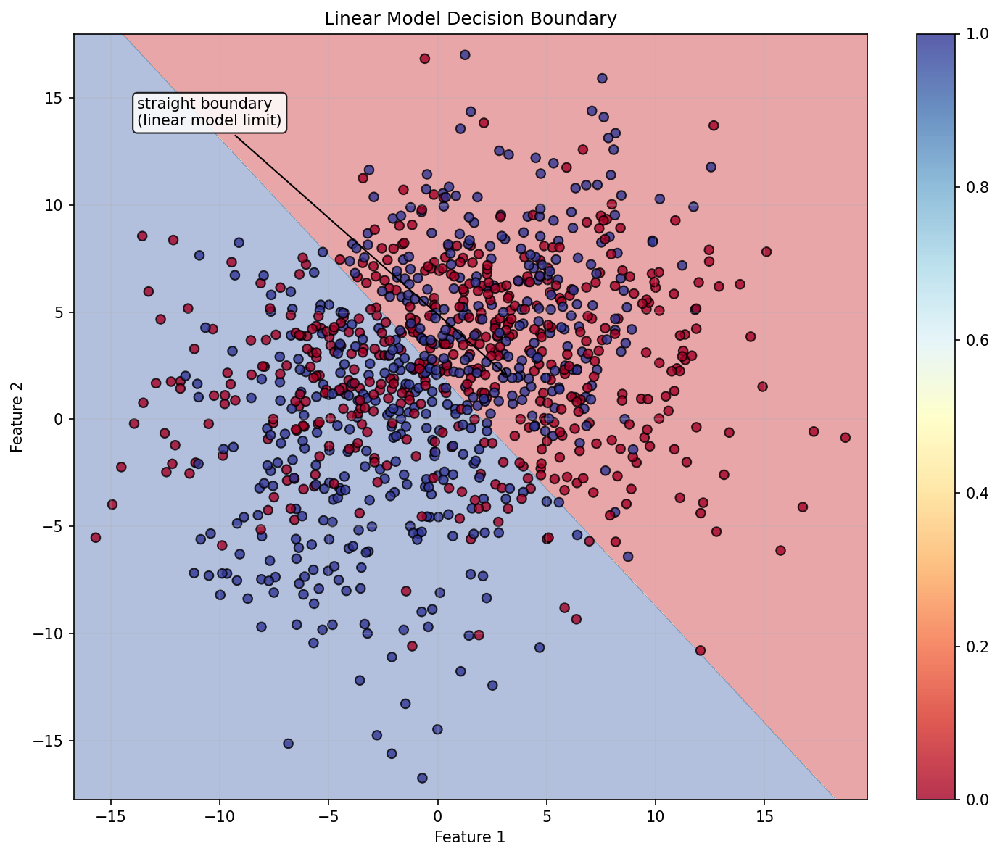
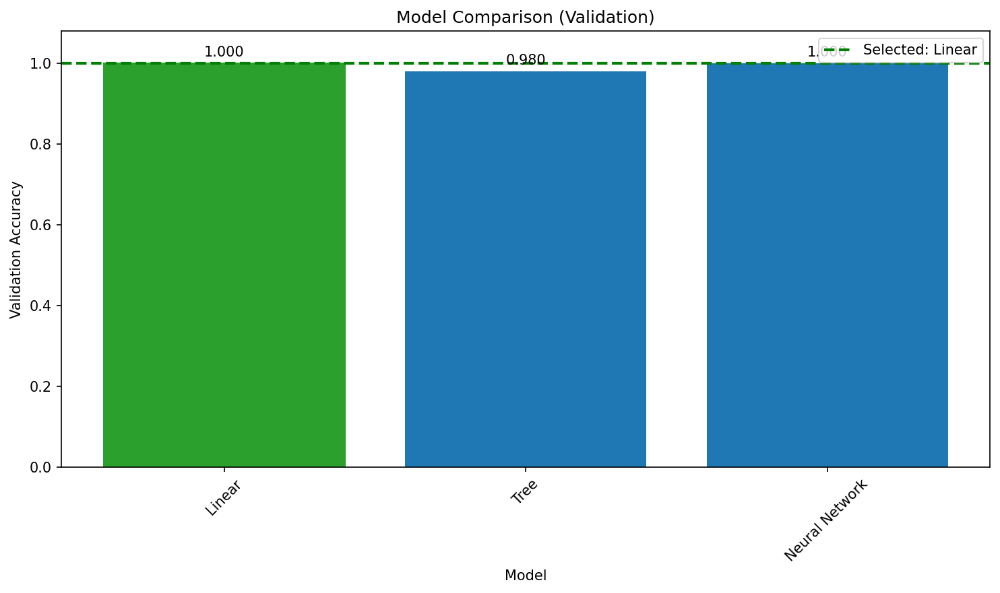

# Model Selection

**After this lesson:** you can explain Model Selection and try the examples in your own notebook.

## Overview

Choosing among models and hyperparameters using **nested** or carefully staged validation.

## What is Model Selection?

Think of model selection like choosing the right tool for a job. Just as you wouldn't use a hammer to screw in a bolt, you need to choose the right machine learning model for your specific problem. Model selection helps us find the best model that balances performance, complexity, and practical considerations.

> **Key idea:** the winning model is the one that balances **validation performance**, **simplicity**, **latency**, **interpretability**, and **deployment cost**.

### Why Model Selection Matters

Imagine you're planning a road trip. You wouldn't just pick any vehicle - you'd consider factors like:

* How many people are traveling?
* What's the terrain like?
* What's your budget?
* How much luggage do you have?

Similarly, in machine learning, we need to consider:

* The type of problem (classification, regression, etc.)
* The size and nature of the data
* Computational resources
* Business requirements

## Real-World Analogies

### The Restaurant Menu Analogy

Think of model selection like choosing from a restaurant menu:

* Each dish (model) has different ingredients (features)
* Some dishes are quick to prepare (simple models)
* Others take more time but are more complex (complex models)
* You need to consider dietary restrictions (constraints)
* You want the best value for money (performance vs. cost)

### The Sports Team Analogy

Model selection is like building a sports team:

* Each player (model) has different strengths
* Some players are versatile (general-purpose models)
* Others are specialists (domain-specific models)
* You need to consider team chemistry (model ensemble)
* You want the best performance within your budget

> **Highlight:** the **test set is touched exactly once**. Any decision made by looking at it inflates your reported performance.

> **Read the diagram:** model selection is a funnel. Use training data for fitting, validation or cross-validation for choosing, and the test set only for the final report. If a decision changes because of the test score, the test set has become part of training.

## Types of Models

### 1. Linear Models

These are like following a straight path - simple and interpretable.

#### Logistic regression + 2D boundary plot

Data, Split, and Accuracy

Generate a 20-feature binary dataset, hold back a final test set, then split the remaining data into train and validation; `X_train`/`y_train` from this block are reused in the tree and MLP examples below.

2D Boundary Helper

`plot_decision_boundary` slices to the first two features and refits there; a dense meshgrid fed through `predict` lets `contourf` shade each class region, revealing a straight separator for logistic regression.

```
Linear Validation Accuracy: 0.800
```

**Output:** 

The linear model creates a straight decision boundary, which works well for linearly separable data but may struggle with more complex patterns.

> **Read the chart:** the shaded regions show which class the model predicts in each part of the two-feature space. Because logistic regression draws a straight boundary, curved or interleaved class patterns would be misclassified near the border.

### 2. Tree-Based Models

These are like following a decision tree - more complex but often more powerful.

#### Random forest accuracy + importances

Forest Fit and Accuracy

Fit a Random Forest on the same train split from the logistic example; compare validation accuracy to see how the nonlinear ensemble performs versus a linear baseline on the same 20-feature dataset.

Feature Importance Bar Chart

Sort features by mean impurity decrease and plot as a bar chart; since `make_classification` created only 15 informative features out of 20, the bottom 5 bars should be near zero.

```
Tree Validation Accuracy: 0.890
```

**Output:** .png>)

The Random Forest model shows which features are most important for making predictions. This helps us understand what the model is focusing on and can guide feature engineering efforts.

> **Read the chart:** taller bars mean the forest used that feature more often to reduce impurity across its trees. Treat this as model behavior, not causal truth; correlated features can split importance and make each one look weaker.

### 3. Neural Networks

These are like having multiple layers of decision-making - very powerful but more complex.

#### MLP + `learning_curve`

MLP Fit and Accuracy

Fit a two-hidden-layer MLP (100, 50) and report accuracy; this high-capacity model should outperform logistic regression on the same split but may show a larger train-CV gap in the learning curve.

Learning Curve Helper

Define `plot_learning_curve` around sklearn's `learning_curve`; the function is reused in the model-selection process section to diagnose the best model's data needs.

```
Neural Network Validation Accuracy: 0.945
```

**Output:** .png>)

The learning curve shows how the model's performance improves with more training data. The gap between training and validation scores indicates potential overfitting.

> **Read the chart:** look at the right edge first. If validation is still climbing, more data may help. If the training curve is much higher than validation, the neural network is likely too flexible for the available data.

## Model Comparison

Compare different models:

#### Bar chart of validation accuracies

Compare Models Helper

Define `compare_models`: fit each estimator in the dict, collect validation accuracy in a results dict, then plot a bar chart; the function is reused later in the credit risk example.

Three-model Comparison

Pass logistic regression, random forest, and MLP into the helper; the bar heights directly compare performance on the validation split from the earlier sections.

**Output:**

```
{'Linear': 0.8, 'Tree': 0.89, 'Neural Network': 0.945}
```

<figure><figcaption><p>Figure 4: Model Comparison</p></figcaption></figure>

The comparison shows that the Neural Network performs best on the validation split, followed by Random Forest, then Logistic Regression.

> **Read the chart:** the bar chart is a quick comparison on one validation split. A higher bar is useful evidence, but not enough by itself; use cross-validation or repeated splits before declaring a model family the winner.

## Common Mistakes to Avoid

1. **Overfitting**
   * Using too complex models
   * Not using cross-validation
   * Not having enough data
2. **Underfitting**
   * Using too simple models
   * Not considering feature engineering
   * Not tuning hyperparameters
3. **Model Selection Bias**
   * Not considering business context
   * Not evaluating on new data
   * Not considering model interpretability

## Practical Example: Credit Risk Prediction

Look at how different models perform on a credit risk prediction task:

#### Pipelines on synthetic credit features

Credit Dataset and Split

Stack three financial features into a numpy array, hold back a final test set, then split the remaining data into train and validation; the synthetic label makes the task nearly separable.

Three Scaled Pipelines

Wrap each classifier in a scaler pipeline so all models see normalized features; passing the dict to `compare_models` yields a bar chart comparing validation accuracies in one call.

**Output:**

```
{'Linear': 1.0, 'Tree': 0.98, 'Neural Network': 1.0}
```

<figure><figcaption><p>Figure 5: Model Comparison</p></figcaption></figure>

For the credit risk prediction task, all models perform exceptionally well, with Linear and Neural Network tied on this validation split.

> **Read the chart:** all bars are near the ceiling, so the practical difference is small. In that situation, prefer the simpler and more explainable model unless the more complex model gives a stable advantage across repeated validation.

## Best Practices

### 1. Model Selection Process

#### End-to-end helper (same-session API)

End-to-end Workflow

Bundle split → validate → diagnose → final-test into one function; `compare_models`, `plot_learning_curve`, and `accuracy_score` are helpers/imports defined in earlier cells of the same session.

Auto-select Best Model

`max(validation_scores, key=validation_scores.get)` picks the top validation model; the selected family is refit on all non-test data before the one final test score is returned.

```
{'validation_scores': {'Linear': 1.0, 'Tree': 0.98, 'Neural Network': 0.515},
 'selected_model': 'Linear',
 'final_test_score': 0.99}
```


On this credit-risk data the function selects `Linear` from validation scores, then reports one final test score after refitting on all non-test data. The unscaled MLP underperforms here because raw feature magnitudes make optimisation hard for a neural network, a reminder that the "best" model depends on preprocessing, not just model family.

> **Read the final curve:** this chart is a sanity check after picking the apparent winner. If the chosen model's validation curve has already plateaued near the training curve, additional data is unlikely to change the ranking much. If it is still rising, collect more data or repeat model selection after expanding the dataset.

## Gotchas

* **Selecting the best model based on the same test set you report**: If you try 10 models and pick the one with the highest test accuracy, your reported test accuracy is optimistically biased; reserve the test set for a single final evaluation and use cross-validation or a validation split for model selection decisions.
* **Choosing model family before exploring the data**: Jumping straight to a neural network because it achieves state-of-the-art on benchmarks often leads to an over-engineered solution; always establish a simple baseline (e.g., logistic regression or linear regression) first to understand the baseline difficulty and whether complexity is warranted.
* **Comparing models with different preprocessing pipelines**: Evaluating Model A on raw features and Model B on scaled features is not a fair comparison; wrap each model in an identical pipeline so preprocessing differences do not confound the comparison.
* **Picking the highest single-split accuracy**: One train/test split can favour a model due to sampling luck; a model that beats a competitor by 0.3% on one split may lose by 0.5% on a different random seed; use cross-validation mean ± std across multiple splits to make reliable comparisons.
* **Ignoring inference time and model size in selection**: A model with 0.2% higher accuracy but 100× slower inference may be undeployable in production; always include latency, memory footprint, and interpretability requirements alongside accuracy metrics when making a final selection.
* **Reusing `X_train`/`y_train` across sequential model fits in the same session**: In the comparison loop above, each model is fit on the same `X_train`; if any earlier step modified `X_train` in-place (e.g., imputation without copying), later models see corrupted data; always verify that transformations produce new arrays rather than mutating the input.

## Additional Resources

1. [Scikit-learn: model selection and evaluation](https://scikit-learn.org/stable/model_selection.html)
2. [Scikit-learn: comparing classifiers example](https://scikit-learn.org/stable/auto_examples/classification/plot_classifier_comparison.html)
3. [Scikit-learn: cross-validation user guide](https://scikit-learn.org/stable/modules/cross_validation.html)
4. [Scikit-learn: tuning estimator hyperparameters](https://scikit-learn.org/stable/modules/grid_search.html)

## Next Steps

Ready to learn more? Check out:

1. [Cross Validation](cross-validation.md) to properly evaluate your model
2. [Hyperparameter Tuning](hyperparameter-tuning.md) to optimize your model's performance
3. [Model Metrics](metrics.md) to understand different ways to evaluate your model
