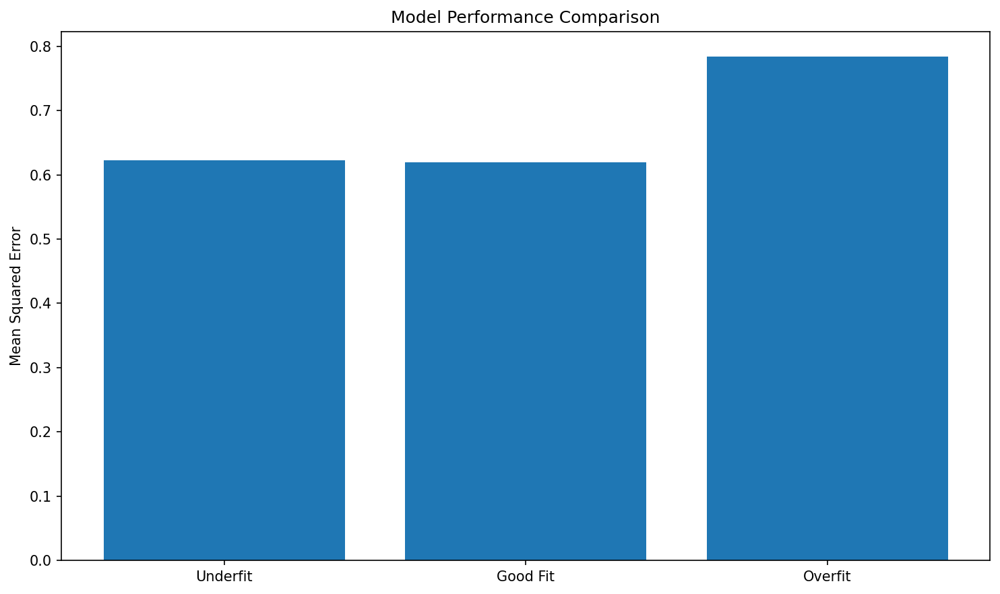

# Overfitting and Underfitting

**After this lesson:** you can explain Overfitting and Underfitting and try the examples in your own notebook.

## Overview

Recognizing **over** vs **under**fitting from learning curves and error gaps, not only training loss.

## Introduction

Understanding overfitting and underfitting is important for building effective machine learning models. These concepts help us diagnose model performance and make better decisions about model complexity.

> **Key idea:** diagnose from **train vs validation** behaviour, not from training score alone.

## What is Overfitting?

Overfitting occurs when a model learns the training data too well, including its noise and outliers. Think of it like memorizing answers for a test without understanding the underlying concepts.

### Signs of Overfitting

1. **High training accuracy but low test accuracy**
2. **Poor performance on new data**
3. Model captures **noise** in the training data
4. Complex decision boundaries

## What is Underfitting?

Underfitting happens when a model is too simple to capture the underlying patterns in the data. It's like trying to solve a complex problem with an oversimplified approach.

### Signs of Underfitting

1. **Low training accuracy**
2. **Low test accuracy**
3. Model fails to capture important patterns
4. Overly simple decision boundaries

_The learning curve is the fastest diagnostic: plot train and validation error vs training set size. A large gap between the two curves signals overfitting; both curves high signals underfitting._

> **Highlight:** **large gap = overfitting**; **both poor = underfitting**; **both strong and close = good fit**.

## Real-World Analogies

### The Student Analogy

Think of overfitting and underfitting like different study approaches:

* Overfitting: Memorizing specific questions and answers
* Underfitting: Only learning basic concepts
* Good fit: Understanding concepts and applying them to new problems

### The Weather Forecast Analogy

Model fitting is like weather forecasting:

* Overfitting: Predicting exact temperatures for specific locations
* Underfitting: Always predicting the same temperature
* Good fit: Making accurate predictions based on patterns

## Solutions

### For Overfitting

1. Increase training data
2. Use regularization
3. Simplify the model
4. Use cross-validation
5. Apply early stopping

### For Underfitting

1. Add more features
2. Increase model complexity
3. Reduce regularization
4. Train for longer
5. Use more sophisticated algorithms

## Practical Example

#### Polynomial degree vs test MSE

Data Generation

Create 100 points from the linear function `2x` with Gaussian noise, then split 80/20 to measure out-of-sample performance for each model.

Model Complexity Spectrum

Three models span the complexity range: linear (underfitting), degree-2 polynomial (good fit), and degree-15 polynomial (overfitting to noise).

Fit and Evaluate

For polynomial models, features are expanded with `fit_transform` (train only), then a fresh `LinearRegression` fits the expanded training set and scores on test.

MSE Bar Chart

A bar chart of test MSE across the three models visually confirms that degree-15 produces the largest error despite fitting the training data far more closely.

<figure><figcaption>
Figure 1: Model Performance Comparison
</figcaption></figure>

## Best Practices

1. **Data Preparation**
   * Use enough training data to represent the variation the model will see later; tiny samples make both overfitting and underfitting diagnoses unstable.
   * Clean and preprocess data before comparing models so differences in performance reflect model behaviour rather than inconsistent inputs.
   * Investigate outliers because a model can either memorise them (overfitting) or flatten the whole pattern to accommodate them (underfitting).
2. **Model Selection**
   * Start with simple models to establish whether the signal is easy to learn.
   * Increase complexity only when both training and validation performance are poor; if only validation is poor, the problem is variance, not insufficient capacity.
   * Use cross-validation because one split can make a model look overfit or underfit due to sampling luck.
3. **Regularization**
   * Add regularisation when training performance is much better than validation performance; that gap is the evidence that complexity needs control.
   * Tune regularisation strength instead of guessing; too much penalty creates underfitting and too little leaves overfitting unchanged.
   * Monitor validation performance because the best regularisation level is the one that improves generalisation, not the one that makes coefficients smallest.
4. **Monitoring**
   * Track training and validation metrics together because the diagnosis depends on both the absolute score and the gap.
   * Use learning curves to decide whether the next lever is more data, a simpler model, or a more expressive model.
   * Implement early stopping for iterative models when validation performance stops improving before training performance does.

## Common Mistakes to Avoid

1. **Overfitting**
   * Using too complex models
   * Not using validation sets
   * Ignoring regularization
2. **Underfitting**
   * Using too simple models
   * Not considering feature engineering
   * Insufficient training time

## Gotchas

* **Diagnosing overfitting from training accuracy alone**: A training accuracy of 99% is only concerning if validation accuracy is significantly lower; high training accuracy combined with high, similar validation accuracy is a sign of a good model, not overfitting; always compare both curves before drawing conclusions.
* **Treating small training sets as underfitting**: If you have 50 samples and a complex model memorises them perfectly (training accuracy 100%), that is overfitting, not good generalisation; the symptom is a large train-validation gap, not low training accuracy; diagnose from the gap, not the absolute training score.
* **Fixing underfitting by adding training epochs alone**: For gradient-based models, training longer can improve a truly underfit model, but continuing past convergence causes overfitting; monitor validation loss and stop when it stops improving rather than training for a fixed epoch budget.
* **Polynomial degree overfitting is subtler with real data**: The degree-15 polynomial example clearly overfits because the ground truth is linear; in real datasets the "true" function is unknown and a degree-3 or degree-5 polynomial might already overfit; use cross-validation to pick degree rather than relying on visual inspection of a single train/test plot.
* **Assuming regularisation always fixes overfitting**: Regularisation shrinks coefficients and can reduce overfitting, but if the model is structurally wrong for the problem (e.g., linear model on highly non-linear data), regularisation only reduces variance without improving bias; you also need to consider the model family.
* **Ignoring data leakage as a source of apparent overfitting**: A large gap between train and test performance is not always caused by model complexity; if preprocessing was fit on the full dataset or test labels accidentally influenced training, the gap may reflect leakage rather than overfitting, and increasing regularisation will not help.

## Additional Resources

1. Scikit-learn documentation
2. Research papers on model complexity
3. Online tutorials on regularization
