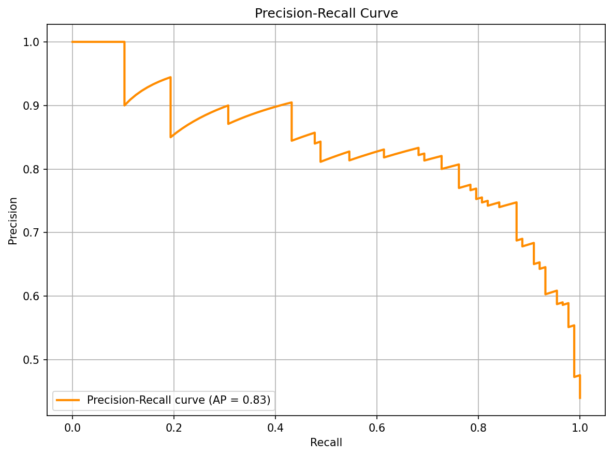
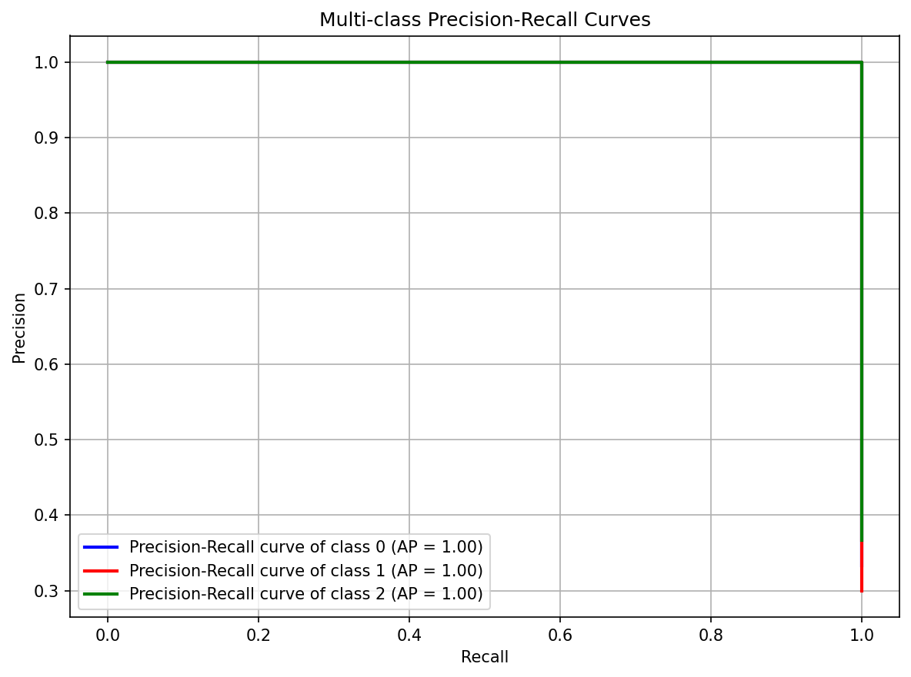
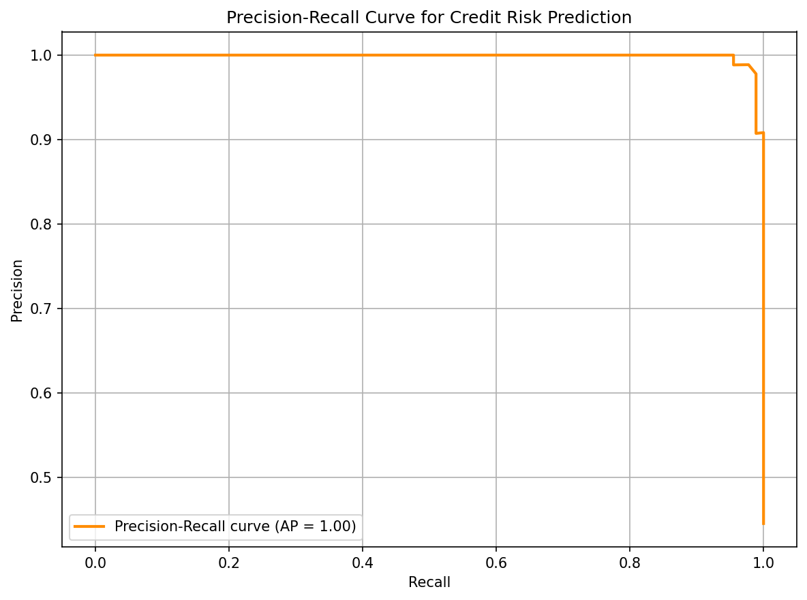

# Precision and Recall

**After this lesson:** you can explain Precision and Recall and try the examples in your own notebook.

## Overview

**Precision** vs **recall**, tradeoffs, and **F1**-especially under imbalance or asymmetric error costs.

## Introduction

Precision and Recall are fundamental metrics in machine learning for evaluating classification models. They provide insights into a model's performance in terms of accuracy and completeness.

### Video Tutorial: Sensitivity and Specificity Explained

_StatQuest: Machine Learning Fundamentals: Sensitivity and Specificity by Josh Starmer_

Note: **sensitivity** is exactly the same metric as **recall** (TP / (TP + FN)), so this video builds the intuition you need before we layer precision on top.

## What are Precision and Recall?

> **Key idea:** **precision** asks whether positive predictions are trustworthy; **recall** asks whether real positives are being found.

### Precision

* **Definition**: Ratio of true positives to all predicted positives
* **Formula**: TP / (TP + FP)
* **Interpretation**: "Of all the cases I predicted as positive, how many were actually positive?"
* **Range**: 0 to 1 (higher is better)
* **Focus**: Quality of positive predictions

### Recall (Sensitivity)

* **Definition**: Ratio of true positives to all actual positives
* **Formula**: TP / (TP + FN)
* **Interpretation**: "Of all the actual positive cases, how many did I correctly identify?"
* **Range**: 0 to 1 (higher is better)
* **Focus**: Completeness of positive detection

### The Precision-Recall Trade-off

There's typically a trade-off between precision and recall:

* **High Precision, Low Recall**: Very conservative model - when it says "positive," it's usually right, but it misses many positive cases
* **Low Precision, High Recall**: Very liberal model - catches most positive cases but also flags many false positives
* **Balanced**: Moderate precision and recall - good overall performance

> **Threshold rule:** raising the threshold usually increases **precision** and lowers **recall**; lowering the threshold usually increases **recall** and lowers **precision**.

### Real-World Examples

**Medical Diagnosis (Cancer Screening):**

* **High Recall Priority**: Don't miss any cancer cases (even if some false alarms)
* **High Precision Priority**: Avoid unnecessary anxiety and procedures

**Email Spam Detection:**

* **High Precision Priority**: Don't block important emails
* **High Recall Priority**: Catch all spam emails

**Fraud Detection:**

* **High Recall Priority**: Catch all fraudulent transactions
* **High Precision Priority**: Don't block legitimate transactions

## Types of Precision-Recall Curves

### 1. Binary Classification

#### PR curve and average precision

Data, Model, and Probabilities

Fit logistic regression and extract `predict_proba[:, 1]`, the positive-class probabilities needed to sweep the threshold for the PR curve.

Compute PR Curve

`precision_recall_curve` returns aligned precision/recall arrays at every unique probability threshold; `average_precision_score` summarizes the area in one number.

Plot Curve

Plot recall on x and precision on y; the AP score in the legend gives a quick summary of the curve's area without reading the shape manually.

<figure><figcaption>
Figure 1: Precision-Recall Curve
</figcaption></figure>

### 2. Multi-class Classification

#### One-vs-rest PR curves (Iris)

Binarize Labels

`label_binarize` converts the three-class integer labels to a 3-column binary matrix; each column is the one-vs-rest indicator for that class.

Per-class PR Curves

Loop over each class, pairing the binarized true labels with the model's predicted probability for that column; store precision, recall, and AP per class in dicts.

Overlay Three Curves

Cycle through three colors to draw each class's PR curve on the same axes; the AP in the legend lets you compare performance per class at a glance.

<figure><figcaption>
Figure 2: Multi-class Precision-Recall Curves
</figcaption></figure>

## Interpreting Precision-Recall Curves

### 1. Binary Classification

* Area Under Curve (AUC / Average Precision): Overall model performance
* Perfect classifier: AUC = 1.0
* Random classifier: Average Precision ≈ the positive-class prevalence (the fraction of positives), **not** 0.5, that 0.5 baseline belongs to the ROC curve, not the PR curve
* Quality is judged **relative to the prevalence baseline**: a "good" model sits well above prevalence, a "poor" model sits near or below it. Fixed 0.6/0.8 cutoffs are misleading because, on a rare positive class, even a strong model may have a modest absolute AP.

### 2. Multi-class Classification

* One curve per class
* Micro-average: Overall performance
* Macro-average: Class-wise average
* Weighted average: Class-weighted performance

### 3. Average Precision

* Range: 0 to 1
* ≈ positive-class prevalence: random classifier
* 1.0: Perfect classifier
* The 0.7-0.8 (good), 0.8-0.9 (very good), and 0.9+ (excellent) bands are only meaningful **relative to that prevalence baseline**, an AP of 0.7 is excellent when positives are 5% of the data but unremarkable when they are 60%.

## Best Practices

1. **Choose Appropriate Threshold**
   * Choose the threshold from business costs, not from the default 0.5 probability cutoff.
   * Move the threshold up when false positives are expensive and down when false negatives are expensive.
   * Use domain knowledge to identify realistic operating points; a medical screening tool and a marketing lead scorer should not use the same trade-off.
   * Validate the selected threshold with stakeholders because they own the practical consequences of the errors.
2. **Handle Class Imbalance**
   * Use precision-recall curves for imbalanced problems because they focus on positive-class retrieval instead of true negatives.
   * Apply sampling or class weights inside the training process only; changing the validation distribution can make precision look better than it will be in production.
   * Use cost-sensitive learning when one class is rare but operationally important.
   * Compare against the positive-class prevalence baseline, since average precision is meaningful only relative to that baseline.
3. **Validate Results**
   * Use cross-validation to check whether the curve shape is stable across folds.
   * Check for overfitting by comparing train and validation curves; a large separation means the threshold analysis is optimistic.
   * Compare with a baseline classifier so the PR curve improvement has context.
   * Consider multiple metrics because the best threshold for F1 may not be the best threshold for cost or recall.
4. **Visualize Effectively**
   * Label the baseline prevalence line so viewers know what a random or trivial classifier would achieve.
   * Mark candidate operating thresholds directly on the curve; otherwise readers see the trade-off but not the decision point.
   * Include a legend when comparing models so the winning curve is identifiable without colour memory.
   * Use grid lines or threshold labels sparingly to make recall/precision trade-offs readable.

## Common Mistakes to Avoid

1. **Ignoring Threshold Selection**
   * Using default threshold
   * Not considering costs
   * Missing business context
   * Overlooking trade-offs
2. **Poor Visualization**
   * Unclear labels
   * Wrong color scheme
   * Missing context
   * Incomplete information
3. **Misinterpretation**
   * Focusing on AUC alone
   * Ignoring class imbalance
   * Overlooking costs
   * Missing patterns

## Practical Example: Credit Risk Prediction

Analyze precision-recall curves for a credit risk prediction model:

#### Credit pipeline + PR plot

Credit Dataset

Generate five financial features with realistic distributions and derive a binary approval label from a linear threshold, reusing the same synthetic credit setup as other 5.5 examples.

Pipeline and Probabilities

A scaler+forest pipeline avoids leakage; `predict_proba[:, 1]` gives the positive-class score needed to sweep the PR threshold.

PR Curve and Plot

Compute and plot the precision-recall curve; the AP score tells lenders whether the model reliably ranks high-risk applicants above low-risk ones.

<figure><figcaption>
Figure 3: Precision-Recall Curve for Credit Risk Prediction
</figcaption></figure>

## Gotchas

* **Calling `precision_recall_curve` with hard predictions instead of probabilities**: `precision_recall_curve` requires continuous probability scores from `predict_proba[:, 1]`, not binary `predict` output; with hard labels the function returns only two operating points and the resulting "curve" cannot guide threshold selection.
* **Average Precision is not the same as area under a smoothed PR curve**: AP is a weighted step sum of precision at each recall increment (Σ (Rₙ − Rₙ₋₁)·Pₙ), deliberately _not_ the trapezoidal interpolation used by `auc(recall, precision)`, which can be over-optimistic; do not mix the two, and do not compare AP scores computed by different libraries that may interpolate differently.
* **Precision is undefined when the model predicts zero positives**: If your threshold is so high that the model never predicts the positive class, `TP + FP = 0` and precision is undefined (sklearn returns 0 with a warning); this silent 0 can mislead if you scan thresholds programmatically without checking prediction counts.
* **F1 score hides severe imbalance in precision and recall**: An F1 of 0.67 could represent precision=1.0, recall=0.5 (never wrong but misses half) or precision=0.5, recall=1.0 (catches everything but half are false alarms); always report precision and recall separately in addition to F1 so the direction of the tradeoff is visible.
* **Interpreting a high-recall model as "safe" for all use cases**: A spam filter with recall=0.99 for spam sounds great, but if precision=0.30 then 70% of flagged emails are legitimate; high recall at low precision is only acceptable when the cost of false negatives vastly outweighs false positives.
* **Using the default 0.5 threshold without justification**: sklearn's `predict` uses 0.5 as the decision boundary, which is optimal only for balanced classes with equal misclassification costs; for fraud detection, medical screening, or any asymmetric-cost problem, plot the full PR curve and choose the threshold that minimises your actual cost function.

## Additional Resources

1. Scikit-learn documentation on precision-recall curves
2. Research papers on classification metrics
3. Online tutorials on model evaluation
4. Books on machine learning evaluation
