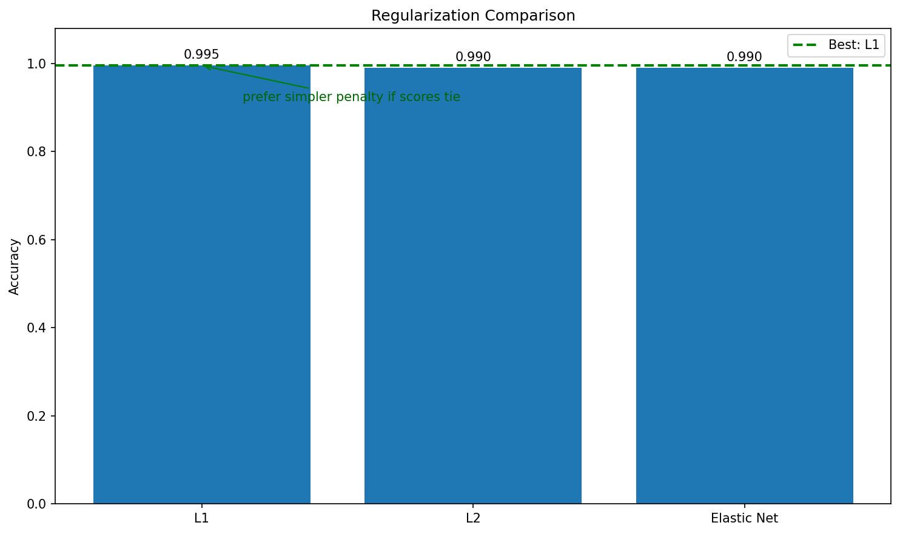

# Regularization

**After this lesson:** you can explain the core ideas in “Regularization” and reproduce the examples here in your own notebook or environment.

## Overview

Evaluation chapter angle on **regularization** choices and how they interact with CV scores.

Distinct from [5.3 regularization lesson](../5.3-supervised-learning-2/regularization/1-introduction.md)—this page is about choosing and measuring effects.


## Introduction

Regularization is a technique used to prevent overfitting in machine learning models. It helps us find the right balance between model complexity and generalization ability.

## What is Regularization?

Regularization adds a penalty term to the model's loss function to discourage complex models. Think of it like adding rules to a game to prevent players from exploiting loopholes.

### Why Regularization Matters

1. Prevents overfitting
2. Improves model generalization
3. Handles multicollinearity
4. Reduces model complexity

## Types of Regularization



*Higher `alpha` (λ) = stronger penalty = simpler model. Too high and you underfit. Use `RidgeCV` or `LassoCV` to search automatically.*

> **Read the diagram:** start from the symptom. If training score is much higher than validation score, add regularization. Then choose the penalty shape: L1 can drop features, L2 shrinks all weights, and Elastic Net combines both.

### 1. L1 Regularization (Lasso)

L1 regularization adds the absolute value of coefficients to the loss function:

#### Lasso pipeline (regression \(R^2\))

<div class="code-explainer" data-code-explainer>
<div class="code-explainer__code">


import numpy as np
from sklearn.datasets import make_regression
from sklearn.model_selection import train_test_split
from sklearn.linear_model import Lasso
from sklearn.preprocessing import StandardScaler
from sklearn.pipeline import Pipeline

X, y = make_regression(n_samples=500, n_features=20, noise=15, random_state=42)
X_train, X_test, y_train, y_test = train_test_split(
    X, y, test_size=0.2, random_state=42
)

# Create pipeline with L1 regularization
pipeline = Pipeline([
    ('scaler', StandardScaler()),
    ('lasso', Lasso(alpha=0.1))
])

# Fit and evaluate
pipeline.fit(X_train, y_train)
print(f"L1 Regularization Score: {pipeline.score(X_test, y_test):.3f}")


</div>
<aside class="code-explainer__callouts" aria-label="Code walkthrough">
  <div class="code-callout" data-lines="1-11" data-tint="1">
    <div class="code-callout__meta">
      <span class="code-callout__lines"></span>
      <span class="code-callout__title">Data and Split</span>
    </div>
    <div class="code-callout__body">
      <p>Generate a synthetic regression dataset with 20 features and noise, then split 80/20 for training and evaluation.</p>
    </div>
  </div>
  <div class="code-callout" data-lines="13-21" data-tint="2">
    <div class="code-callout__meta">
      <span class="code-callout__lines"></span>
      <span class="code-callout__title">Pipeline and Score</span>
    </div>
    <div class="code-callout__body">
      <p>Build a pipeline that scales features then applies Lasso (L1) at alpha=0.1, fit it, and print the test R² score.</p>
    </div>
  </div>
</aside>
</div>

```
L1 Regularization Score: 0.989
```

> **Read the output:** this is an \(R^2\) score, so values close to 1 mean the model explains most target variation on the test split. Lasso also tends to push some coefficients exactly to zero, so it can double as a feature-selection tool.

### 2. L2 Regularization (Ridge)

L2 regularization adds the squared value of coefficients to the loss function:

#### Ridge pipeline (same synthetic split)

**Purpose:** Recreate the regression split and evaluate an L2-regularized Ridge pipeline.

```python
from sklearn.datasets import make_regression
from sklearn.linear_model import Ridge
from sklearn.model_selection import train_test_split
from sklearn.preprocessing import StandardScaler
from sklearn.pipeline import Pipeline

X, y = make_regression(n_samples=500, n_features=20, noise=15, random_state=42)
X_train, X_test, y_train, y_test = train_test_split(
    X, y, test_size=0.2, random_state=42
)

# Create pipeline with L2 regularization
pipeline = Pipeline([
    ('scaler', StandardScaler()),
    ('ridge', Ridge(alpha=0.1))
])

# Fit and evaluate
pipeline.fit(X_train, y_train)
print(f"L2 Regularization Score: {pipeline.score(X_test, y_test):.3f}")
```

```
L2 Regularization Score: 0.988
```

> **Read the output:** Ridge reaches almost the same test \(R^2\) as Lasso here, but it usually keeps all features with smaller coefficients. Prefer Ridge when many features carry small, shared signal rather than a few features dominating.

### 3. Elastic Net

Elastic Net combines L1 and L2 regularization:

#### Elastic Net (`l1_ratio` mixes L1 vs L2)

**Purpose:** Recreate the same regression setup and evaluate a model that blends L1 and L2 penalties.

```python
from sklearn.datasets import make_regression
from sklearn.linear_model import ElasticNet
from sklearn.model_selection import train_test_split
from sklearn.preprocessing import StandardScaler
from sklearn.pipeline import Pipeline

X, y = make_regression(n_samples=500, n_features=20, noise=15, random_state=42)
X_train, X_test, y_train, y_test = train_test_split(
    X, y, test_size=0.2, random_state=42
)

# Create pipeline with Elastic Net
pipeline = Pipeline([
    ('scaler', StandardScaler()),
    ('elastic_net', ElasticNet(alpha=0.1, l1_ratio=0.5))
])

# Fit and evaluate
pipeline.fit(X_train, y_train)
print(f"Elastic Net Score: {pipeline.score(X_test, y_test):.3f}")
```

```
Elastic Net Score: 0.984
```

> **Read the output:** Elastic Net is slightly lower on this synthetic split, but still strong. The point is the tradeoff: it can behave like Lasso when sparsity helps and like Ridge when correlated features should share weight.

## Real-World Analogies

### The Diet Analogy

Think of regularization like a diet:

- L1: Strict rules about what you can eat
- L2: General guidelines about portion sizes
- Elastic Net: A balanced approach with both rules and guidelines

### The Traffic Control Analogy

Regularization is like traffic control:

- L1: Strict speed limits on specific roads
- L2: General traffic flow guidelines
- Elastic Net: A combination of specific and general rules

## Best Practices

1. **Choose the Right Type**
   - L1 for feature selection
   - L2 for general regularization
   - Elastic Net for balanced approach

2. **Tune Regularization Strength**
   - Use cross-validation
   - Start with small values
   - Monitor model performance

3. **Preprocess Data**
   - Scale features
   - Handle outliers
   - Remove multicollinearity

4. **Monitor Results**
   - Track training and validation metrics
   - Check feature importance
   - Validate on new data

## Common Mistakes to Avoid

1. **Too Strong Regularization**
   - Underfitting
   - Loss of important features
   - Poor model performance

2. **Too Weak Regularization**
   - Overfitting
   - Unstable predictions
   - Poor generalization

3. **Ignoring Data Scale**
   - Inconsistent regularization effects
   - Biased feature selection
   - Poor model performance

## Practical Example: Credit Risk Prediction

Let's see how regularization helps in a credit risk prediction task:

> **Watch the direction of the knob.** `LogisticRegression` (and `SVC`) is tuned with `C`, not `alpha`, and `C` is the *inverse* regularisation strength (`C` = 1/λ). So a **larger `C` means LESS regularisation**, the opposite of `Lasso`/`Ridge`, where a **larger `alpha` means MORE regularisation**.

#### Logistic penalties (L1 / L2 / elastic-net)

<div class="code-explainer" data-code-explainer>
<div class="code-explainer__code">


import numpy as np
import matplotlib.pyplot as plt
from sklearn.linear_model import LogisticRegression
from sklearn.preprocessing import StandardScaler
from sklearn.pipeline import Pipeline
from sklearn.model_selection import train_test_split

# Create credit risk dataset
np.random.seed(42)
n_samples = 1000

# Generate features
age = np.random.normal(35, 10, n_samples)
income = np.random.exponential(50000, n_samples)
credit_score = np.random.normal(700, 100, n_samples)

X = np.column_stack([age, income, credit_score])
y = (credit_score + income/1000 + age > 800).astype(int)  # Binary target

X_train, X_test, y_train, y_test = train_test_split(
    X, y, test_size=0.2, random_state=42
)

# Create pipelines with different regularization
pipelines = {
    'L1': Pipeline([
        ('scaler', StandardScaler()),
        ('classifier', LogisticRegression(penalty='l1', solver='liblinear'))
    ]),
    'L2': Pipeline([
        ('scaler', StandardScaler()),
        ('classifier', LogisticRegression(penalty='l2'))
    ]),
    'Elastic Net': Pipeline([
        ('scaler', StandardScaler()),
        ('classifier', LogisticRegression(penalty='elasticnet', solver='saga', l1_ratio=0.5))
    ])
}

# Compare pipelines
results = {}
for name, pipeline in pipelines.items():
    pipeline.fit(X_train, y_train)
    results[name] = pipeline.score(X_test, y_test)

# Plot results
plt.figure(figsize=(10, 6))
bars = plt.bar(results.keys(), results.values())
best_name = max(results, key=results.get)
best_score = results[best_name]
for bar in bars:
    height = bar.get_height()
    plt.text(bar.get_x() + bar.get_width() / 2, height + 0.01,
             f'{height:.3f}', ha='center', va='bottom')
plt.axhline(best_score, color='green', linestyle='--', linewidth=2,
            label=f'Best: {best_name}')
plt.annotate('prefer simpler penalty if scores tie', xy=(0, best_score),
             xytext=(0.15, best_score - 0.08),
             arrowprops=dict(arrowstyle='->', color='green'), color='darkgreen')
plt.title('Regularization Comparison')
plt.ylabel('Accuracy')
plt.ylim(0, 1.08)
plt.legend()
plt.show()


</div>
<aside class="code-explainer__callouts" aria-label="Code walkthrough">
  <div class="code-callout" data-lines="1-22" data-tint="1">
    <div class="code-callout__meta">
      <span class="code-callout__lines"></span>
      <span class="code-callout__title">Credit Dataset and Split</span>
    </div>
    <div class="code-callout__body">
      <p>Generate three financial features and derive a binary label; the same synthetic credit setup used across 5.5 examples ensures the regularization comparison is consistent with other lessons.</p>
    </div>
  </div>
  <div class="code-callout" data-lines="24-42" data-tint="2">
    <div class="code-callout__meta">
      <span class="code-callout__lines"></span>
      <span class="code-callout__title">Three Penalty Pipelines</span>
    </div>
    <div class="code-callout__body">
      <p>Build L1 (liblinear solver), L2, and Elastic Net logistic regression pipelines; the solver choice matters — <code>liblinear</code> for L1 and <code>saga</code> for elastic-net are sklearn requirements.</p>
    </div>
  </div>
  <div class="code-callout" data-lines="44-52" data-tint="3">
    <div class="code-callout__meta">
      <span class="code-callout__lines"></span>
      <span class="code-callout__title">Accuracy Bar Chart</span>
    </div>
    <div class="code-callout__body">
      <p>Fit each pipeline and collect test accuracy in a dict, then plot as a bar chart; similar scores across penalties indicate the data is well-separated regardless of regularization type.</p>
    </div>
  </div>
</aside>
</div>


<figure>

<figcaption>Figure 1: Regularization Comparison</figcaption>
</figure>

> **Read Figure 1:** compare the bar heights as test accuracy, not as proof that one penalty is universally better. When the bars are close, choose based on secondary needs: L1 for simpler feature sets, L2 for stable coefficients, and Elastic Net when features are correlated.

## Gotchas

- **Applying regularization without scaling features** — L1 and L2 penalties are applied to raw coefficient magnitudes, so a feature with a large numeric range (e.g., income in thousands) will attract a disproportionately large penalty compared to a small-range feature; always run `StandardScaler` before regularized models.
- **Choosing the penalty type by name rather than task** — Lasso sets some coefficients to exactly zero (useful for feature selection), while Ridge keeps all features but shrinks them; using Ridge when you actually want to select features will give a denser, harder-to-interpret model with no zero coefficients.
- **Treating `alpha=1.0` as a neutral default** — sklearn's default `alpha` for `Lasso` and `Ridge` is 1.0, which is often far too large for your specific dataset scale; always use `LassoCV` or `RidgeCV` to select alpha via cross-validation rather than accepting the default.
- **Comparing regularized models without the same solver** — For `LogisticRegression`, switching from `penalty='l2'` (default solver `lbfgs`) to `penalty='l1'` (requires `solver='liblinear'` or `'saga'`) silently falls back or errors; always set the solver explicitly to match the penalty type.
- **Expecting Elastic Net to always outperform L1 or L2 alone** — Elastic Net adds a second hyperparameter (`l1_ratio`) that must itself be tuned; with only a small dataset and no CV over `l1_ratio`, you can easily get a worse model than simple Lasso or Ridge.
- **Forgetting that regularization interacts with the loss function** — The `alpha` that works well for MSE regression may be wildly inappropriate for logistic loss; re-tune the regularization strength whenever you change the model family or target type.

## Additional Resources

1. [Scikit-learn: linear models and regularization](https://scikit-learn.org/stable/modules/linear_model.html)
2. [Scikit-learn: `RidgeCV`](https://scikit-learn.org/stable/modules/generated/sklearn.linear_model.RidgeCV.html)
3. [Scikit-learn: `LassoCV`](https://scikit-learn.org/stable/modules/generated/sklearn.linear_model.LassoCV.html)
4. [Scikit-learn: logistic regression regularization path example](https://scikit-learn.org/stable/auto_examples/linear_model/plot_logistic_l1_l2_sparsity.html)
