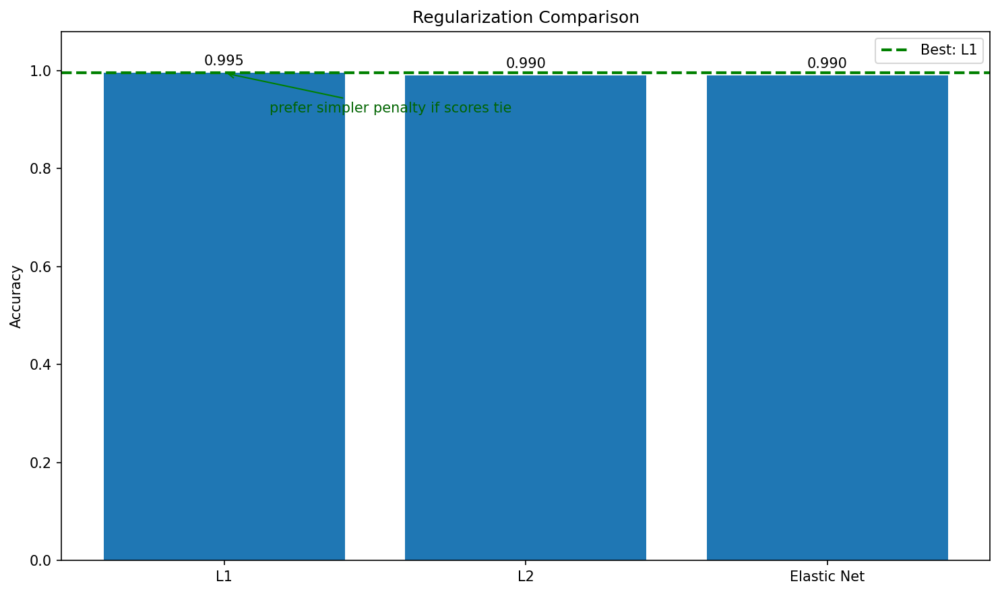

# Regularization

**After this lesson:** you can explain Regularization and try the examples in your own notebook.

## Overview

Evaluation chapter angle on **regularization** choices and how they interact with CV scores.

Distinct from [5.3 regularization lesson](../5.3-supervised-learning-2/regularization/1-introduction.md), this page is about choosing and measuring effects.

## Introduction

Regularization is a technique used to prevent overfitting in machine learning models. It helps us find the right balance between model complexity and generalization ability.

> **Key idea:** regularization deliberately makes the model a little less flexible so it generalizes better.

## What is Regularization?

Regularization adds a penalty term to the model's loss function to discourage complex models. Think of it like adding rules to a game to prevent players from exploiting loopholes.

### Why Regularization Matters

1. Prevents **overfitting**
2. Improves **model generalization**
3. Handles **multicollinearity**
4. Reduces model complexity

## Types of Regularization

> **Highlight:** higher `alpha` (λ) = **stronger penalty** = **simpler model**. Too high and you underfit. Use `RidgeCV` or `LassoCV` to search automatically.

> **Read the diagram:** start from the symptom. If training score is much higher than validation score, add regularization. Then choose the penalty shape: L1 can drop features, L2 shrinks all weights, and Elastic Net combines both.

### 1. L1 Regularization (Lasso)

L1 regularization adds the absolute value of coefficients to the loss function:

#### Lasso pipeline (regression (R^2))

Data and Split

Generate a synthetic regression dataset with 20 features and noise, then split 80/20 for training and evaluation.

Pipeline and Score

Build a pipeline that scales features then applies Lasso (L1) at alpha=0.1, fit it, and print the test R² score.

```
L1 Regularization Score: 0.989
```

> **Read the output:** this is an (R^2) score, so values close to 1 mean the model explains most target variation on the test split. Lasso also tends to push some coefficients exactly to zero, so it can double as a feature-selection tool.

### 2. L2 Regularization (Ridge)

L2 regularization adds the squared value of coefficients to the loss function:

#### Ridge pipeline (same synthetic split)

**Purpose:** Recreate the regression split and evaluate an L2-regularized Ridge pipeline.

```python
from sklearn.datasets import make_regression
from sklearn.linear_model import Ridge
from sklearn.model_selection import train_test_split
from sklearn.preprocessing import StandardScaler
from sklearn.pipeline import Pipeline

X, y = make_regression(n_samples=500, n_features=20, noise=15, random_state=42)
X_train, X_test, y_train, y_test = train_test_split(
    X, y, test_size=0.2, random_state=42
)

# Create pipeline with L2 regularization
pipeline = Pipeline([
    ('scaler', StandardScaler()),
    ('ridge', Ridge(alpha=0.1))
])

# Fit and evaluate
pipeline.fit(X_train, y_train)
print(f"L2 Regularization Score: {pipeline.score(X_test, y_test):.3f}")
```

```
L2 Regularization Score: 0.988
```

> **Read the output:** Ridge reaches almost the same test (R^2) as Lasso here, but it usually keeps all features with smaller coefficients. Prefer Ridge when many features carry small, shared signal rather than a few features dominating.

### 3. Elastic Net

Elastic Net combines L1 and L2 regularization:

#### Elastic Net (`l1_ratio` mixes L1 vs L2)

**Purpose:** Recreate the same regression setup and evaluate a model that blends L1 and L2 penalties.

```python
from sklearn.datasets import make_regression
from sklearn.linear_model import ElasticNet
from sklearn.model_selection import train_test_split
from sklearn.preprocessing import StandardScaler
from sklearn.pipeline import Pipeline

X, y = make_regression(n_samples=500, n_features=20, noise=15, random_state=42)
X_train, X_test, y_train, y_test = train_test_split(
    X, y, test_size=0.2, random_state=42
)

# Create pipeline with Elastic Net
pipeline = Pipeline([
    ('scaler', StandardScaler()),
    ('elastic_net', ElasticNet(alpha=0.1, l1_ratio=0.5))
])

# Fit and evaluate
pipeline.fit(X_train, y_train)
print(f"Elastic Net Score: {pipeline.score(X_test, y_test):.3f}")
```

```
Elastic Net Score: 0.984
```

> **Read the output:** Elastic Net is slightly lower on this synthetic split, but still strong. The point is the tradeoff: it can behave like Lasso when sparsity helps and like Ridge when correlated features should share weight.

## Real-World Analogies

### The Diet Analogy

Think of regularization like a diet:

* L1: Strict rules about what you can eat
* L2: General guidelines about portion sizes
* Elastic Net: A balanced approach with both rules and guidelines

### The Traffic Control Analogy

Regularization is like traffic control:

* L1: Strict speed limits on specific roads
* L2: General traffic flow guidelines
* Elastic Net: A combination of specific and general rules

## Best Practices

1. **Choose the Right Type**
   * Use L1 when you want a sparse model because it can drive weak coefficients to exactly zero, making the selected features easier to inspect.
   * Use L2 when most features may carry some signal because it shrinks coefficients smoothly instead of removing them completely.
   * Use Elastic Net when features are correlated: L1 may pick one correlated feature arbitrarily, while the L2 component helps keep groups of related features stable.
2. **Tune Regularization Strength**
   * Tune strength with cross-validation because the right amount of penalty is the one that improves held-out performance, not the one that looks neat on training data.
   * Sweep values on a log scale; small changes near zero can be less important than order-of-magnitude changes in `alpha` or inverse-strength `C`.
   * Check where the selected value sits in the search range. If the best value is at the boundary, extend the range before treating it as a real optimum.
3. **Preprocess Data**
   * Scale numeric features before regularised linear models so the penalty treats coefficients comparably; otherwise large-scale features can be penalised differently for purely numeric reasons.
   * Handle extreme outliers because they can force large coefficients that regularisation then shrinks in a way that hides the actual data-quality issue.
   * Diagnose multicollinearity because correlated predictors make coefficients unstable; regularisation reduces the problem but does not explain which correlated feature is causally important.
4. **Monitor Results**
   * Track both training and validation scores: if both are low, the penalty is probably too strong; if training is high and validation is low, it is probably too weak.
   * Inspect coefficients or feature importance after tuning to confirm that regularisation changed the model in a plausible direction.
   * Validate on fresh data before deployment because a penalty tuned on one sample can still fail when the feature distribution shifts.

## Common Mistakes to Avoid

1. **Too Strong Regularization**
   * Underfitting
   * Loss of important features
   * Poor model performance
2. **Too Weak Regularization**
   * Overfitting
   * Unstable predictions
   * Poor generalization
3. **Ignoring Data Scale**
   * Inconsistent regularization effects
   * Biased feature selection
   * Poor model performance

## Practical Example: Credit Risk Prediction

Look at how regularization helps in a credit risk prediction task:

> **Watch the direction of the knob.** `LogisticRegression` (and `SVC`) is tuned with `C`, not `alpha`, and `C` is the _inverse_ regularisation strength (`C` = 1/λ). So a **larger `C` means LESS regularisation**, the opposite of `Lasso`/`Ridge`, where a **larger `alpha` means MORE regularisation**.

#### Logistic penalties (L1 / L2 / elastic-net)

Credit Dataset and Split

Generate three financial features and derive a binary label; the same synthetic credit setup used across 5.5 examples ensures the regularization comparison is consistent with other lessons.

Three Penalty Pipelines

Build L1 (liblinear solver), L2, and Elastic Net logistic regression pipelines; the solver choice matters, `liblinear` for L1 and `saga` for elastic-net are sklearn requirements.

Accuracy Bar Chart

Fit each pipeline and collect test accuracy in a dict, then plot as a bar chart; similar scores across penalties indicate the data is well-separated regardless of regularization type.

<figure><figcaption><p>Figure 1: Regularization Comparison</p></figcaption></figure>

> **Read Figure 1:** compare the bar heights as test accuracy, not as proof that one penalty is universally better. When the bars are close, choose based on secondary needs: L1 for simpler feature sets, L2 for stable coefficients, and Elastic Net when features are correlated.

## Gotchas

* **Applying regularization without scaling features**: L1 and L2 penalties are applied to raw coefficient magnitudes, so a feature with a large numeric range (e.g., income in thousands) will attract a disproportionately large penalty compared to a small-range feature; always run `StandardScaler` before regularized models.
* **Choosing the penalty type by name rather than task**: Lasso sets some coefficients to exactly zero (useful for feature selection), while Ridge keeps all features but shrinks them; using Ridge when you actually want to select features will give a denser, harder-to-interpret model with no zero coefficients.
* **Treating `alpha=1.0` as a neutral default**: sklearn's default `alpha` for `Lasso` and `Ridge` is 1.0, which is often far too large for your specific dataset scale; always use `LassoCV` or `RidgeCV` to select alpha via cross-validation rather than accepting the default.
* **Comparing regularized models without the same solver**: For `LogisticRegression`, switching from `penalty='l2'` (default solver `lbfgs`) to `penalty='l1'` (requires `solver='liblinear'` or `'saga'`) silently falls back or errors; always set the solver explicitly to match the penalty type.
* **Expecting Elastic Net to always outperform L1 or L2 alone**: Elastic Net adds a second hyperparameter (`l1_ratio`) that must itself be tuned; with only a small dataset and no CV over `l1_ratio`, you can easily get a worse model than simple Lasso or Ridge.
* **Forgetting that regularization interacts with the loss function**: The `alpha` that works well for MSE regression may be wildly inappropriate for logistic loss; re-tune the regularization strength whenever you change the model family or target type.

## Additional Resources

1. [Scikit-learn: linear models and regularization](https://scikit-learn.org/stable/modules/linear_model.html)
2. [Scikit-learn: `RidgeCV`](https://scikit-learn.org/stable/modules/generated/sklearn.linear_model.RidgeCV.html)
3. [Scikit-learn: `LassoCV`](https://scikit-learn.org/stable/modules/generated/sklearn.linear_model.LassoCV.html)
4. [Scikit-learn: logistic regression regularization path example](https://scikit-learn.org/stable/auto_examples/linear_model/plot_logistic_l1_l2_sparsity.html)
