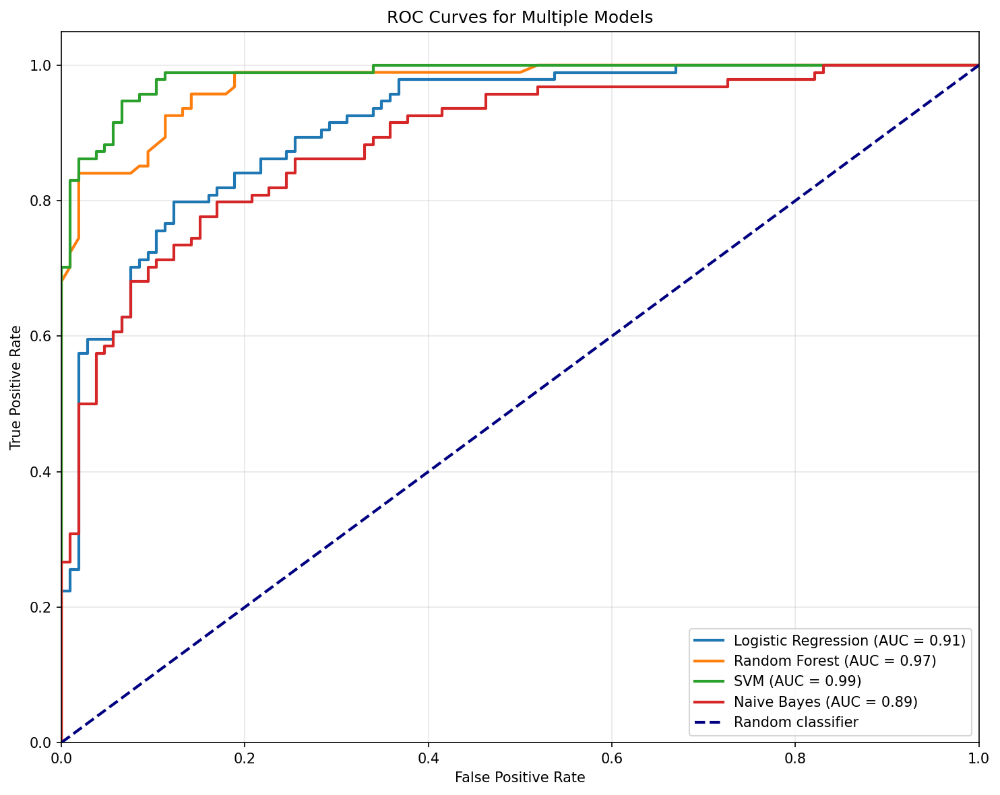
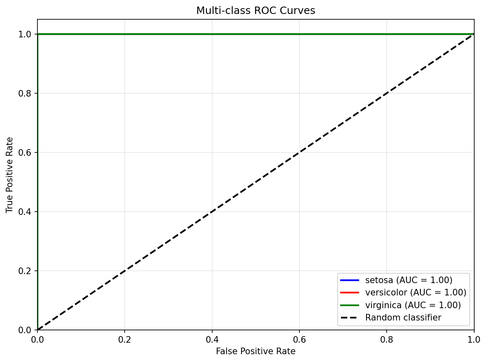
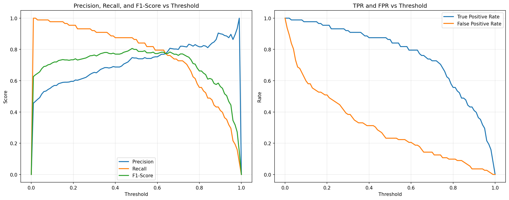

# ROC Curves and AUC: Complete Guide

**After this lesson:** you can explain ROC Curves and AUC: Complete Guide and try the examples in your own notebook.

## Overview

**ROC curves** and **AUC**: ranking quality across thresholds; complements precision-recall for skewed classes.

## Introduction

The Receiver Operating Characteristic (ROC) curve and Area Under the Curve (AUC) are powerful tools for evaluating binary classification models. They provide a comprehensive view of model performance across different classification thresholds and help us understand the trade-offs between sensitivity and specificity.

### Video Tutorial: ROC and AUC Explained

_StatQuest: ROC and AUC, Clearly Explained! by Josh Starmer_

## Real-World Analogies

### The Airport Security Analogy

Think of ROC and AUC like airport security screening:

* **True Positives**: Correctly identifying dangerous items
* **False Positives**: Flagging safe items as dangerous (inconvenience)
* **True Negatives**: Correctly identifying safe items
* **False Negatives**: Missing dangerous items (security risk)

The ROC curve shows how the security system performs at different sensitivity levels. A perfect system would catch all threats without any false alarms.

### The Medical Diagnosis Analogy

Imagine you're a doctor diagnosing a disease:

* **True Positives**: Correctly identifying patients with the disease
* **False Positives**: Diagnosing healthy patients as sick (unnecessary treatment)
* **True Negatives**: Correctly identifying healthy patients
* **False Negatives**: Missing patients who actually have the disease (delayed treatment)

ROC and AUC help us find the right balance between catching all cases and avoiding false alarms.

> **Key idea:** ROC-AUC measures **ranking quality across thresholds**. It does not choose the final threshold for you.

## Technical Definitions

### ROC Curve Components

The ROC curve plots the True Positive Rate (TPR) against the False Positive Rate (FPR) at various threshold settings:

**True Positive Rate (TPR)** = Sensitivity = Recall \\\[ \text{TPR} = \frac{\text{True Positives\}}{\text{True Positives} + \text{False Negatives\}} \\]

**False Positive Rate (FPR)** = 1 - Specificity \\\[ \text{FPR} = \frac{\text{False Positives\}}{\text{False Positives} + \text{True Negatives\}} \\]

### AUC (Area Under the Curve)

The AUC measures the model's ability to distinguish between classes:

* **AUC = 1.0**: Perfect classification
* **AUC = 0.5**: Random guessing (diagonal line)
* **AUC < 0.5**: Worse than random (but can be inverted)

**AUC Interpretation Guidelines:**

* **AUC > 0.9**: Excellent
* **0.8 < AUC ≤ 0.9**: Very good
* **0.7 < AUC ≤ 0.8**: Good
* **0.6 < AUC ≤ 0.7**: Fair
* **0.5 < AUC ≤ 0.6**: Poor
* **AUC = 0.5**: Random

> **Important:** these bands are only rough orientation. On rare-positive problems, also inspect **precision-recall** because ROC-AUC can look strong while precision is operationally poor.

## Understanding ROC Curve Shapes

.png>)

**Key Patterns:**

* **Perfect Classifier**: Curve goes straight up to (0,1) then across to (1,1)
* **Random Classifier**: Diagonal line from (0,0) to (1,1)
* **Good Classifier**: Curve bows toward the upper-left corner
* **Poor Classifier**: Curve below diagonal line

> **Read first:** the useful region is often the **low-FPR** area on the left. A model can have decent AUC but still be unacceptable if it produces too many false positives at your operating point.

## Implementation Examples

### 1. Basic ROC Curve for Binary Classification

#### Train a model and plot one ROC curve

Data, Model, and Probabilities

Fit logistic regression and extract `predict_proba[:, 1]`, the positive-class scores used to sweep the decision threshold across the ROC curve.

Compute ROC and AUC

`roc_curve` returns aligned FPR, TPR, and threshold arrays; `auc(fpr, tpr)` integrates the curve, the same value as `roc_auc_score`.

Reusable Plot Function

Encapsulate the plot logic so the same function can be called for any model's FPR/TPR arrays; the dashed diagonal shows the random-classifier baseline.

```
AUC Score: 0.914
```

### 2. Comparing Multiple Models

#### Overlay ROC curves for several classifiers

Four Classifiers

Collect logistic regression, random forest, SVM (with `probability=True`), and Naive Bayes in a dict; the SVM needs the flag to expose `predict_proba`.

Fit and Plot Loop

Each model is fit on the same training split; its ROC curve is computed and plotted in one loop so all four appear on the same axes for direct comparison.

Baseline and Formatting

The dashed diagonal marks random performance (AUC 0.5); the legend with per-model AUC lets you rank classifiers at a glance.

<figure><figcaption><p>Figure 2: ROC Curves for Multiple Models</p></figcaption></figure>

**Output:**

```
Model Performance Comparison:
Model                | Accuracy | Precision | Recall | F1-Score | AUC
----------------------------------------------------------------------
Logistic Regression |    0.825 |     0.817 |  0.809 |    0.813 |  0.914
Random Forest       |    0.900 |     0.878 |  0.915 |    0.896 |  0.973
SVM                 |    0.935 |     0.909 |  0.957 |    0.933 |  0.985
Naive Bayes         |    0.800 |     0.814 |  0.745 |    0.778 |  0.888

Model Ranking by AUC:
1. SVM: 0.985
2. Random Forest: 0.973
3. Logistic Regression: 0.914
4. Naive Bayes: 0.888
```

### 3. Multi-class ROC Curves

#### One-vs-rest ROC on Iris

Binarize Labels

Convert the three-class integer array to a 3-column binary matrix with `label_binarize`; each column is the one-vs-rest indicator for one Iris species.

Per-class ROC Loop

For each class index, pair the binarized true column with the predicted probability column; store FPR, TPR, and AUC in dicts keyed by class index.

Overlay Three Curves

Cycle through three colors to plot each species' ROC curve; real class names from `iris.target_names` make the legend readable without numeric class indices.

<figure><figcaption><p>Figure 3: Multi-class ROC Curves</p></figcaption></figure>

**Output:**

```
Multi-class Dataset Summary:
Training samples: 120
Test samples: 30
Features: 4
Classes: 3 (setosa, versicolor, virginica)

Multi-class ROC Results:
Class        | AUC Score
--------------------------
setosa       |     1.000
versicolor   |     1.000
virginica    |     1.000

Average AUC: 1.000

Class Distribution in Test Set:
setosa: 10 samples (33.3%)
versicolor: 9 samples (30.0%)
virginica: 11 samples (36.7%)

Model Accuracy: 100.0%
```

## Threshold Analysis and Selection

Understanding how different thresholds affect model performance is important for practical applications.

#### Sweep thresholds and plot precision/recall vs TPR/FPR

Function Signature and Dict

Import classification metrics and define `analyze_thresholds`; the metrics dict pre-declares six lists that will be filled in the sweep loop.

Threshold Sweep Loop

For each threshold, binarize the predicted probabilities; guard against all-one-class edge cases with `zero_division=0`, then derive TPR and FPR from `confusion_matrix(...).ravel()`.

Two-panel Visualization

Left panel plots precision, recall, and F1 vs threshold; right panel plots TPR and FPR, together they reveal the operating point trade-off space beyond a single AUC number.

<figure><figcaption><p>Figure 4: Precision, Recall, and F1-Score vs Threshold</p></figcaption></figure>

## Practical Example: Credit Risk Assessment

Apply ROC and AUC analysis to a realistic credit risk prediction scenario:

#### Synthetic credit data, pipeline, and four-panel analysis

Synthetic Credit Dataset

Generate seven financial features with realistic distributions; the binary default label is derived from a logistic-style linear combination, giving a \~25% default rate that tests the model under class imbalance.

Stratified Split and Pipeline

`stratify=y` preserves the default rate in both splits; the scaler+forest pipeline prevents leakage and produces ranking scores (not necessarily calibrated) via `predict_proba[:, 1]`, ROC/AUC only needs the scores to rank positives above negatives correctly.

Four-panel Analysis

The 2×2 figure covers ROC curve, threshold trade-offs, predicted probability distributions separated by true label, and feature importance, giving a full diagnostic view of the credit scoring model.

```
Default rate: 25.65%

Credit Risk Model Performance:
AUC Score: 0.734
Number of test samples: 400
Actual default rate: 25.75%
Predicted default rate (threshold=0.5): 13.00%
```

## Best Practices

### 1. Data Preparation

* **Handle missing values** before modelling because some estimators drop or error on missing rows, and silent row loss changes the class distribution.
* **Scale features** when necessary, especially for distance-based and linear models; otherwise ROC differences may reflect optimisation difficulty rather than model quality.
* **Address class imbalance** explicitly. ROC can look strong even when precision is poor on rare positives, so pair it with PR analysis when positives are scarce.
* **Validate data quality** before modelling because leakage, duplicate rows, and temporal ordering can all inflate AUC.

### 2. Model Development

* **Use cross-validation** for reliable evaluation so the ROC curve is not driven by one lucky split.
* **Compare multiple models** systematically with the same preprocessing and folds; otherwise AUC differences may come from the evaluation setup.
* **Consider model complexity** versus performance trade-offs because a tiny AUC gain may not justify slower inference or lower interpretability.
* **Validate on holdout data** once at the end so the reported AUC is not biased by repeated tuning.

### 3. ROC/AUC Analysis

* **Examine the full ROC curve**, not just AUC, because two models can have the same AUC but perform differently in the false-positive region you actually use.
* **Consider the shape** of the curve for insights; steep early lift is valuable when you can tolerate only a small false-positive rate.
* **Analyze threshold sensitivity** for practical deployment because the operating threshold determines the final confusion matrix.
* **Use domain knowledge** for threshold selection so the chosen point reflects real costs, capacity, and risk tolerance.

### 4. Threshold Selection

* **Consider business costs** of false positives versus false negatives before choosing an operating point.
* **Involve stakeholders** in threshold decisions because they understand the acceptable trade-off better than the metric alone.
* **Document the rationale** for chosen thresholds so future reviewers know whether the decision was driven by cost, capacity, safety, or regulation.
* **Monitor performance** in production because score distributions and class prevalence can drift after deployment.

### 5. Reporting and Communication

* **Provide context** for AUC scores by comparing against a baseline and the use-case requirement.
* **Explain trade-offs** clearly to stakeholders: higher true-positive rate usually comes with more false positives.
* **Use visualizations** effectively by marking the selected operating point, not just showing the curve.
* **Include confidence intervals** when possible so small AUC differences are not overstated.

## Common Mistakes to Avoid

### 1. Data-Related Issues

* **Ignoring class imbalance** effects on ROC/AUC
* **Data leakage** leading to overly optimistic results
* **Insufficient validation** data
* **Not checking for temporal dependencies**

### 2. Interpretation Errors

* **Focusing solely on AUC** without considering the ROC curve shape
* **Assuming high AUC means good model** for all use cases
* **Ignoring the cost matrix** in threshold selection
* **Not considering model uncertainty**

### 3. Technical Mistakes

* **Using inappropriate metrics** for imbalanced datasets
* **Not validating threshold selection** on independent data
* **Overfitting to validation set** through excessive tuning
* **Ignoring model calibration** issues

### 4. Communication Issues

* **Not explaining trade-offs** to stakeholders
* **Using technical jargon** without explanation
* **Not providing actionable insights**
* **Failing to set realistic expectations**

## When to Use ROC/AUC vs. Other Metrics

### Use ROC/AUC When:

* **Balanced datasets** or when both classes are important
* **Ranking/scoring** applications
* **Comparing models** across different algorithms
* **Threshold-independent** evaluation is needed

### Consider Alternatives When:

* **Highly imbalanced datasets**: Use Precision-Recall curves
* **Cost-sensitive applications**: Use cost-weighted metrics
* **Specific business metrics**: Use domain-specific measures
* **Calibration matters**: Use calibration plots and Brier score

## Advanced Topics

### 1. Confidence Intervals for AUC

#### Bootstrap CI for a single AUC

Setup Loop

Import AUC scorer and initialise the list that will accumulate AUC values from each bootstrap resample.

Resample and Score

Draw replacement samples, compute AUC for each, and skip resamples that land on a single class to avoid errors.

Confidence Interval

Compute percentile-based lower and upper bounds and return the mean AUC with its confidence interval.

```
AUC: 0.734 (95% CI: 0.677 - 0.787)
```

### 2. Cross-Validation with ROC/AUC

#### Stratified K-fold mean `roc_auc`

**Purpose:** Compute ROC-AUC across stratified folds so the reported score is not tied to a single split.

```python
from sklearn.datasets import make_classification
from sklearn.linear_model import LogisticRegression
from sklearn.model_selection import cross_val_score, StratifiedKFold
from sklearn.pipeline import Pipeline
from sklearn.preprocessing import StandardScaler

X, y = make_classification(n_samples=1000, n_features=20,
                           n_informative=15, random_state=42)
pipeline = Pipeline([
    ("scaler", StandardScaler()),
    ("classifier", LogisticRegression(max_iter=1000, random_state=42))
])

# Perform cross-validation
cv = StratifiedKFold(n_splits=5, shuffle=True, random_state=42)
cv_scores = cross_val_score(pipeline, X, y, cv=cv, scoring='roc_auc')

print(f"Cross-validation AUC scores: {cv_scores}")
print(f"Mean CV AUC: {cv_scores.mean():.3f} (+/- {cv_scores.std() * 2:.3f})")
```

```
Cross-validation AUC scores: [0.9393     0.8851     0.8594     0.9161     0.88758876]
Mean CV AUC: 0.897 (+/- 0.055)
```

## Summary

ROC curves and AUC provide powerful tools for evaluating and comparing classification models. Key takeaways:

1. **ROC curves** visualize the trade-off between sensitivity and specificity
2. **AUC** provides a single metric for model comparison
3. **Threshold selection** should consider business costs and requirements
4. **Multiple metrics** should be used for comprehensive evaluation
5. **Domain knowledge** is important for practical implementation

Remember that while ROC/AUC are valuable metrics, they should be used in conjunction with other evaluation methods and always in the context of your specific problem domain and business requirements.

## Gotchas

* **Passing hard labels instead of probability scores to `roc_curve`**: `roc_curve` needs continuous probability scores (from `predict_proba[:, 1]`) to sweep thresholds; passing binary `predict` output collapses the curve to just two points and gives a meaningless flat line rather than the full ROC shape.
* **AUC of 0.5 does not always mean a random model**: A model that perfectly separates classes but has its probabilities inverted (predicts 1.0 for negatives and 0.0 for positives) also scores 0.5; check whether AUC is near 0.5 because the model is uninformative or because its scores are calibrated backwards.
* **ROC-AUC is optimistic on highly imbalanced datasets**: A model that predicts "not fraud" for every transaction achieves high AUC on a 1% fraud dataset because the many true negatives dominate the FPR denominator; use the Precision-Recall curve or PR-AUC when the positive class is rare.
* **Using AUC alone to select thresholds in production**: AUC measures ranking quality across all thresholds, but deployment requires a single threshold; two models with identical AUC can have very different precision/recall at the business-relevant operating point, so always plot the full ROC curve and examine the curve shape near your cost-optimal threshold.
* **Not stratifying splits before computing ROC**: A random test split on a 5% positive-class dataset might leave zero positives in a fold, causing `roc_auc_score` to raise a `ValueError` or return `NaN`; use `StratifiedKFold` or `train_test_split(..., stratify=y)` to guarantee both classes appear.
* **Comparing AUC across datasets with different class ratios**: AUC is not directly comparable between a balanced dataset and a 10:1 imbalanced one, because the FPR denominator differs in size; models that look similar in AUC may behave very differently in practice when deployed on data with real-world class frequencies.

## Additional Resources

* [Scikit-learn ROC Documentation](https://scikit-learn.org/stable/modules/generated/sklearn.metrics.roc_curve.html)
* [Scikit-learn AUC Documentation](https://scikit-learn.org/stable/modules/generated/sklearn.metrics.roc_auc_score.html)
* [Model Evaluation Best Practices](https://scikit-learn.org/stable/modules/model_evaluation.html)
* [Classification Metrics Guide](https://scikit-learn.org/stable/modules/classification_report.html)
