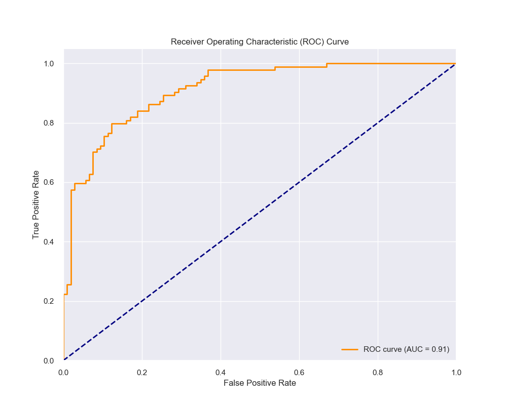

# ROC Curves and AUC: Complete Guide

## Introduction

The Receiver Operating Characteristic (ROC) curve and Area Under the Curve (AUC) are powerful tools for evaluating binary classification models. They provide a comprehensive view of model performance across different classification thresholds and help us understand the trade-offs between sensitivity and specificity.

## Real-World Analogies

### The Airport Security Analogy

Think of ROC and AUC like airport security screening:

- **True Positives**: Correctly identifying dangerous items
- **False Positives**: Flagging safe items as dangerous (inconvenience)
- **True Negatives**: Correctly identifying safe items
- **False Negatives**: Missing dangerous items (security risk)

The ROC curve shows how the security system performs at different sensitivity levels. A perfect system would catch all threats without any false alarms.

### The Medical Diagnosis Analogy

Imagine you're a doctor diagnosing a disease:

- **True Positives**: Correctly identifying patients with the disease
- **False Positives**: Diagnosing healthy patients as sick (unnecessary treatment)
- **True Negatives**: Correctly identifying healthy patients
- **False Negatives**: Missing patients who actually have the disease (delayed treatment)

ROC and AUC help us find the right balance between catching all cases and avoiding false alarms.

## Technical Definitions

### ROC Curve Components

The ROC curve plots the True Positive Rate (TPR) against the False Positive Rate (FPR) at various threshold settings:

**True Positive Rate (TPR)** = Sensitivity = Recall
\[
\text{TPR} = \frac{\text{True Positives}}{\text{True Positives} + \text{False Negatives}}
\]

**False Positive Rate (FPR)** = 1 - Specificity
\[
\text{FPR} = \frac{\text{False Positives}}{\text{False Positives} + \text{True Negatives}}
\]

### AUC (Area Under the Curve)

The AUC measures the model's ability to distinguish between classes:

- **AUC = 1.0**: Perfect classification
- **AUC = 0.5**: Random guessing (diagonal line)
- **AUC < 0.5**: Worse than random (but can be inverted)

**AUC Interpretation Guidelines:**
- **AUC > 0.9**: Excellent
- **0.8 < AUC ≤ 0.9**: Very good
- **0.7 < AUC ≤ 0.8**: Good
- **0.6 < AUC ≤ 0.7**: Fair
- **0.5 < AUC ≤ 0.6**: Poor
- **AUC = 0.5**: Random

## Understanding ROC Curve Shapes



**Key Patterns:**
- **Perfect Classifier**: Curve goes straight up to (0,1) then across to (1,1)
- **Random Classifier**: Diagonal line from (0,0) to (1,1)
- **Good Classifier**: Curve bows toward the upper-left corner
- **Poor Classifier**: Curve below diagonal line

## Implementation Examples

### 1. Basic ROC Curve for Binary Classification

```python
import numpy as np
import matplotlib.pyplot as plt
from sklearn.datasets import make_classification
from sklearn.model_selection import train_test_split
from sklearn.linear_model import LogisticRegression
from sklearn.metrics import roc_curve, auc, roc_auc_score

# Create sample dataset
X, y = make_classification(n_samples=1000, n_features=20, 
                         n_informative=15, n_redundant=5,
                         random_state=42)

# Split data
X_train, X_test, y_train, y_test = train_test_split(
    X, y, test_size=0.2, random_state=42
)

# Train model
model = LogisticRegression(random_state=42)
model.fit(X_train, y_train)

# Get probability predictions
y_pred_proba = model.predict_proba(X_test)[:, 1]

# Calculate ROC curve
fpr, tpr, thresholds = roc_curve(y_test, y_pred_proba)
roc_auc = auc(fpr, tpr)

# Alternative: Direct AUC calculation
auc_score = roc_auc_score(y_test, y_pred_proba)
print(f"AUC Score: {auc_score:.3f}")

# Plot ROC curve
def plot_roc_curve(fpr, tpr, roc_auc, title="ROC Curve"):
    plt.figure(figsize=(8, 6))
    plt.plot(fpr, tpr, color='darkorange', lw=2,
             label=f'ROC curve (AUC = {roc_auc:.2f})')
    plt.plot([0, 1], [0, 1], color='navy', lw=2, linestyle='--',
             label='Random classifier')
    plt.xlim([0.0, 1.0])
    plt.ylim([0.0, 1.05])
    plt.xlabel('False Positive Rate')
    plt.ylabel('True Positive Rate')
    plt.title(title)
    plt.legend(loc="lower right")
    plt.grid(True, alpha=0.3)
    plt.show()

plot_roc_curve(fpr, tpr, roc_auc)
```

### 2. Comparing Multiple Models

```python
from sklearn.ensemble import RandomForestClassifier
from sklearn.svm import SVC
from sklearn.naive_bayes import GaussianNB

# Train multiple models
models = {
    'Logistic Regression': LogisticRegression(random_state=42),
    'Random Forest': RandomForestClassifier(random_state=42),
    'SVM': SVC(probability=True, random_state=42),
    'Naive Bayes': GaussianNB()
}

plt.figure(figsize=(10, 8))

# Plot ROC curve for each model
for name, model in models.items():
    model.fit(X_train, y_train)
    y_pred_proba = model.predict_proba(X_test)[:, 1]
    fpr, tpr, _ = roc_curve(y_test, y_pred_proba)
    roc_auc = auc(fpr, tpr)
    plt.plot(fpr, tpr, lw=2, label=f'{name} (AUC = {roc_auc:.2f})')

# Add random classifier line
plt.plot([0, 1], [0, 1], color='navy', lw=2, linestyle='--',
         label='Random classifier')

plt.xlim([0.0, 1.0])
plt.ylim([0.0, 1.05])
plt.xlabel('False Positive Rate')
plt.ylabel('True Positive Rate')
plt.title('ROC Curves for Multiple Models')
plt.legend(loc="lower right")
plt.grid(True, alpha=0.3)
plt.show()
```

### 3. Multi-class ROC Curves

```python
from sklearn.datasets import load_iris
from sklearn.preprocessing import label_binarize
from itertools import cycle

# Load iris dataset
iris = load_iris()
X, y = iris.data, iris.target
X_train, X_test, y_train, y_test = train_test_split(X, y, test_size=0.2, random_state=42)

# Binarize the output for multi-class ROC
y_test_bin = label_binarize(y_test, classes=[0, 1, 2])
n_classes = y_test_bin.shape[1]

# Train model
model = RandomForestClassifier(random_state=42)
model.fit(X_train, y_train)
y_pred_proba = model.predict_proba(X_test)

# Calculate ROC curve for each class
fpr = dict()
tpr = dict()
roc_auc = dict()

for i in range(n_classes):
    fpr[i], tpr[i], _ = roc_curve(y_test_bin[:, i], y_pred_proba[:, i])
    roc_auc[i] = auc(fpr[i], tpr[i])

# Plot multi-class ROC curves
plt.figure(figsize=(8, 6))
colors = cycle(['blue', 'red', 'green'])
class_names = iris.target_names

for i, color in zip(range(n_classes), colors):
    plt.plot(fpr[i], tpr[i], color=color, lw=2,
             label=f'{class_names[i]} (AUC = {roc_auc[i]:.2f})')

plt.plot([0, 1], [0, 1], 'k--', lw=2, label='Random classifier')
plt.xlim([0.0, 1.0])
plt.ylim([0.0, 1.05])
plt.xlabel('False Positive Rate')
plt.ylabel('True Positive Rate')
plt.title('Multi-class ROC Curves')
plt.legend(loc="lower right")
plt.grid(True, alpha=0.3)
plt.show()
```

## Threshold Analysis and Selection

Understanding how different thresholds affect model performance is crucial for practical applications.

```python
from sklearn.metrics import confusion_matrix, precision_score, recall_score, f1_score

def analyze_thresholds(y_true, y_pred_proba, thresholds=None):
    """Analyze model performance across different thresholds."""
    
    if thresholds is None:
        thresholds = np.linspace(0, 1, 101)
    
    metrics = {
        'threshold': [],
        'precision': [],
        'recall': [],
        'f1': [],
        'fpr': [],
        'tpr': []
    }
    
    for threshold in thresholds:
        y_pred = (y_pred_proba >= threshold).astype(int)
        
        # Calculate metrics
        if len(np.unique(y_pred)) > 1:  # Avoid division by zero
            precision = precision_score(y_true, y_pred, zero_division=0)
            recall = recall_score(y_true, y_pred, zero_division=0)
            f1 = f1_score(y_true, y_pred, zero_division=0)
        else:
            precision = recall = f1 = 0
        
        # Calculate TPR and FPR
        tn, fp, fn, tp = confusion_matrix(y_true, y_pred).ravel()
        tpr = tp / (tp + fn) if (tp + fn) > 0 else 0
        fpr = fp / (fp + tn) if (fp + tn) > 0 else 0
        
        metrics['threshold'].append(threshold)
        metrics['precision'].append(precision)
        metrics['recall'].append(recall)
        metrics['f1'].append(f1)
        metrics['fpr'].append(fpr)
        metrics['tpr'].append(tpr)
    
    return metrics

# Analyze thresholds for our model
threshold_metrics = analyze_thresholds(y_test, y_pred_proba)

# Plot threshold analysis
fig, (ax1, ax2) = plt.subplots(1, 2, figsize=(15, 6))

# Plot 1: Precision, Recall, F1 vs Threshold
ax1.plot(threshold_metrics['threshold'], threshold_metrics['precision'], 
         label='Precision', linewidth=2)
ax1.plot(threshold_metrics['threshold'], threshold_metrics['recall'], 
         label='Recall', linewidth=2)
ax1.plot(threshold_metrics['threshold'], threshold_metrics['f1'], 
         label='F1-Score', linewidth=2)
ax1.set_xlabel('Threshold')
ax1.set_ylabel('Score')
ax1.set_title('Precision, Recall, and F1-Score vs Threshold')
ax1.legend()
ax1.grid(True, alpha=0.3)

# Plot 2: TPR and FPR vs Threshold
ax2.plot(threshold_metrics['threshold'], threshold_metrics['tpr'], 
         label='True Positive Rate', linewidth=2)
ax2.plot(threshold_metrics['threshold'], threshold_metrics['fpr'], 
         label='False Positive Rate', linewidth=2)
ax2.set_xlabel('Threshold')
ax2.set_ylabel('Rate')
ax2.set_title('TPR and FPR vs Threshold')
ax2.legend()
ax2.grid(True, alpha=0.3)

plt.tight_layout()
plt.show()
```

## Practical Example: Credit Risk Assessment

Let's apply ROC and AUC analysis to a realistic credit risk prediction scenario:

```python
import pandas as pd
from sklearn.preprocessing import StandardScaler
from sklearn.pipeline import Pipeline
from sklearn.ensemble import RandomForestClassifier

# Create realistic credit risk dataset
np.random.seed(42)
n_samples = 2000

# Generate correlated features
data = {
    'age': np.random.normal(35, 12, n_samples),
    'income': np.random.lognormal(10.5, 0.8, n_samples),  # Log-normal for income
    'credit_score': np.random.normal(650, 120, n_samples),
    'debt_to_income': np.random.beta(2, 5, n_samples),
    'employment_years': np.random.exponential(5, n_samples),
    'num_credit_accounts': np.random.poisson(3, n_samples),
    'credit_utilization': np.random.beta(2, 3, n_samples)
}

# Create DataFrame
df = pd.DataFrame(data)

# Clip values to realistic ranges
df['age'] = np.clip(df['age'], 18, 80)
df['credit_score'] = np.clip(df['credit_score'], 300, 850)
df['employment_years'] = np.clip(df['employment_years'], 0, 40)
df['credit_utilization'] = np.clip(df['credit_utilization'], 0, 1)

# Create target variable (loan default) with realistic relationships
default_probability = (
    -0.01 * df['credit_score'] +
    -0.00001 * df['income'] +
    0.5 * df['debt_to_income'] +
    0.8 * df['credit_utilization'] +
    -0.02 * df['employment_years'] +
    0.05 * df['num_credit_accounts'] +
    5  # Base probability
)

# Convert to probability and create binary target
default_prob = 1 / (1 + np.exp(-default_probability))
y = np.random.binomial(1, default_prob, n_samples)

print(f"Default rate: {y.mean():.2%}")

# Split data
X_train, X_test, y_train, y_test = train_test_split(
    df, y, test_size=0.2, random_state=42, stratify=y
)

# Create and train pipeline
pipeline = Pipeline([
    ('scaler', StandardScaler()),
    ('classifier', RandomForestClassifier(n_estimators=100, random_state=42))
])

pipeline.fit(X_train, y_train)

# Get predictions
y_pred_proba = pipeline.predict_proba(X_test)[:, 1]

# Calculate ROC curve
fpr, tpr, thresholds = roc_curve(y_test, y_pred_proba)
roc_auc = auc(fpr, tpr)

# Plot comprehensive analysis
fig, ((ax1, ax2), (ax3, ax4)) = plt.subplots(2, 2, figsize=(15, 12))

# ROC Curve
ax1.plot(fpr, tpr, color='darkorange', lw=2, label=f'ROC curve (AUC = {roc_auc:.3f})')
ax1.plot([0, 1], [0, 1], color='navy', lw=2, linestyle='--')
ax1.set_xlim([0.0, 1.0])
ax1.set_ylim([0.0, 1.05])
ax1.set_xlabel('False Positive Rate')
ax1.set_ylabel('True Positive Rate')
ax1.set_title('ROC Curve - Credit Risk Model')
ax1.legend(loc="lower right")
ax1.grid(True, alpha=0.3)

# Threshold analysis
threshold_metrics = analyze_thresholds(y_test, y_pred_proba, np.linspace(0, 1, 101))

ax2.plot(threshold_metrics['threshold'], threshold_metrics['precision'], 
         label='Precision', linewidth=2)
ax2.plot(threshold_metrics['threshold'], threshold_metrics['recall'], 
         label='Recall (TPR)', linewidth=2)
ax2.plot(threshold_metrics['threshold'], threshold_metrics['f1'], 
         label='F1-Score', linewidth=2)
ax2.set_xlabel('Threshold')
ax2.set_ylabel('Score')
ax2.set_title('Performance Metrics vs Threshold')
ax2.legend()
ax2.grid(True, alpha=0.3)

# Distribution of predicted probabilities
ax3.hist(y_pred_proba[y_test == 0], bins=30, alpha=0.7, label='No Default', density=True)
ax3.hist(y_pred_proba[y_test == 1], bins=30, alpha=0.7, label='Default', density=True)
ax3.set_xlabel('Predicted Probability')
ax3.set_ylabel('Density')
ax3.set_title('Distribution of Predicted Probabilities')
ax3.legend()
ax3.grid(True, alpha=0.3)

# Feature importance
feature_importance = pipeline.named_steps['classifier'].feature_importances_
feature_names = df.columns
sorted_idx = np.argsort(feature_importance)[::-1]

ax4.bar(range(len(feature_importance)), feature_importance[sorted_idx])
ax4.set_xlabel('Features')
ax4.set_ylabel('Importance')
ax4.set_title('Feature Importance')
ax4.set_xticks(range(len(feature_importance)))
ax4.set_xticklabels([feature_names[i] for i in sorted_idx], rotation=45)
ax4.grid(True, alpha=0.3)

plt.tight_layout()
plt.show()

# Print model performance summary
print(f"\nCredit Risk Model Performance:")
print(f"AUC Score: {roc_auc:.3f}")
print(f"Number of test samples: {len(y_test)}")
print(f"Actual default rate: {y_test.mean():.2%}")
print(f"Predicted default rate (threshold=0.5): {(y_pred_proba >= 0.5).mean():.2%}")
```

## Best Practices

### 1. Data Preparation
- **Handle missing values** appropriately
- **Scale features** when necessary
- **Address class imbalance** if present
- **Validate data quality** before modeling

### 2. Model Development
- **Use cross-validation** for robust evaluation
- **Compare multiple models** systematically
- **Consider model complexity** vs. performance trade-offs
- **Validate on holdout data** for final assessment

### 3. ROC/AUC Analysis
- **Examine the full ROC curve**, not just AUC
- **Consider the shape** of the curve for insights
- **Analyze threshold sensitivity** for practical deployment
- **Use domain knowledge** for threshold selection

### 4. Threshold Selection
- **Consider business costs** of false positives vs. false negatives
- **Involve stakeholders** in threshold decisions
- **Document the rationale** for chosen thresholds
- **Monitor performance** in production

### 5. Reporting and Communication
- **Provide context** for AUC scores
- **Explain trade-offs** clearly to stakeholders
- **Use visualizations** effectively
- **Include confidence intervals** when possible

## Common Mistakes to Avoid

### 1. Data-Related Issues
- **Ignoring class imbalance** effects on ROC/AUC
- **Data leakage** leading to overly optimistic results
- **Insufficient validation** data
- **Not checking for temporal dependencies**

### 2. Interpretation Errors
- **Focusing solely on AUC** without considering the ROC curve shape
- **Assuming high AUC means good model** for all use cases
- **Ignoring the cost matrix** in threshold selection
- **Not considering model uncertainty**

### 3. Technical Mistakes
- **Using inappropriate metrics** for imbalanced datasets
- **Not validating threshold selection** on independent data
- **Overfitting to validation set** through excessive tuning
- **Ignoring model calibration** issues

### 4. Communication Issues
- **Not explaining trade-offs** to stakeholders
- **Using technical jargon** without explanation
- **Not providing actionable insights**
- **Failing to set realistic expectations**

## When to Use ROC/AUC vs. Other Metrics

### Use ROC/AUC When:
- **Balanced datasets** or when both classes are important
- **Ranking/scoring** applications
- **Comparing models** across different algorithms
- **Threshold-independent** evaluation is needed

### Consider Alternatives When:
- **Highly imbalanced datasets**: Use Precision-Recall curves
- **Cost-sensitive applications**: Use cost-weighted metrics
- **Specific business metrics**: Use domain-specific measures
- **Calibration matters**: Use calibration plots and Brier score

## Advanced Topics

### 1. Confidence Intervals for AUC

```python
from scipy import stats

def bootstrap_auc(y_true, y_pred_proba, n_bootstrap=1000, confidence_level=0.95):
    """Calculate bootstrap confidence interval for AUC."""
    n_samples = len(y_true)
    bootstrap_aucs = []
    
    for _ in range(n_bootstrap):
        # Bootstrap sample
        indices = np.random.choice(n_samples, n_samples, replace=True)
        y_boot = y_true[indices]
        y_pred_boot = y_pred_proba[indices]
        
        # Calculate AUC for bootstrap sample
        try:
            auc_boot = roc_auc_score(y_boot, y_pred_boot)
            bootstrap_aucs.append(auc_boot)
        except ValueError:
            # Skip if bootstrap sample has only one class
            continue
    
    # Calculate confidence interval
    alpha = 1 - confidence_level
    lower = np.percentile(bootstrap_aucs, 100 * alpha / 2)
    upper = np.percentile(bootstrap_aucs, 100 * (1 - alpha / 2))
    
    return np.mean(bootstrap_aucs), lower, upper

# Calculate confidence interval for our credit risk model
auc_mean, auc_lower, auc_upper = bootstrap_auc(y_test, y_pred_proba)
print(f"AUC: {auc_mean:.3f} (95% CI: {auc_lower:.3f} - {auc_upper:.3f})")
```

### 2. Cross-Validation with ROC/AUC

```python
from sklearn.model_selection import cross_val_score, StratifiedKFold

# Perform cross-validation
cv = StratifiedKFold(n_splits=5, shuffle=True, random_state=42)
cv_scores = cross_val_score(pipeline, X_train, y_train, cv=cv, scoring='roc_auc')

print(f"Cross-validation AUC scores: {cv_scores}")
print(f"Mean CV AUC: {cv_scores.mean():.3f} (+/- {cv_scores.std() * 2:.3f})")
```

## Summary

ROC curves and AUC provide powerful tools for evaluating and comparing classification models. Key takeaways:

1. **ROC curves** visualize the trade-off between sensitivity and specificity
2. **AUC** provides a single metric for model comparison
3. **Threshold selection** should consider business costs and requirements
4. **Multiple metrics** should be used for comprehensive evaluation
5. **Domain knowledge** is crucial for practical implementation

Remember that while ROC/AUC are valuable metrics, they should be used in conjunction with other evaluation methods and always in the context of your specific problem domain and business requirements.

## Additional Resources

- [Scikit-learn ROC Documentation](https://scikit-learn.org/stable/modules/generated/sklearn.metrics.roc_curve.html)
- [Scikit-learn AUC Documentation](https://scikit-learn.org/stable/modules/generated/sklearn.metrics.roc_auc_score.html)
- [Model Evaluation Best Practices](https://scikit-learn.org/stable/modules/model_evaluation.html)
- [Classification Metrics Guide](https://scikit-learn.org/stable/modules/classification_report.html)
