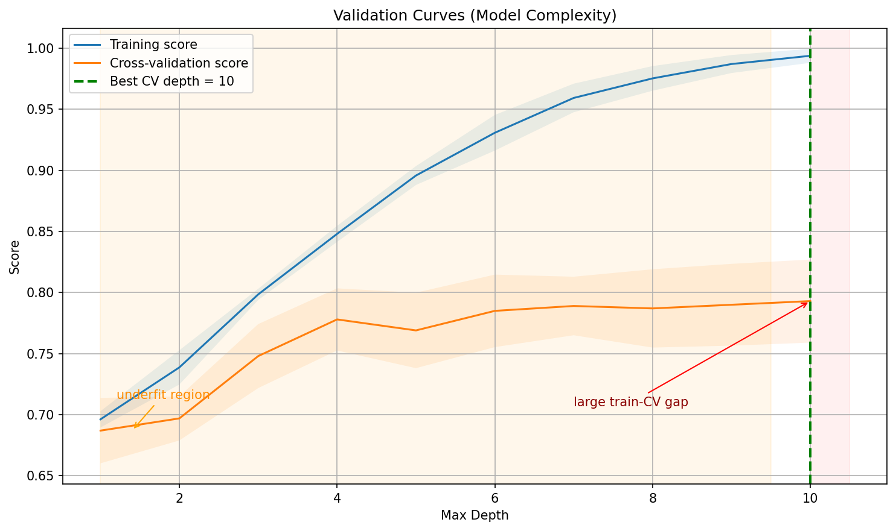
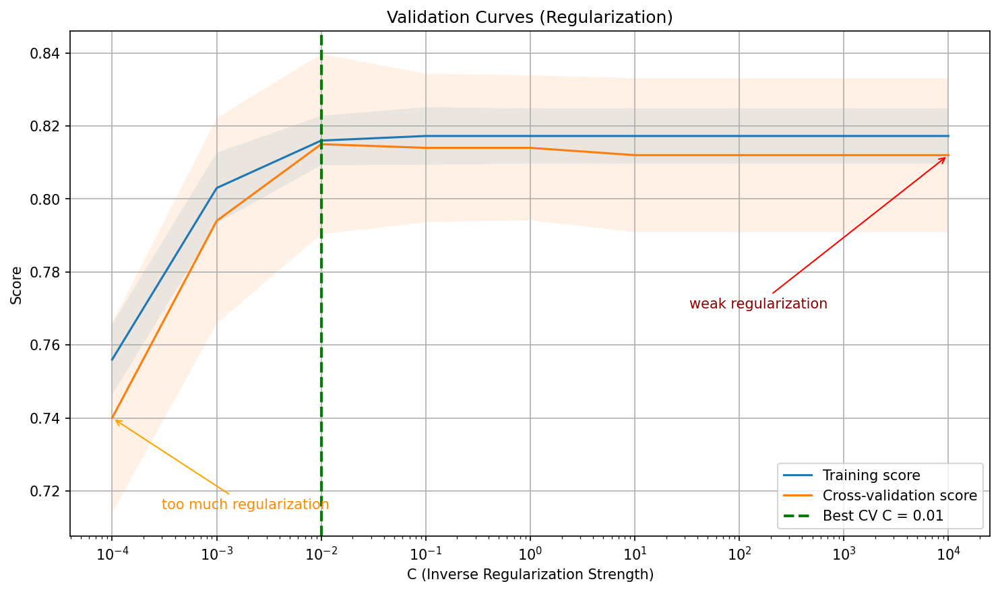
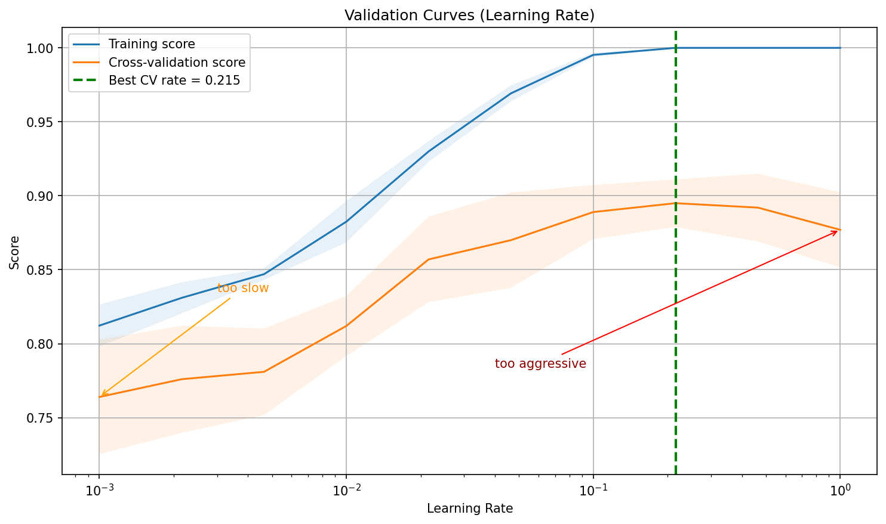
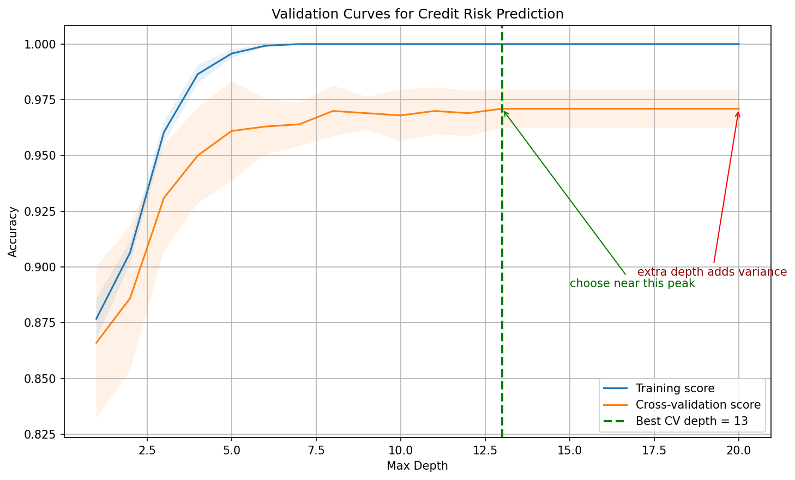

# Validation Curves

**After this lesson:** you can explain Validation Curves and try the examples in your own notebook.

## Overview

**Validation curves** for a single hyperparameter: where the train/CV gap blows up (overfitting onset).

## Introduction

Validation curves are essential tools in machine learning for understanding how a model's performance changes with different hyperparameter values. They help us find the optimal hyperparameter settings and diagnose issues like overfitting and underfitting.

> **Key idea:** validation curves answer **"which value of this hyperparameter is reasonable?"** while holding the rest of the setup fixed.

## What are Validation Curves?

Validation curves plot the model's performance (typically error or accuracy) against different values of a hyperparameter. They show:

1. **Training score**
2. **Validation score**
3. The **gap** between them

> **Read the diagram:** move from left to right as the hyperparameter makes the model more flexible. The best region is not where the training score is highest; it is where the validation score is highest and the train-validation gap is still small.

## Types of Validation Curves

### 1. Model Complexity

#### `validation_curve` for tree depth

Sweep Max Depth

`validation_curve` fits 5 CV folds at each of 10 depth values; the output matrices (n\_depths × n\_folds) capture how score varies with complexity and split randomness.

Aggregate and Plot

Take mean and std across folds (`axis=1`), then plot both curves with `fill_between` bands; a widening gap between training and CV scores signals the onset of overfitting.

<figure><figcaption>
Figure 1: Validation Curves (Model Complexity)
</figcaption></figure>

> **Read Figure 1:** the x-axis is tree depth. Shallow trees underfit because both curves are lower. As depth increases, the training score keeps rising, but the cross-validation score eventually flattens or drops. Choose a depth near the validation-score peak, before the gap becomes large.

### 2. Regularization Strength

#### Logistic `C` on a log scale

> This example reuses `X, y` (and the imported `np`/`plt`) from the first block above.

Log-scale C Sweep

`logspace(-4, 4, 9)` generates nine values from 0.0001 to 10000; small `C` applies strong L2 regularization while large `C` approaches an unregularized fit.

Semilog Plot

`semilogx` places the log-spaced `C` values evenly on the x-axis; the convergence of train and CV scores in the middle shows where regularization stops hurting and starts helping.

<figure><figcaption>
Figure 2: Validation Curves (Regularization)
</figcaption></figure>

> **Read Figure 2:** `C` is inverse regularization strength. Very small `C` means heavy regularization and can underfit. Very large `C` means weak regularization and can overfit. The useful region is the middle plateau where validation performance is strong and stable.

### 3. Learning Rate

#### Gradient boosting `learning_rate`

> This example reuses `X, y` (and the imported `np`/`plt`) from the first block above.

Learning Rate Range

Sweep learning rate from 0.001 to 1.0 on a log scale; a very low rate needs more trees to converge while a very high rate can overfit with the default number of estimators.

Gap Analysis

The same semilog plot pattern as the regularization example; a large train-CV gap at high learning rates identifies the overfitting regime for gradient boosting.

<figure><figcaption>
Figure 3: Validation Curves (Learning Rate)
</figcaption></figure>

> **Read Figure 3:** the learning rate controls how aggressively boosting corrects previous mistakes. A tiny value may learn too slowly for the fixed number of estimators. A large value can fit training data too sharply. Prefer the range where the validation curve peaks before the training curve separates.

## Interpreting Validation Curves

### 1. Overfitting

* Training score increases
* Validation score decreases
* Large gap between curves
* Need more regularization

### 2. Underfitting

* Both scores are low
* Small gap between curves
* Need more complexity
* More features might help

### 3. Good Fit

* Both scores are high
* Small gap between curves
* Optimal parameter found
* Model is well-tuned

## Best Practices

1. **Choose Appropriate Range**
   * Start wide enough that the validation curve shows both sides of the decision: a region where the model underfits and a region where extra complexity stops helping.
   * Refine around the highest cross-validation score only after the first plot shows the peak; otherwise a narrow grid can make an edge value look "best" simply because better values were never tested.
   * Use a log scale for parameters such as `C`, `alpha`, or learning rate because their effect is usually multiplicative; testing `0.001, 0.01, 0.1, 1, 10` is more informative than testing `1, 2, 3, 4, 5`.
2. **Use Cross-Validation**
   * Plot cross-validation means rather than one validation split so the curve reflects a repeatable pattern, not a lucky or unlucky split.
   * Use stratified folds for classification when class balance matters; without stratification, some folds may contain too few minority-class examples and create artificial dips in the curve.
   * Match the metric to the cost of mistakes: accuracy can hide bad minority-class performance, while recall, precision, F1, or AUC may reveal the actual trade-off.
3. **Plot Confidence Intervals**
   * Add standard-deviation bands so students can distinguish a real improvement from noise; if two settings have overlapping bands, the simpler or cheaper setting is usually safer.
   * Repeat the curve with different random seeds when the model is unstable, especially for random forests, neural networks, or small datasets.
   * Keep the chart readable: highlight the selected value and label underfit/overfit regions directly on the graph so the conclusion is visible without rereading the code.
4. **Consider Multiple Parameters**
   * A validation curve isolates one parameter, so use it to build intuition before running a multi-parameter search.
   * Use grid search when there are few parameters and you need full coverage; use random search when many parameters matter unevenly and compute is limited.
   * Use Bayesian optimisation only after the metric, search bounds, and validation setup are trustworthy; otherwise it can optimise a noisy or misleading target very efficiently.

## Common Mistakes to Avoid

1. **Insufficient Range**
   * Too narrow
   * Missing optimal point
   * Wrong conclusions
2. **Poor Cross-Validation**
   * Not enough folds
   * Data leakage
   * Inappropriate metrics
3. **Misinterpretation**
   * Ignoring variance
   * Overlooking trends
   * Wrong conclusions

## Practical Example: Credit Risk Prediction

Analyze validation curves for a credit risk prediction model:

#### Pipeline + `classifier__max_depth` sweep

Credit Dataset and Pipeline

Generate the synthetic credit dataset and wrap a scaler+forest in a `Pipeline`; the pipeline object is passed directly to `validation_curve` so preprocessing runs correctly inside each fold.

Nested Parameter Name

Use `classifier__max_depth` (double underscore) to reach through the pipeline and set the forest's depth; this pattern works for any nested step parameter in sklearn pipelines.

Plot and Interpret

Plot mean ± std bands across depths 1-20; the depth where CV score peaks and the train-CV gap starts growing is the recommended operating depth for this credit model.

<figure><figcaption>
Figure 4: Validation Curves for Credit Risk Prediction
</figcaption></figure>

> **Read Figure 4:** this is the same depth sweep in a business-style credit-risk pipeline. If a deeper forest gives almost no validation gain but increases the training-validation gap, the extra depth is complexity without reliable generalization. In a real credit setting, prefer the simpler depth with nearly the same validation score.

## Gotchas

* **Misreading the y-axis direction**: `validation_curve` returns scores (higher is better), not errors; a rising training curve that diverges from a flat validation curve signals overfitting, but learners who expect an error plot may reverse their interpretation and increase complexity when they should reduce it.
* **Sweeping a linear range for parameters that need a log scale**: Regularization parameters like `C` in logistic regression span orders of magnitude; a linear sweep from 1 to 10 misses the critical low-`C` region where the model underfits; always use `np.logspace` for parameters whose effect is multiplicative.
* **Confusing the validation curve peak with the final model**: The hyperparameter value where the CV score peaks on a validation curve was selected by looking at validation data; that score is optimistic; use a separate test set or nested CV to get an unbiased performance estimate for the chosen setting.
* **Passing the full dataset to `validation_curve` and then also evaluating on a held-out test set drawn from the same data**: `validation_curve` uses internal cross-validation on whatever `X, y` you pass; if `X` already excludes your test split, this is fine, but passing all data and later claiming a separate test set breaks the independence requirement.
* **Drawing conclusions from noisy `fill_between` bands**: Wide standard-deviation bands across folds indicate the validation curve estimate is unreliable (often due to small datasets); increasing `cv` folds or dataset size before reading the curve will give cleaner, more actionable results.
* **Forgetting to use the `classifier__` prefix for pipeline parameters**: When the estimator is wrapped in a `Pipeline`, the `param_name` argument must use the double-underscore notation (e.g., `"classifier__max_depth"`); omitting the step prefix raises a `ValueError` that is easy to misread as a data problem.

## Additional Resources

1. [Scikit-learn: validation curve user guide](https://scikit-learn.org/stable/modules/learning_curve.html#validation-curve)
2. [Scikit-learn: `validation_curve` API](https://scikit-learn.org/stable/modules/generated/sklearn.model_selection.validation_curve.html)
3. [Scikit-learn example: plotting validation curves](https://scikit-learn.org/stable/auto_examples/model_selection/plot_validation_curve.html)
4. [Scikit-learn: tuning estimator hyperparameters](https://scikit-learn.org/stable/modules/grid_search.html)
