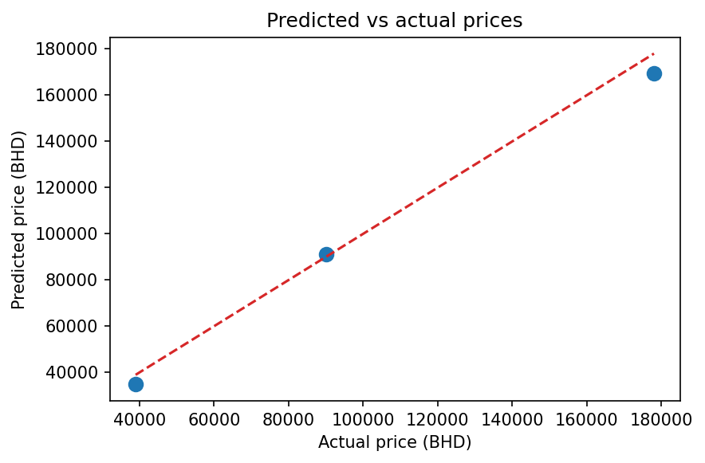

# Data Science & AI Capstone Project

**After this module:** you can plan, build, document, and present a complete data science project. The capstone is where the earlier modules come together: problem framing, data cleaning, visualization, modeling, evaluation, and communication.

## Helpful video

End-to-end context for planning and presenting a capstone project.

<iframe width="560" height="315" src="https://www.youtube.com/embed/RBSUwFGa6Fk" title="What is Data Science?" frameborder="0" allow="accelerometer; autoplay; clipboard-write; encrypted-media; gyroscope; picture-in-picture" allowfullscreen></iframe>

## Project Overview

This capstone project demonstrates industry-relevant data science and AI skills acquired throughout the course. You will work with real or realistic datasets, make defensible technical choices, and explain what your work means for a practical audience.

**Before you start:** You should be able to load and clean tabular data in **pandas**, build at least one **visualization** with clear intent, and explain **limitations** of a model or summary. The capstone is not the place to learn pandas, visualization, or modeling from scratch. Use earlier modules to refresh, then focus here on **problem framing**, **reproducibility**, and **communication**.



## Timeline and Deliverables

- Duration: 2 weeks part-time
- Main technical artifact: public GitHub repository
- Main communication artifact: 5-minute video presentation
- Expected evidence: clear notebooks, visible outputs, charts where they support a claim, model metrics where modeling is used, and a README that explains how to reproduce the project

## What A Strong Capstone Shows

A strong capstone does not need the most complex model. It needs a coherent chain of evidence:

1. **Problem:** What decision, question, or operational pain point does the project address?
2. **Data:** What data is used, where did it come from, and what quality issues matter?
3. **Method:** What cleaning, features, visualizations, and models were used?
4. **Evidence:** What outputs, logs, metrics, and charts support the conclusions?
5. **Recommendation:** What should a stakeholder do next, and what are the limitations?

## Metric Formulas To Use Correctly

When you report model performance, match the metric to the task and explain the formula in plain language.

- For regression, mean absolute error is \\(MAE = \frac{1}{n}\sum_{i=1}^{n}|y_i-\hat{y}_i|\\). It is the average absolute size of the prediction error in the original unit.
- For classification, accuracy is \\(Accuracy = \frac{TP + TN}{TP + TN + FP + FN}\\). It is only reliable when classes are reasonably balanced.
- For imbalanced classification, report precision \\(Precision = \frac{TP}{TP + FP}\\), recall \\(Recall = \frac{TP}{TP + FN}\\), or F1 score \\(F1 = 2 \times \frac{Precision \times Recall}{Precision + Recall}\\).

## Structured Project Options

Choose one of the three structured project briefs below, or propose your own project if it still meets the general requirements.

### Example Project A: UN Sustainable Development Goals Data Analysis Pipeline

**Project overview:** Develop a data science pipeline to analyze progress toward specific UN Sustainable Development Goals using official UN datasets. Create visualizations and, where appropriate, predictive models to assess global or regional SDG performance.

**Learning objectives**

- Integrate data from multiple sources using APIs and direct downloads
- Apply data preprocessing and feature engineering techniques
- Create meaningful visualizations for policy insights
- Build predictive models for SDG progress forecasting when the data supports it

**Datasets and resources**

1. **UN Data Commons for SDGs:** https://unstats.un.org/sdgs
2. **Global SDG Indicators Database:** https://unstats.un.org/sdgs/indicators/database/
3. **UN Statistics Division API:** access SDG indicators for many countries and regions
4. **World Bank Open Data:** https://data.worldbank.org/ for complementary socioeconomic data

**Implementation plan**

- Week 1, days 1-2: Select 2-3 focused goals, such as SDG 1 No Poverty or SDG 3 Good Health.
- Week 1, days 3-4: Extract data using API calls or direct downloads.
- Week 1, days 5-7: Clean data, standardize country or year fields, and prepare features.
- Week 2, days 8-10: Create exploratory charts and write interpretation notes.
- Week 2, days 11-12: Build baseline forecasts or classification models if the question needs them.
- Week 2, days 13-14: Prepare repository, presentation, and recommendations.

**Suggested `requirements.txt` entries**

```text
pandas
numpy
requests
matplotlib
seaborn
plotly
scikit-learn
jupyter
```

**Expected outputs**

- A notebook with the complete pipeline and visible outputs after important cells
- At least three charts that support clear policy or operational insights
- A short model evaluation section if modeling is used
- A 5-minute presentation with recommendations and limitations

### Example Project B: Bahrain Vision 2030 Economic Development Analysis

**Project overview:** Analyze Bahrain's economic development indicators to assess progress toward Vision 2030 goals. Use official government data where possible and create insights that could support policy or strategy decisions.

**Learning objectives**

- Work with government open data portals
- Analyze economic trends and patterns
- Create policy-relevant visualizations
- Build simple forecasting models for economic indicators when the historical data is suitable

**Datasets and resources**

1. **Bahrain Open Data Portal:** https://www.data.gov.bh
2. **General Economic Indicators:** https://www.data.gov.bh/explore/dataset/01-annually-general-economic-indicators-by-cp/
3. **Agricultural Sector Economic Indicators:** https://www.data.gov.bh/explore/dataset/economic-indicators-for-the-agricultural-sector/
4. **National Summary Data Page:** https://www.data.gov.bh/pages/national-summary-data-page-nsdp/
5. **World Bank Data on Bahrain:** useful for comparative analysis

**Key indicators to analyze**

- GDP growth and composition
- Private sector contribution
- Employment rates and sectoral distribution
- Trade statistics and diversification metrics
- Infrastructure development indicators

**Suggested `requirements.txt` entries**

```text
pandas
numpy
matplotlib
plotly
statsmodels
scikit-learn
jupyter
```

**Expected outputs**

- Trend charts with clear axis labels and date ranges
- A data dictionary or source table explaining each indicator
- A short interpretation of whether the evidence supports the selected Vision 2030 theme
- A presentation with policy or business implications, not only technical charts

### Example Project C: Web Scraping To Data Pipeline Implementation

**Project overview:** Build an end-to-end data pipeline that collects public data, processes it into a structured dataset, and produces actionable insights through analysis or machine learning.

**Suggested project choices**

- **Real estate market analysis:** collect public property listings and analyze price drivers.
- **Financial markets dashboard:** use public financial APIs and compare sector or stock performance.
- **Weather and climate analysis:** use public weather APIs to analyze patterns and forecasting signals.

**Ethical guidelines**

- Respect `robots.txt`, API limits, and terms of service.
- Use public data only.
- Add delays between requests when scraping pages.
- Store raw data separately from cleaned data.
- Document failures, missing records, and assumptions.

**Purpose:** This first example turns a small HTML sample into a structured dataset. It mirrors the early stage of a scraping project while staying reproducible offline for the course page.

```python
from html.parser import HTMLParser
import pandas as pd


sample_html = """
<article class="listing"><h2>Studio apartment</h2><span data-price="42000"></span><span data-bedrooms="1"></span></article>
<article class="listing"><h2>Family villa</h2><span data-price="135000"></span><span data-bedrooms="4"></span></article>
<article class="listing"><h2>City flat</h2><span data-price="70000"></span><span data-bedrooms="2"></span></article>
"""


class ListingParser(HTMLParser):
    def __init__(self):
        super().__init__()
        self.rows = []
        self.current = {}
        self.capture_title = False

    def handle_starttag(self, tag, attrs):
        attrs = dict(attrs)
        if tag == "article" and attrs.get("class") == "listing":
            self.current = {}
        elif tag == "h2":
            self.capture_title = True
        elif tag == "span" and "data-price" in attrs:
            self.current["price_bhd"] = int(attrs["data-price"])
        elif tag == "span" and "data-bedrooms" in attrs:
            self.current["bedrooms"] = int(attrs["data-bedrooms"])

    def handle_data(self, data):
        if self.capture_title:
            self.current["title"] = data.strip()

    def handle_endtag(self, tag):
        if tag == "h2":
            self.capture_title = False
        elif tag == "article" and self.current:
            self.rows.append(self.current)


parser = ListingParser()
parser.feed(sample_html)
listings = pd.DataFrame(parser.rows)

print("Collected listing sample:")
print(listings.to_string(index=False))
print(f"Rows collected: {len(listings)}")
print(f"Average price: {listings['price_bhd'].mean():,.0f} BHD")
```

```
Collected listing sample:
           title  price_bhd  bedrooms
Studio apartment      42000         1
    Family villa     135000         4
       City flat      70000         2
Rows collected: 3
Average price: 82,333 BHD
```

**Purpose:** This second example shows the minimum modeling evidence expected in a capstone: a reproducible train/test split, clear metrics, a compact results table, and a chart that helps diagnose prediction quality.

```python
# fig-caption: Predicted versus actual property prices for a small capstone modeling check.
import pandas as pd
import matplotlib.pyplot as plt
from sklearn.linear_model import LinearRegression
from sklearn.metrics import mean_absolute_error, r2_score
from sklearn.model_selection import train_test_split


property_data = pd.DataFrame(
    {
        "bedrooms": [1, 1, 2, 2, 3, 3, 4, 4, 5, 5],
        "size_sqm": [48, 55, 72, 80, 105, 118, 150, 168, 205, 220],
        "distance_km": [2.1, 7.5, 3.4, 9.0, 5.5, 11.2, 4.8, 12.0, 6.4, 14.5],
        "price_bhd": [42000, 39000, 70000, 64000, 98000, 90000, 135000, 121000, 178000, 162000],
    }
)

features = ["bedrooms", "size_sqm", "distance_km"]
X_train, X_test, y_train, y_test = train_test_split(
    property_data[features],
    property_data["price_bhd"],
    test_size=0.3,
    random_state=42,
)

model = LinearRegression()
model.fit(X_train, y_train)
predictions = model.predict(X_test)

results = X_test.copy()
results["actual_bhd"] = y_test
results["predicted_bhd"] = predictions.round(0).astype(int)
results["absolute_error"] = (results["actual_bhd"] - results["predicted_bhd"]).abs()

mae = mean_absolute_error(y_test, predictions)
r2 = r2_score(y_test, predictions)

print("Model evaluation summary")
print(f"Rows used: {len(property_data)}")
print(f"Mean absolute error: {mae:,.0f} BHD")
print(f"R^2 on holdout: {r2:.2f}")
print(results.sort_values("actual_bhd").to_string(index=False))

plt.figure(figsize=(6, 4))
plt.scatter(y_test, predictions, color="#1f77b4", s=70)
plt.plot([y_test.min(), y_test.max()], [y_test.min(), y_test.max()], "--", color="#d62728")
plt.xlabel("Actual price (BHD)")
plt.ylabel("Predicted price (BHD)")
plt.title("Predicted vs actual prices")
plt.show()
```


<figure>

<figcaption>Figure 1: Predicted versus actual property prices for a small capstone modeling check.</figcaption>
</figure>

```
Model evaluation summary
Rows used: 10
Mean absolute error: 4,607 BHD
R^2 on holdout: 0.99
 bedrooms  size_sqm  distance_km  actual_bhd  predicted_bhd  absolute_error
        1        55          7.5       39000          34867            4133
        3       118         11.2       90000          91206            1206
        5       205          6.4      178000         169517            8483
```

**Expected outputs**

- A complete data pipeline with logs or printed checks at collection, cleaning, and modeling stages
- A model section with at least one appropriate metric and one diagnostic chart
- A dashboard, notebook, or lightweight web application that demonstrates the insights

## General Project Requirements

### Data Collection And Preparation

- Source and clean one or more datasets.
- Document the dataset source, license or access constraints, and collection date.
- Show row counts before and after cleaning.
- Explain missing values, duplicates, outliers, and any records removed.

### Exploratory Data Analysis

- Include descriptive statistics for the most important variables.
- Create charts that answer specific questions rather than decorating the notebook.
- Add short interpretation notes after important charts.
- Use consistent labels, units, and color meaning.

### Modeling And Evaluation

- Start with a simple baseline.
- Use train/test splits or cross-validation where appropriate.
- Choose metrics that match the problem type.
- Include output logs or tables that show model performance.
- Explain why the final model is useful or why modeling was not appropriate.

### Results And Recommendations

- Present clear findings and recommendations.
- Support conclusions with data, charts, and metrics.
- Discuss limitations and practical implications.
- Distinguish facts from assumptions.

### Technical Implementation

- Use Python, pandas, scikit-learn, and visualization libraries covered in the course unless your instructor approves another stack.
- Keep notebooks readable with markdown explanations before code blocks.
- Keep code cells focused: one task per cell is easier to review than long mixed-purpose cells.
- Store raw and cleaned data separately when possible.
- Include `requirements.txt` or equivalent dependency documentation.

## Recommended Development Environments

1. **Google Colab**
   - Free access to common data science libraries
   - Easy sharing and collaboration
   - Good for notebook-first capstone projects

2. **Deepnote**
   - Real-time collaboration
   - Integrated version control
   - Rich markdown support

3. **Local Jupyter environment**
   - Best when you want full control of files and dependencies
   - Requires more setup discipline
   - Good preparation for professional workflows

## Recommended Datasets From Kaggle

### Healthcare And Life Sciences

1. [COVID-19 Dataset](https://www.kaggle.com/datasets/sudalairajkumar/novel-corona-virus-2019-dataset)
   - Time series analysis
   - Geographical visualization
   - Predictive modeling opportunities

2. [Healthcare Diabetes Dataset](https://www.kaggle.com/datasets/mathchi/diabetes-data-set)
   - Binary classification
   - Feature importance analysis
   - Medical diagnostic modeling

### Business And Finance

1. [E-commerce Customer Behavior](https://www.kaggle.com/datasets/mkechinov/ecommerce-behavior-data-from-multi-category-store)
   - Customer segmentation
   - Purchase prediction
   - Time series analysis

2. [Credit Card Fraud Detection](https://www.kaggle.com/datasets/mlg-ulb/creditcardfraud)
   - Anomaly detection
   - Imbalanced classification
   - Risk modeling

### Environmental And Climate

1. [Global Temperature Time Series](https://www.kaggle.com/datasets/berkeleyearth/climate-change-earth-surface-temperature-data)
   - Time series analysis
   - Trend prediction
   - Visualization challenges

2. [Air Quality Data](https://www.kaggle.com/datasets/fedesoriano/air-quality-data-set)
   - Multivariate analysis
   - Sensor data processing
   - Environmental impact assessment

### Technology And Social Media

1. [Twitter Sentiment Analysis](https://www.kaggle.com/datasets/kazanova/sentiment140)
   - Natural language processing
   - Sentiment classification
   - Text preprocessing

2. [Stack Overflow Questions](https://www.kaggle.com/datasets/stackoverflow/stackoverflow)
   - Text classification
   - Tag prediction
   - Trend analysis

### Urban And Transportation

1. [NYC Taxi Trip Duration](https://www.kaggle.com/competitions/nyc-taxi-trip-duration)
   - Regression analysis
   - Geospatial visualization
   - Feature engineering

2. [Bike Sharing Demand](https://www.kaggle.com/competitions/bike-sharing-demand)
   - Demand forecasting
   - Time series analysis
   - Weather impact analysis

## Repository Structure

Use a structure that makes the project easy to run and review.

```text
capstone-project/
├── data/
│   ├── raw/                 # Original files or download notes
│   └── processed/           # Cleaned datasets used by notebooks
├── notebooks/
│   ├── 1-eda.ipynb          # Exploratory data analysis
│   ├── 2-preprocessing.ipynb # Cleaning and feature engineering
│   └── 3-modeling.ipynb     # Modeling and evaluation
├── src/                     # Optional reusable Python code
├── docs/
│   └── presentation.md      # Presentation script or notes
├── requirements.txt
└── README.md
```

## README Checklist

Your repository README should include:

- Project title and one-paragraph description
- Problem statement and stakeholder context
- Dataset description and source links
- Methodology overview
- Key findings and insights
- Model metrics and limitations if modeling is used
- Installation or setup instructions
- Usage instructions for notebooks, scripts, or dashboards

## Video Presentation Structure

1. **Problem introduction, 1 minute**
   - Context and motivation
   - Problem statement
   - Expected impact

2. **Technical approach, 2 minutes**
   - Data processing methods
   - Analysis techniques
   - Model development if used

3. **Results and insights, 1.5 minutes**
   - Key findings
   - Model performance or analysis evidence
   - Business, policy, or operational recommendations

4. **Conclusion, 0.5 minutes**
   - Summary of achievements
   - Limitations and future improvements
   - Lessons learned

## Submission Process

1. **GitHub repository**
   - Commit all code and documentation.
   - Make the repository public unless your instructor gives different guidance.
   - Submit the repository URL via the course platform.

2. **Video presentation**
   - Upload to a video platform such as YouTube, Vimeo, or Loom.
   - Make the video unlisted or public.
   - Submit the video URL via the course platform.

3. **Final checks**
   - Repository is public and accessible.
   - Notebooks run from a clean environment.
   - Important code cells have printed outputs, tables, or charts.
   - Documentation is complete and clear.
   - Video is accessible and plays correctly.

## Common Pitfalls To Avoid

1. **Data issues**
   - Not exploring data thoroughly before modeling
   - Ignoring missing values or outliers
   - Using inappropriate data splits
   - Creating data leakage during feature engineering

2. **Modeling mistakes**
   - Not establishing a baseline model
   - Overfitting without validation
   - Using metrics that do not match the problem
   - Reporting model scores without interpretation

3. **Presentation problems**
   - Exceeding the time limit
   - Using too much technical jargon
   - Showing charts without explaining the decision they support
   - Not telling a coherent story

4. **Documentation issues**
   - Missing methodology explanations
   - Code cells with no outputs or unclear outputs
   - No discussion of limitations
   - Unclear repository structure

## Frequently Asked Questions

### What if I can't access certain datasets?

Document the access issue and use alternative sources. The Kaggle datasets section provides reliable alternatives.

### Can I use pre-trained models?

Yes, but you must demonstrate understanding of the model, properly cite sources, and show how you adapted the model to your specific problem.

### What if my model performance is poor?

Focus on proper methodology, data understanding, and clear communication. Document what you tried and why certain approaches did not work. This shows critical thinking.

### How technical should my presentation be?

Aim for balance. Explain the approach clearly, but make it accessible to a business or policy audience. Use visualizations to support technical concepts.

### Can I propose my own project idea?

Yes. If you have a specific domain interest or dataset in mind, you can propose your own project as long as it meets the general requirements.

### What programming languages can I use?

Python is strongly recommended because it is the primary language covered in the course. R is acceptable if you have strong justification for its use in your domain.

### How do I handle large datasets that won't fit in memory?

Document the issue and use sampling, chunking, or cloud computing resources. Explain the limitations introduced by your approach.

### What if I finish early?

Use extra time to improve analysis, add better validation, create clearer visualizations, or extend the project to additional research questions.

### How important is the business context?

Very important. This project should demonstrate your ability to apply data science to a practical problem, not just technical skills in isolation.

## Getting Help

### During Development

- Use course discussion forums for technical questions.
- Attend office hours for guidance on scope and methodology.
- Consult documentation and reputable examples for implementation details.

### Before Submission

- Review the assessment rubric.
- Test your code in a fresh environment.
- Ask someone to review your presentation for clarity and timing.
- Double-check all repository and video submission requirements.

The capstone is your opportunity to show both technical competency and business judgment through a well-executed, clearly communicated data science project.
